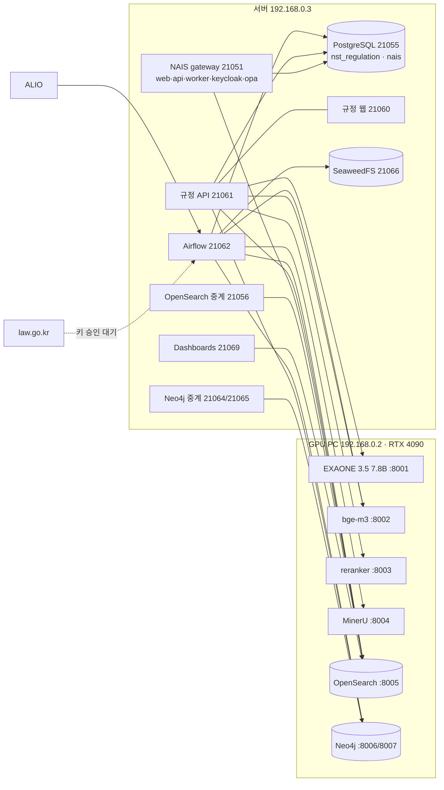

# NST 규정·법령 플랫폼 + NAIS 기술자료 (목차)

- 기준일: 2026-10-03 · 모든 수치는 작성 시점에 실제 DB·색인·그래프에서 다시 센 값이다 (각 문서에 쓴 SQL·쿼리가 함께 있다).
- 비밀번호·키 값은 문서에 넣지 않았다. 위치는 서버의 `/data/project/nst-regulation/.env`, `/data/project/nst-nexus/.env`.

## 1. 두 시스템 한눈에

| 구분 | 규정·법령 플랫폼 | NAIS (연구데이터 플랫폼) |
|---|---|---|
| 주소 | 웹 http://192.168.0.3:21060 · API :21061 · Airflow :21062 · Dashboards :21069 · Neo4j 브라우저 :21065 | 포털 http://192.168.0.3:21051 (gateway) |
| 저장소 | `/data/project/nst-regulation` (GitHub `nigel1513/nst-regualtion`) | `/data/project/nst-nexus` |
| 하는 일 | 25개 출연연·NST 내부규정 수집(ALIO) + law.go.kr 법령 미러 → 조·항·호·목 구조화 → 뷰어·검색·질의응답·개정 알림 | 연구데이터 업로드·검증·발행·검색, 프로젝트 |
| RDB | PostgreSQL 16 DB `nst_regulation` (스키마 regulation / law / ops) | 같은 PostgreSQL 서버의 DB `nais` |
| 검색 | GPU PC OpenSearch `reg-provisions` → r16 | 같은 클러스터 `nais-datasets` → v2 |
| 그래프 | GPU PC Neo4j (법령·규정 구조 그래프) | 같은 DB에 `Nais*` 라벨로 넣을 계획 |
| 배치 | Airflow 3.3.2, DAG 10개 | Dramatiq worker + index_queue |

## 2. 문서 목록

| 문서 | 내용 |
|---|---|
| [02-data-loading.md](02-data-loading.md) | **데이터 적재 상세**: 출처(ALIO·law.go.kr) → 원본 보관 → 변환·OCR → 조·항·호·목 파싱·계보 → 참조 해석 → 색인·그래프·알림 반영, Airflow DAG 10개, 수동 명령과 런북, 현재 적재 수치 |
| [03-rdb.md](03-rdb.md) | **PostgreSQL**: 34개 테이블·뷰의 모든 필드·제약·인덱스와 쓰는 쿼리, 설계 근거, ERD, 현황 |
| [04-search-graph.md](04-search-graph.md) | **OpenSearch**(필드 42개, 분석기, 하이브리드 검색, 릴리스 모델) + **Neo4j**(노드·관계·속성, 동기화, 근거 확장·관계도·이력·영향 분석 쿼리), 현황 |
| [05-services-infra-e2e.md](05-services-infra-e2e.md) | **서비스·인프라·E2E**: 서버·GPU PC 구성과 포트, 버전, API 33개, 화면별 E2E 흐름(조회·참조 팝업·검색·질의응답·개정 알림·일일 배치), 질의응답 평가, 운영, 테스트 |
| [NAIS 기술 문서](../../../nst-nexus/docs/tech/nais-technical-reference.md) (`/data/project/nst-nexus/docs/tech/nais-technical-reference.md`) | **NAIS**: 구성, 모듈, DB 스키마, `nais-datasets` 색인, 데이터 적재(업로드 → 검증 → 발행 → 준비도 → 색인), E2E, 현황, 계획 |

## 3. 문서 작성 중 확인된 할 일 (모아 보기)

| # | 내용 | 출처 문서 |
|---|---|---|
| 1 | law.go.kr OC 키 승인 대기 — 법령 DAG 3개 일시정지, `law` 스키마 0건 | 02, 03 |
| 2 | law.go.kr 법령은 현재 코드상 현행 **전체**를 받음 → 필요한 법령만으로 범위 조정 필요 | 02 |
| 3 | 미해석 참조 65,009건 중 약 41%는 같은 규정 안의 조문·별표 인용 → 파서 쪽 개선 여지 | 02 |
| 4 | 인덱스 보강: `provision_change.work_id`, `reference.work_id`, `review_task.target`; `work_alio_seq` 부분 인덱스가 쿼리 조건 누락으로 미사용 | 03 |
| 5 | 정리 대상: 미사용 `regulation.law_watch`, `nais` DB의 옛 `regulation` 스키마, 옛 색인 `nais-regulations-r14`(8.4GB), 멈춘 기록(pipeline_run 162, release 10) | 03, 04 |
| 6 | 질문 속 기관명("천문연")이 기관 선택 없이 검색할 때 일반 결과에 적용되지 않음 | 05 |
| 7 | GPU PC OpenSearch 데모 계정 남아 있음, 앱 계정 all_access → 외부 공개 전 정리 필요 | 04 |
| 8 | OCR 작업이 `gpu_pool`에 묶여 있지 않음; KIMM `.xls` 1건 형식 오인식; 서식이 별표 라벨로 묶임 | 02, 04 |
| 9 | KRIBB 수집 8회 연속 실패 기록 — 수정 코드가 Airflow 이미지에 들어간 것은 2026-10-03 재빌드부터 | 03 |
| 10 | NAIS 포털 웹이 mock 모드로 배포되어 있음 (`NEXT_PUBLIC_API_MOCKING=enabled`) | NAIS |
