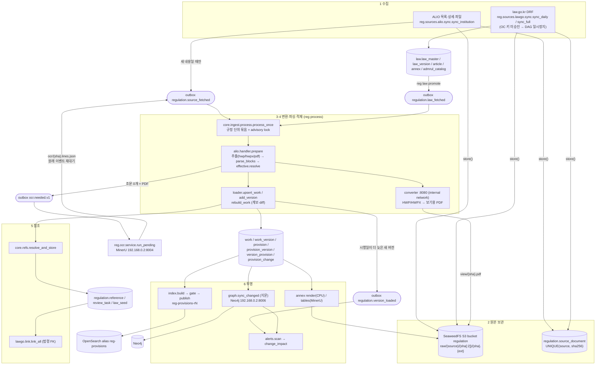

# 02. 데이터 적재 (수집 → 원본 보관 → 변환·OCR → 파싱 → 참조 → 투영)

- 대상: NST·출연연 내부규정·법령 플랫폼 (웹 21060, API 21061, Airflow 21062)
- 기준 코드: worktree `/data/project/nst-regulation-wt/m6-integration`, 브랜치 `feat/m6-integration`, 커밋 `bff3b1b`
- 기준 데이터: DB `nst_regulation`(스키마 `regulation`·`law`·`ops`), 2026-10-03 읽기 전용 SELECT로 다시 셌다(§9)
- 이 문서의 모든 내용은 코드나 데이터에서 직접 확인했다. 확인하지 못한 항목은 "미확인"으로 적었다.

---

## 0. 전체 흐름



### 0.1 단계별로 건드리는 테이블·토픽·보관소 키

| 단계 | 진입점 (모듈.함수) | 읽음 | 씀 (DB) | outbox 토픽 (씀 → 읽음) | 보관소 키 |
|---|---|---|---|---|---|
| 1a ALIO 기관 설정 | `alio.sync.load_institutions` | `config/sources/alio.yaml` | `regulation.institution` (UPSERT) | - | - |
| 1b ALIO 수집 | `alio.tasks.collect_institution` → `alio.sync.sync_institution` | `alio_rule`, `alio_rule_file` | `alio_rule`, `alio_rule_file`, `source_document`, `ops.fetch_run`, `ops.request_log`, `ops.pipeline_run` | `regulation.source_fetched` 씀 | `raw/alio/..` |
| 1c ALIO 폐지 대조 | `alio.tasks.reconcile` → `reconcile.run_reconcile` | `alio_rule`, `work` | `alio_rule.missing_since/abolish_state`, `work.status/abolished_on`, `review_task(ABOLISHED)` | - | - |
| 1d 법령 미러 | `lawgo.tasks.sync_daily / sync_full / fetch_annexes` | `law.*` | `law.law_master`, `law_version`, `article`, `annex`, `admrul_catalog`, `sync_run`, `change_log`, `source_document`, `ops.fetch_run`, `ops.request_log` | - | `raw/lawgo/..xml`, `law/annex/{seq}.html/.pdf` |
| 1e 법령 승격 | `lawgo.tasks.promote` → `promote.promote_all` | `reference.target_law_id`, `law.*` | `work.law_id`, `work_version.law_mst` | `regulation.law_fetched` 씀 | - |
| 3·4 처리 | `core.ingest.tasks.process_all` → `process.process_once` | `source_document`, `alio_rule`, `alio_rule_file` | `work`, `work_version`, `amendment_history`, `provision`, `provision_version`, `version_provision`, `provision_change`, `review_task`, `source_document.view_*/ocr_status` | `source_fetched`·`law_fetched` 읽음, `ocr.needed.v1`·`regulation.version_loaded` 씀 | `view/{sha}.pdf` |
| 3 OCR | `ocr.tasks.run_pending` → `ocr.service.run_pending` | `source_document` | `source_document.ocr_*`, `review_task(LOW_TEXT)` | `ocr.needed.v1` 읽음, `source_fetched` 재대기 | `ocr/{sha}.lines.json`, `.middle.json`, `.md` |
| 5 참조 | `refs.resolve_and_store`, `quality.record_reference_tasks` (처리 안에서) | 같은 기관 `work` 제목, `kr/law/·kr/admrul/` 제목 | `reference`, `law_seed`, `review_task(REFERENCE)` | - | - |
| 5 법령 FK | `lawgo.tasks.link` → `link.link_all` | `reference`, `law.law_master`, `law.article` | `reference.target_law_id/_article_id`, `review_task(REF_LAW_GONE/AMBIGUOUS)` | - | - |
| 6a 별표 이미지 | `core.annex_tasks.render_current` | 현행 판본·별표 위치 | - | - | `annex/{sha}/{path}.png`, `@n.png`, `manifest.json` |
| 6b 별표 표 | `core.annex_tasks.convert_tables` | manifest | - | - | `annex/{sha}/{path}.html`, manifest |
| 6c 색인 | `index.tasks.build / gate / publish / prune` | `work_version` 외 | `ops.release`, `ops.release_item`, `ops.embedding_cache` | - | OpenSearch `reg-provisions-r{id}` |
| 6d 그래프 | `graph.tasks.sync` → `sync.sync_changed` | `work`, `work_version`, `provision*`, `reference` | (Neo4j) | - | - |
| 6e 영향 분석 | `alerts.tasks.scan` → `scan.scan_once` | `provision_change`, Neo4j | `ops.change_impact` | `regulation.version_loaded` 읽음 | - |
| 공통 | `platform.runs.task_run` | - | `ops.pipeline_run` | - | - |

---

## 1. 출처

### 1.1 ALIO 내부규정

#### 엔드포인트 (`reg.sources.alio.client.AlioClient`, 인증 없음)

| 용도 | 호출 | 쓰는 필드 |
|---|---|---|
| 목록 `list_rules` | `GET https://www.alio.go.kr/occasional/findRuleList.json?type=apbaNa&word=<alio_name>&pageNo=<n>` | `data.page.totalPage`, `data.result[].{seq,title,apbaId,insdRuleDivis}` + 지문 필드 |
| 상세 `detail` | `GET /occasional/findRuleDtl.json?seq=<seq>` | `title`, `insdRuleDivis`, `retryRvsnYmd`(개정일), `idate`(게시일), `bFiles` |
| 파일 `download` | `GET /download/rulefiledown.json?fileNo=<fileNo>` | 본문 바이트 |

- 목록 검색어는 부분 일치다. 그래서 `apbaId == alio_apba_id`인 행만 쓴다.
- 응답 봉투가 `status != "success"`이거나 JSON이 아니면 `AlioError`를 던진다.
- `bFiles`는 `"151446|이름.pdf,186628|이름.pdf"` 형식이고 개정 이력 파일이 모두 들어 있다. 정규식 `,(?=\d+\|)`로 나눈다(`parse_bfiles`).

#### 요청 예절 (`reg.platform.http.PoliteClient`)

| 규칙 | 값·동작 |
|---|---|
| 최소 간격 | `REG_ALIO_MIN_INTERVAL` (기본 `alio_min_interval=1.5`초). 응답이 끝난 시점부터 잰다 |
| 429·503 | `Retry-After`(없으면 60초, 상한 600초)만큼 쉰다. 간격을 두 배로 늘린다(상한 30초). 연속 20회 성공하면 원래 간격으로 돌아온다 |
| 403·3xx·5xx(503 제외) | `StopCollecting`으로 즉시 중지한다 |
| 나쁜 응답 연속 3회 | `StopCollecting` |
| 요청 기록 | `ops.request_log` (autocommit 별도 연결 `open_log_conn`이라 롤백돼도 남는다) |

#### 기관 설정 (`config/sources/alio.yaml`)

- 한 줄에 기관 하나다. 필드는 `code`, `name`, `kind`(NST|GRI), `alio_apba_id`, `alio_name`, `active`, `aliases`이다.
- `load_institutions`가 `regulation.institution`에 UPSERT한다. 일 배치 대상은 `active AND alio_apba_id IS NOT NULL`이다.

| 구분 | 기관 (ALIO apbaId) |
|---|---|
| 활성 25 | NST(C0909), KIST(C0159), KBSI(C0177), NIMS(C0441), KASI(C0266), KRIBB(C0212), KISTI(C0161), KIOM(C0291), KITECH(C0213), ETRI(C0251), KICT(C0154), KRRI(C0269), KRISS(C0286), KFRI(C0226), WIKIM(C0431), KIGAM(C0263), KIMM(C0174), KIMS(C0381), KARI(C0292), KIER(C0229), KERI(C0245), KRICT(C0300), KIT(C0384), KAERI(C0235), KFE(C0382) |
| 비활성 | NSR 국가보안기술연구소: `alio_apba_id: null`, `active: false`. ALIO 검색 결과가 0건이다(공시 대상이 아님) |
| 보류 (주석 처리) | NIGT 국가녹색기술연구소(C0878): 연구회 소관 포함 여부를 확인한 뒤 추가한다 |

- 활성 25곳은 NST 1곳과 출연연 24곳이다. DB에서도 `active AND alio_apba_id IS NOT NULL`이 25건이다.

#### 변경 감지 (목록 지문)

| 항목 | 내용 |
|---|---|
| 지문 | `client.FINGERPRINT_KEYS = (submissionNo, ruleStDa, idate, crctYn, reSbmtYn)`를 `\|`로 이어 붙인다 |
| 같을 때 | `alio_rule.list_fingerprint`가 같고 받은 파일(`status='fetched'`)이 1개 이상이면 상세·파일을 건너뛴다. `last_seen_at = now()`만 갱신한다 |
| 다를 때 | 상세를 받아 `_upsert_rule`을 하고, `bFiles` 중 아직 받지 않은 `fileNo`만 내려받는다 |
| fileNo 중복 | 이미 `fetched`인 fileNo는 다른 규정 것이라도 다시 받지 않는다. 같은 `bFiles` 안의 중복도 거른다 |
| 형식 판별 | `platform.sniff.sniff`: `%PDF` → pdf, OLE 매직 → `application/x-hwp`, `PK` + 파일명 `.hwpx` → hwpx. 그 밖은 `alio_rule_file.status='rejected'`, `reject_reason='형식 불명 (앞 16바이트)'`이다. 거부된 fileNo는 다음 수집에서 다시 시도한다(`_record_file`의 `WHERE status='rejected'`) |
| 커밋 단위 | 규정 하나(`seq`)마다 커밋한다. 중간에 멈춰도 다시 돌리면 이어서 받는다 |
| 완결 여부 | `limit` 없이 목록 끝까지 예외 없이 돌았을 때만 `complete=True`이다. 시작 시각은 DB `now()`이고, 이것이 `started_at`이 된다 |

#### 제목 null 처리

- `detail()`에서 제목이 null이면 `"제목 없음 (ALIO seq {seq})"`으로 채워 수집을 이어 간다.
- 실데이터: KRIBB seq 47430이다(DB `alio_rule.title = '제목 없음 (ALIO seq 47430)'`).
- 이 수정 전에는 `reg_alio_daily`의 `alio.collect:KRIBB`가 `AttributeError: 'NoneType' object has no attribute 'strip'`로 실패했다. `ops.pipeline_run`에 2026-10-02 실패가 8건 남아 있다.

#### 응답 구조 점검 (canary)

- `reg_alio_daily`의 첫 태스크 `alio.tasks.active_institutions`가 `canary.run_canary`를 먼저 부른다.
  - 요청은 KASI 목록 1쪽과 seq 47852 상세다.
- 구조가 다르면 `AlioSchemaChanged`로 실패하고 수집 태스크는 하나도 돌지 않는다. 점검·장애는 `AlioError`이고 Airflow가 재시도한다.
- CLI `reg alio canary`는 0 정상, 2 구조 변경, 1 점검·장애를 돌려준다.

#### 폐지 감지 (`reg.sources.alio.reconcile`)

| 단계 | 함수 | 규칙 |
|---|---|---|
| 1 | `run_reconcile(results)` | `complete=True`인 기관 결과만 대조한다. 실패한 기관은 `skipped`에 넣는다 |
| 2 | `mark_missing` | `last_seen_at >= started_at`이면 다시 나타난 것이다. `missing_since`·`abolish_state`를 지운다 |
| 3 | 급감 보호 | 알려진 규정이 10건(`SHRINK_MIN_KNOWN`) 이상이고, 이번에 본 수가 그 50%(`SHRINK_RATIO`) 미만이면 사라짐을 기록하지 않는다(`guard`) |
| 4 | 사라짐 | `last_seen_at < started_at`이면 `missing_since = coalesce(missing_since, 오늘(KST))` |
| 5 | 후보 | `missing_since <= 오늘-2`(3일째)이고 work가 있으면 `abolish_state='CANDIDATE'` |
| 6 | `project` | 원장을 `work.status`(ACTIVE·ABOLISHED_CANDIDATE·ABOLISHED)·`abolished_on`과 `review_task(kind='ABOLISHED', target='work:{id}')`에 투영한다 |
| 7 | 사람 판단 | `reg alio abolish WORK_ID`로 확정한다(폐지일 = `missing_since`). `--reject`이면 반려한다 |

- DAG에서는 `reconcile`이 `trigger_rule="all_done"`이다. 정상 종료된 기관이 하나도 없으면 대조를 건너뛴다.
- 현재: `missing_since`·`abolish_state`가 있는 규정은 0건이다. `work.status`는 모두 `ACTIVE`(3,839)이다.

### 1.2 law.go.kr (`reg.sources.lawgo`)

#### 키·요청

| 항목 | 내용 |
|---|---|
| 키 | `REG_LAWGO_OC`. 요청할 때만 붙인다. 요청 로그·오류에는 `OC=***`로 가린다(`client.redact`) |
| 간격 | 1.0초 이상(`MIN_INTERVAL`, `REG_LAWGO_MIN_INTERVAL`) |
| 오류 판별 | 오류도 HTTP 200으로 온다. 그래서 `client.check`가 본문으로 판별한다 |
| 오류 종류 | `미신청된 목록/본문` → `KeyNotApproved`. `<Response><result>` → `KeyRejected`. `<Law>일치하는…` → `NotFound`. XML이 아니면 `ResponseChanged` |

#### 쓰는 API (`client.LawGoClient`)

| 메서드 | 요청 | 쓰는 곳 |
|---|---|---|
| `search("law", sort="ddes")` | `/DRF/lawSearch.do?target=law&type=XML&display=100` | 현행 법령 목록. 일: 최신순으로 훑기(`scan_recent`), 주: 전체(`list_all`) |
| `search("admrul")` | `target=admrul` | 행정규칙 카탈로그(`law.admrul_catalog`) |
| `search("licbyl", search=2, query=법령명)` | 법령 별표 목록 | `관련법령ID`로 거른다 |
| `search("admbyl", search=2, query=행정규칙명)` | 행정규칙 별표 목록 | |
| `service("law", MST)` | `/DRF/lawService.do?target=law&MST=…&type=XML` | 법령 본문 → `parse_law_xml` |
| `service("admrul", ID)` | `target=admrul&ID=…` | 행정규칙 본문 → `parse_admrul_xml` |
| `annex_html(licbyl|admbyl, ID)` | `type=HTML` | 별표 HTML 원본(3KB 껍데기)을 그대로 저장한다 |
| `file(/LSW/flDownload.do?…)` | 별표서식 PDF (OC 불필요) | `annex.store_pdf: true`일 때 저장한다 |

#### 범위 정책 (`config/sources/lawgo.yaml`)

| 대상 | 범위 |
|---|---|
| 법령(`law`) | 현행 중 **필요한 법령만** 미러한다(사용자 결정 2026-10-03, `scope.py`). 대상 = (a) `law.include` 시드 15개 + `promote.laws`, (b) 내부규정 인용 중 법령형 이름(`법·법률·시행령·시행규칙·영·…에 관한 규정`으로 끝남, 일반 이름 `법·시행령·동법…` 제외, 내부 work로 풀린 인용 제외), (c) 각 법령의 시행령·시행규칙. 순서는 설정 → 인용 많은 순, 상한 `law.max_targets: 4000`. 목록 행과는 정식명·약칭의 정규화 이름으로 맞추고, 약칭으로 맞으면 정식명의 시행령·시행규칙을 받는다. 이미 미러된 법령은 계속 따라간다. 목록 대조·폐지 판정은 여전히 전체 목록으로 한다. 확인: `reg law targets` |
| 행정규칙(`admrul`) | 필요한 것만 받는다(`select.selected_admruls`). 대상은 내부규정이 인용한 이름(`reference.target_name` ∪ `law_seed`), `admrul.include`, `promote.admruls`를 카탈로그 정규화 이름으로 맞춘 현행 행이다 |
| 판본 | 법령당 현행 1개다(`law.law_version`, `is_current`). 조문(`law.article`)은 현행만 유지하고, 지난 판본은 판본 정보만 남긴다 |
| 화면 판본 줄 | `api.edition_line` → `[시행 2026. 9. 11.] [법률 제21421호, 2026. 3. 10., 일부개정]` |
| 별표 | HTML과 PDF 원본만 보관하고 파싱하지 않는다. 실행당 본문 상한은 `annex.body_limit_per_run: 2000`이다 |
| 승격 | `promote.laws` 10개 + 내부규정이 인용해 `target_law_id`가 잡힌 법령을 `regulation.work`(`kr/law/…`, `kr/admrul/…`)로 올린다 |
| 폐지 안전장치 | 전체 목록이 기존 현행의 95%(`abolish_min_ratio`) 미만이면 폐지 처리 없이 `ResponseChanged`로 실패한다 |
| 일 변경분 | 마지막 성공일에서 `buffer_days: 7`일 이전 공포일이 나오면 목록 넘김을 멈춘다 |

#### 현재 상태 (2026-10-03 확인)

- `reg law status --canary` 결과: `KeyNotApproved`(`OC 키가 'law 목록 1쪽'에 대해 승인되지 않았습니다(미신청된 목록/본문에 대한 접근)`). 키 승인을 기다리는 중이다.
- Airflow `airflow dags list` 결과: `reg_law_daily`, `reg_law_full`, `reg_law_link`가 `is_paused=True`이다.
- `law.law_master`와 `law.sync_run`은 0행이다. 미러 최초 적재를 아직 하지 않았다.
- `regulation.work`의 `kr/law/…` 10건은 미러가 아니다. 2026-10-01 15:12(UTC)에 옛 M1 수집이 남긴 `regulation.law_fetched` 이벤트 10건으로 적재됐다(`lawgo.handler.prepare`의 "구 law_sync 이벤트 (판정 R11)" 경로). 이 10건이 `promote.laws` 10개와 같다. `work.law_id`는 비어 있다.
- 키가 승인된 뒤의 순서: `reg law status --canary` → `reg law full` → `reg_law_*` DAG 일시정지 해제.

---

## 2. 원본 보관

| 항목 | 내용 |
|---|---|
| 보관소 | SeaweedFS S3 (compose 서비스 `storage`, 이미지 `chrislusf/seaweedfs:4.48`). 호스트는 `127.0.0.1:21066`, compose 안에서는 `http://storage:8333` |
| 버킷 | `regulation` (`REG_S3_BUCKET`, `settings.s3_bucket` 기본값). `reg bucket ensure`가 만든다 |
| 클라이언트 | `platform.storage.blob.S3BlobStore` (boto3, path-style, s3v4) |
| 함수 | `platform.archive.store(conn, blob, source, url, content, kind, meta)` |
| 중복 제거 | `sha256(content)`로 `(source, sha256)`를 먼저 조회한다. 있으면 `is_new=False`로 기존 행을 돌려준다. 키가 이미 있으면 put을 생략한다. DB 제약은 `UNIQUE(source, sha256)`이다 |
| 새 내용일 때만 | ALIO는 `doc.is_new`일 때만 `regulation.source_fetched`를 낸다. 같은 내용 파일이 다른 fileNo로 와도 이벤트는 한 번이다 |

### 2.1 보관소 키 체계

| 키 | 만드는 곳 | 내용 |
|---|---|---|
| `raw/alio/{sha[:2]}/{sha}.{pdf|hwp|hwpx}` | `archive.store` (`blob_key`) | ALIO 원본 |
| `raw/lawgo/{sha[:2]}/{sha}.xml` | `lawgo.sync.ingest_law/ingest_admrul` | DRF 본문 XML |
| `view/{sha}.pdf` | `alio.handler._view` | HWP·HWPX를 바꾼 보기용 PDF |
| `ocr/{sha}.lines.json` · `.middle.json` · `.md` | `ocr.service._one` | OCR 줄(쪽·원본 PDF 좌표), MinerU 원본 결과, 마크다운 |
| `annex/{sha}/{path}.png`, `{path}@{n}.png`, `manifest.json` | `core.annex.render_order` | 별표 영역 이미지와 목록 |
| `annex/{sha}/{path}.html` | `core.annex_tables.convert_version` | 별표 표 HTML(정제됨) |
| `law/annex/{seq}.html`, `.pdf` | `lawgo.mirror.store_annex_body` | 법령·행정규칙 별표 원본 |

### 2.2 `regulation.source_document` 주요 열

| 열 | 값 |
|---|---|
| `source` | `alio` \| `lawgo` (CHECK) |
| `sha256`, `blob_key`, `mime`, `size_bytes`, `url` | 원본 |
| `source_meta` | ALIO는 `{seq, file_no, file_name, institution_code, institution_name}`, 법령은 `{law_id, mst, name}` |
| `view_blob_key`, `view_status` | `pending` \| `ready` \| `failed` \| `not_needed` |
| `ocr_status`, `ocr_blob_key`, `ocr_engine` | `pending` \| `ready` \| `failed` \| `not_needed` \| NULL |

---

## 3. 변환·텍스트 추출·OCR

### 3.1 텍스트 추출 (`reg.core.extract.extract`)

| mime | 함수 | 방식 |
|---|---|---|
| `application/pdf` | `extract.pdf.extract_pdf` | 글자 층(쪽·bbox 포함). 두 쪽 모아찍기 판별은 `extract.layout` |
| `application/x-hwp` | `extract.hwp.extract_hwp` | OLE `BodyText/Section*`의 `HWPTAG_PARA_TEXT(67)`. 확장 한자는 UTF-16 서로게이트 쌍을 합친다(`surrogatepass`) |
| `application/hwp+zip` | `extract.hwpx.extract_hwpx` | HWPX XML |
| 그 밖 | `ValueError("지원하지 않는 형식")` | |

- 조문 텍스트는 변환기를 거치지 않는다. 원본에서 직접 뽑는다.

### 3.2 보기용 PDF 변환기 (`reg.platform.convert`, `infra/converter`)

| 항목 | 내용 |
|---|---|
| 지원 형식 | **HWP·HWPX만** PDF로 바꾼다(`CONVERT_KINDS = ("hwp", "hwpx")`, 서버 `KINDS = ("hwp", "hwpx")`). DOC·XLS 변환 경로는 코드에 없다 |
| 엔진 | LibreOffice + H2Orestart 컨테이너 `nst-regulation/converter:0.2` |
| Airflow 안 | `HttpConverter(REG_CONVERTER_URL=http://converter:8080)`, `POST /convert?kind=hwp|hwpx`. 연결 실패는 2초 간격으로 3회 시도한다 |
| 네트워크 | compose 네트워크 `convert`(`internal: true`)에만 붙는다. 외부로 나갈 수 없다. Airflow 컨테이너는 `default`, `nais`, `convert`에 붙는다 |
| 호스트 CLI | `REG_CONVERTER_URL`이 없으면 `DockerConverter`가 `docker run --network none …`으로 실행한다 |
| 결과 | `view/{sha}.pdf`, `view_status='ready'`. 실패하면 `view_status='failed'`이고 파싱은 계속한다. PDF 원본은 `view_blob_key = blob_key`, `not_needed`이다 |
| 재사용 | 이미 `ready`면 변환하지 않고 기존 PDF로 조항 위치만 다시 찾는다(`anchor.locate`) |

- `.xls`·`.doc`도 OLE 매직으로 시작한다. 그래서 `sniff`가 `application/x-hwp`로 받아들이고, 이후 `extract_hwp`에서 실패한다.
- 실제 1건: KIMM `[원규전문]08-04-01 별정직성과급표.xls`, outbox id 7040이다. `OSError: file not found`로 3회 실패해 보류(parked)됐다(§9).

### 3.3 OCR 필요 판정 (`reg.platform.ocr_hooks`)

- 처리기(`alio.handler.prepare`)가 파싱한 결과에 `unit == "article"`이 하나도 없으면 다음을 한다.
  1. `request_ocr`를 부른다.
  2. `review_task(kind='LOW_TEXT', target='source:{id}')`를 남긴다.
  3. `None`을 돌려준다. 버전을 만들지 않고 이벤트는 처리 완료로 둔다.

| 조건 | 결과 |
|---|---|
| PDF가 아님 | `None` (OCR 대상 아님) |
| `ocr_status`가 이미 있음 | 그 상태를 그대로 돌려준다(요청은 원본당 1회) |
| 한글이 쪽당 30자(`MIN_HANGUL_PER_PAGE`) 미만 | `pending`, 사유 `no_text` |
| `제 조` 모양(숫자 빠짐)이 3회(`MIN_BLANK_ARTICLES`) 이상 | `pending`, 사유 `broken_digits` |
| 그 밖 | `not_needed` (조문 형식이 아닌 문서) |

- `pending`이면 outbox `ocr.needed.v1 {source_document_id, topic, payload, reason}`을 쓴다.
- 갱신은 `ocr_status IS NULL` 조건으로 하므로 동시 작업자 중 한 번만 쓴다.

### 3.4 OCR 실행 (`reg.ocr.service.run_pending`, MinerU)

| 항목 | 내용 |
|---|---|
| 엔진 | `platform.ocr.MineruOcr` → `platform.mineru.MineruClient` (MinerU 4 V1 API, GPU PC `REG_MINERU_URL=http://192.168.0.2:8004`, `REG_MINERU_API_KEY`) |
| 호출 순서 | `POST /v1/uploads` → PUT → `complete` → `POST /v1/parse/jobs` → 폴링 → `GET /v1/files/{id}/content` |
| 모드 | `ocr_mode="ocr"`, `tier="standard"`, 출력 `middle_json` + `markdown`. 엔진 이름은 `mineru-{parser_version}-standard` (실데이터 `mineru-4.0.10-standard`) |
| 결과 저장 | `ocr/{sha}.lines.json`(줄·쪽·bbox[pt, 원본 PDF 좌표]), `.middle.json`, `.md`. 그다음 `ocr_status='ready'` |
| 재파싱 연결 | `requeue`가 원래 `regulation.source_fetched` 이벤트를 `processed_at=NULL, attempts=0`으로 되돌린다. 처리기는 `ocr_blob_key`가 있으면 OCR 줄로 파싱하고, 성공하면 `close_low_text`로 LOW_TEXT를 닫는다 |
| 시도 | `MAX_ATTEMPTS = 2`. 2회째 실패하면 `ocr_status='failed'`이고 LOW_TEXT 사유를 남긴다 |
| GPU 꺼짐 | `OcrUnavailable`이면 롤백하고 시도로 세지 않는다. 같은 이벤트에서 3회(`UNAVAILABLE_STRIKES`)째면 시도 1회로 센다 |
| 동시성 | `FOR UPDATE SKIP LOCKED`, 이벤트마다 커밋. 한 실행에서 같은 이벤트는 한 번만 시도한다(`tried`) |
| 옛 LOW_TEXT 소급 | `reg ocr enqueue-low-text [--dry-run]` |

### 3.5 별표 표·이미지 (M6-6)

| 단계 | 함수 | 내용 |
|---|---|---|
| 이미지 (CPU) | `core.annex.render_order` (pypdfium2, scale 2.0 ≈ 144dpi) | 별표 머리 줄 위치부터 다음 조항 머리 직전까지를 쪽(모아찍기는 반쪽)마다 PNG로 만든다. 별표당 최대 30조각이다. 위치 요약값(`anchor_digest`)이 같으면 다시 그리지 않는다 |
| 표 (GPU) | `core.annex_tables.convert_version` + `annex_mineru.MineruTables` | 판본 하나당 MinerU를 한 번 호출한다. 표 블록을 별표 조각과 겹침으로 배정한다. HTML은 `sanitize_table_html`로 정제한다 |
| 상태 | manifest `items[path].table.status` | `ok`, `no_table`, `failed`(3회까지 재시도), `unavailable`(다음 실행), `none`(아직 안 함) |
| 대상 | `annex_tasks.current_versions` | 현행 판본 중 별표가 있고 보기용 PDF가 있으며 위치를 찾은 것 |

---

## 4. 파싱·적재·계보

### 4.1 처리 루프 (`reg.core.ingest.process.process_once`)

| 항목 | 내용 |
|---|---|
| 처리기 등록 | `reg.wiring.register_sources()`가 `alio.HANDLERS`(topic `regulation.source_fetched`, group `seq`)와 `lawgo.HANDLERS`(`regulation.law_fetched`, group `law_id`)를 등록한다 |
| 미등록 토픽 | `regulation.%fetched` 대기 이벤트의 토픽에 처리기가 없으면 `RuntimeError`로 멈춘다(`_check_unhandled`) |
| 묶음 | 첫 이벤트를 `FOR UPDATE SKIP LOCKED`로 잡고, 같은 토픽·같은 그룹 키(ALIO `seq`)의 대기 이벤트를 함께 잡는다. `pg_advisory_xact_lock(hashtext('topic:key'))` |
| 파일 단위 | 이벤트마다 savepoint(`conn.transaction()`) 안에서 `prepare` → `_load`(`upsert_work` + `add_version`)를 한다. 실패하면 `_fail` |
| 묶음 끝 | work마다 `rebuild_work` → `resolve_and_store` → `record_reference_tasks` → `emit_version_events`를 하고, 판본마다 `quality.record(check())`를 한다. 그다음 `processed_at=now()`이다 |
| 실패 | `attempts += 1`, `last_error`를 남긴다. `MAX_ATTEMPTS = 3`에 이르면 대기열에서 빠진다(parked, 집계 `parked`) |
| 조문 0개 | 이벤트는 처리 완료(`ok`)로 두고 버전은 만들지 않는다(LOW_TEXT 검수) |
| 멱등 | `add_version`은 `(work_id, source_document_id)`가 이미 있으면 그 id를 돌려준다. `rebuild_work`는 그 work의 계보를 지우고 다시 만든다 |
| 반복 | `tasks.process_all`은 `claimed`가 0이거나 `ok`가 0일 때까지 100건씩 돈다 |

### 4.2 work 식별자

| 종류 | 규칙 |
|---|---|
| 내부규정 | `loader.work_key_for_regulation`: 먼저 `external_ids->>'alio_seq'`로 찾는다. 없으면 `kr/reg/{기관코드}/{제목에서 공백·가운뎃점 제거}`이고, 이미 쓰인 키면 `~{seq}`를 붙인다 |
| 법령 | `lawgo.ids.work_id_for(law_id)` → `kr/law/{법령ID}` · `kr/admrul/{행정규칙ID}` |
| 판본 id | `{work_id}@{시행일}`. 시행일이 없으면 `{work_id}@undated-{source_document_id}`이고, 겹치면 `.2`, `.3`을 붙인다 |

### 4.3 구조 파서 (`reg.core.parse.parse_blocks`, `PARSER_VERSION = "2026.10.6"`)

- 읽는 순서는 머리부(제목·원규분류·개정 이력·목차) → 본문 → 부칙 → 별표·별지이다.
- 본문 시작은 괄호 제목이 있는 첫 조문이다(목차 줄 제외). 그 바로 앞(3줄 안)에 `제1장`이 있으면 거기부터 시작한다.

| 단위(`unit`) | 정규식·규칙 | 경로(`path`) 예 |
|---|---|---|
| chapter 장 | `^제\s*(\d+)\s*장`, 직전 장 번호 + 1일 때만 | `c2` |
| section 절 | `^제\s*(\d+)\s*절`, 장 안에서만 | `c2-s1` |
| article 조 | `RE_ARTICLE` + 괄호 제목(또는 `삭제`), 번호가 증가할 때만 | `a12`, `a12-2`(조의2) |
| paragraph 항 | 원문자 `①…⑳`. `…다.②`처럼 붙은 항은 `_pre_split`이 나눈다 | `a12.p1` |
| item 호 | `^(\d{1,3})(의\d+)?\.(?!\d)` (날짜·소수 제외) | `a12.p1.i3` |
| subitem 목 | `^([가-하])\.` | `a12.p1.i3.s가` |
| supplement 부칙 | `^부\s*칙` + `<날짜>` 또는 `제N호` | `supp@2024-01-17`, 날짜가 없으면 `supp#1`, 같은 날짜면 `~2` |
| supp_article | 부칙 안의 조 | `supp@2024-01-17/a1` |
| annex 별표·별지 | `annex_heading`: 줄머리 `[<〈`로 시작하거나 뒤가 비었을 때만 머리로 본다 | `annex1`, `form3-2` |

- 마무리(`_finish`)
  - `normalize_glyphs`가 PUA 글리프와 괘선을 바꾼다.
  - `split_notes`가 `<개정 …>` 같은 주석을 `annotations`로 뺀다.
  - `삭제`뿐인 조항은 `deleted=True`로 둔다.
- 줄 정리
  - `despace_line`이 한 글자씩 띄운 줄을 붙인다.
  - `Joiner`가 줄을 잇는다(어절 사전 `quality build-lexicon`).
- 같은 경로가 다시 나오면 `add_version`이 `~n`을 붙인다.
- 통계는 `parse_stats`(`articles`, `paragraphs`, `items`, `supplements`, `annexes`, `unparsed_lines`)이다.

### 4.4 시행일 판정 (`reg.core.effective.resolve`)

우선순위는 다음과 같다.

| 순위 | 근거(`effective_basis`) | 상태(`effective_status`) |
|---|---|---|
| 0 | `api` (법령 XML의 시행일자) | CONFIRMED |
| 1 | `supplement` 마지막 부칙의 "(날짜)부터 시행" 또는 "공포한 날부터 시행"(부칙 머리 날짜) | CONFIRMED. 개정 이력 마지막 날짜 ≠ 부칙 머리이거나, ALIO 개정일이 {이력, 시행일, 부칙 머리} 중 어디에도 없으면 CONFLICT |
| 2 | `history` 개정 이력표의 마지막 날짜 | UNCERTAIN |
| 3 | `alio` ALIO `retryRvsnYmd`. 그 규정의 마지막(ord 최대) 파일에만 쓴다 | UNCERTAIN |
| 4 | `filename` 파일명에 `YYYY년 M월`이 있음 | UNCERTAIN, 시행일 없음 |
| 5 | `none` | UNCERTAIN, 시행일 없음 |

- 부칙의 "다만, 제N조는 …부터"는 조 단위 `effective_from_override`가 된다.
- 품질 검사(`quality.check`)
  - CONFLICT → `CONFLICT`
  - UNCERTAIN → `EFFECTIVE_DATE`
  - 조문이 없거나 평균 10자 미만 → `LOW_TEXT`
  - 조 번호 빈칸 → `PARSE(gap)`
  - 목차와 본문 차이 → `PARSE(toc)`
- `PARSE`·`CONFLICT`·`LOW_TEXT`가 있으면 `work_version.validation_status = 'REVIEW'`, 없으면 `PASSED`이다.

### 4.5 판본 상태와 계보 (`loader.rebuild_work`)

| `version_state` | 조건 |
|---|---|
| UNDATED | `effective_from IS NULL` (검색 색인에서 빠진다) |
| FUTURE | 시행일 > 오늘(KST) |
| CURRENT | 시행일 ≤ 오늘이고, 다음 판본이 없거나 다음 시행일 > 오늘 |
| HISTORICAL | 다음 판본 시행일 ≤ 오늘 |

- `effective_to`는 다음 dated 판본의 시행일이다.
- 계보 테이블

| 테이블 | 뜻 |
|---|---|
| `work` | 규범문서 (`kind`, `title`, `institution_id`, `external_ids`, `status`, `law_id`) |
| `work_version` | 판본 (`parsed` JSON 전체, `parse_stats`, `parser_version`, 시행일, `version_state`, `validation_status`) |
| `amendment_history` | 머리부 개정 이력 |
| `provision` | 조항 계보 (`lineage_key = {path}@{처음 나온 판본}`) |
| `provision_version` | 조항 내용 판본 (`text_norm_hash` = 공백·가운뎃점을 뺀 머리말·본문 sha256 앞 32자) |
| `version_provision` | 판본 ↔ 조항 판본 (`ord`, 판본별 `anchor` = 쪽·bbox) |
| `provision_change` | 판본 간 diff |

- diff 규칙(시행일 순으로 직전 dated 판본과 비교)

| 종류 | 판정 |
|---|---|
| 같은 경로 | 이전 판본의 같은 path와 잇는다 |
| RENUMBERED | 경로가 새로 나왔고 조·항·호 단위이며, 짝을 못 찾은 이전 조항 중 `text_hash`가 같은 것이 있음 |
| MODIFIED | 같은 계보, 본문·머리말·삭제 여부가 다름 |
| ANNOTATION_ONLY | 본문은 같고 주석·조별 시행일만 다름 |
| ADDED | 이전 판본에 없음 |
| DELETED | 이전 판본에만 있음 |
| (변화 없음) | 같은 `provision_version` 행을 다시 쓴다 |

- 개정 이벤트: `emit_version_events`는 이번 묶음에서 더한 판본 중 기존 판본보다 시행일이 늦은 것마다 `regulation.version_loaded {work_id, version_id}`를 낸다. 처음 적재나 과거 판본은 내지 않는다.

### 4.6 알려진 파싱 문제

| 문제 | 확인 결과 |
|---|---|
| 글리프 반복 "중중중" | 현재 데이터에서 `provision_version.text ~ '중중중'`은 5행, work 1개(`kr/reg/KRICT/중소기업지원운영지침`)이다. 한글 한 글자가 3번 이어지는 행(`([가-힣])\1\1`)은 392행, work 136개다. 이 넓은 수에는 정상 텍스트도 섞여 있을 수 있다 |
| 호가 뒤 본문을 삼킴 ("26건") | 26이라는 수를 코드·보고서·데이터에서 재현하지 못했다(**미확인**). 근사 지표: 현행 판본에서 조문 머리 패턴(`quality_report.missed_article`)을 품은 항목은 item 83 · subitem 13 · paragraph 92이다. 3,000자를 넘는 item은 36, subitem은 11이다 |
| 그 밖 (M6-6 보고서 §5) | 이름이 멀리 앞에 있는 긴 개정 부칙 나열, 띄어 쓴 법령 이름(`공무원 여비 규정 제3조`), 맨 낱말 인용("법", "시행령"), HWP 보기용 PDF의 PUA 네모(변환기 글꼴) |
| 검수 큐 | 아래 표 |

| `review_task.kind` | OPEN | RESOLVED |
|---|---:|---:|
| REFERENCE | 21,680 | 3,458 |
| EFFECTIVE_DATE | 1,400 | 0 |
| CONFLICT | 1,351 | 0 |
| LOW_TEXT | 1,130 | 258 |
| PARSE | 1,047 | 0 |

- LOW_TEXT OPEN 1,130의 구성
  - 판본 단위(평균 10자 미만 등) 914건
  - 원본 단위(`source:`) 216건: OCR 상태 없음(HWP 등) 109, `not_needed` 106, `ready` 1

---

## 5. 참조 추출·해석

### 5.1 추출 (`reg.core.refs.extract_refs`, 규칙 기반 `extractor='rule…'`)

| 관계(`rel_type`) | 판정 (`_rel`·후처리) |
|---|---|
| EXCEPTION | 인용 뒤 `…에도 불구하고` |
| MUTATIS | 인용 뒤 문장 안에 `준용` |
| BASIS | 외부 인용 뒤 `…에 따라/따른/의하여/의한/근거하여` |
| DELEGATION | `따로 정한다`·`정하는 바에 따른다`(대상 없음 `NONE`), `X규정에서 정한다`(대상 X) |
| IMPLEMENTS | 목적 조문의 `X 제N조에 의거 … 정함`, `X에서 위임한` |
| CITATION | 그 밖 |

| 추출 종류(`kind`) | 예 |
|---|---|
| internal | `제5조제2항`, `같은 조`, `전항` (같은 문서) |
| annex | `별표 1` |
| external | `「근로기준법」 제74조` (낫표 이름) |
| named / named_annex | 괄호 없는 `연구관리규정 제2조`, `근로기준법 제74조` |
| delegation / delegation_named | 위임 |

- 문서 안 약칭 정의(`(이하 "법"이라 한다)`)로 "법 제24조"를 그 법으로 잇는다(`collect_abbreviations`).

### 5.2 해석 (`resolve_and_store`)

- work마다 기존 `reference`를 지우고 다시 만든다(멱등).

| 대상 | 해석 | `target_kind` | `resolution` |
|---|---|---|---|
| 내부 조문 | 인용 조항 판본이 들어 있는 **모든** 판본의 경로 목록 중 하나에 있음 (2026-10-03 전에는 가장 늦은 판본만 봤다) | PROVISION | RESOLVED / UNRESOLVED |
| 내부 별표 | 같은 방식 | ANNEX | RESOLVED / UNRESOLVED |
| 이름 → 제목 1건 | 같은 기관 `work` 제목 + `kr/law/`·`kr/admrul/` 제목. 기관 접두어(정식명·코드·약칭·`연구원` 등)를 떼고도 맞춘다(`match_title`) | PROVISION / WORK / ANNEX | 경로가 있으면 RESOLVED. 법령이면 경로 확인 없이 RESOLVED |
| 이름 → 여러 건 | | EXTERNAL_UNRESOLVED | AMBIGUOUS |
| 이름 → 없음 | 법령 같은 이름은 `regulation.law_seed`에 넣는다(미러 행정규칙 선별·승격 입력) | EXTERNAL_UNRESOLVED | UNRESOLVED |
| `name-work` 추출인데 못 찾고 법령형 이름도 아님 | 참조를 남기지 않는다 | - | - |

- `record_reference_tasks`: 현행 판본의 `EXTERNAL_UNRESOLVED`마다 `review_task(REFERENCE, target='ref:{work}:{path}:{span}:{name}')`를 만들고, 사라진 것은 RESOLVED로 닫는다.
- 법령 외래키(`lawgo.link.link_all`)
  - 이름은 정식명 → 약칭 → 정규화 이름 순으로 찾는다.
  - 조문은 가장 구체적인 경로부터 `law.article`에 맞추고, `target_law_id`·`target_law_article_id`만 쓴다.
  - 폐지·삭제는 `REF_LAW_GONE`, 후보가 여럿이면 `REF_LAW_AMBIGUOUS`이다.
  - 미러가 비어 있어 현재 `target_law_id`가 채워진 행은 0건이다.

### 5.3 재해석 (`reg refs reresolve`, `reg_process.refs_reresolve`)

- 처리 순서 때문에 먼저 처리된 규정이 나중에 적재된 규정을 가리키면 UNRESOLVED로 남는다. 해석 규칙을 바꾼 뒤의 옛 결과도 그대로 남는다.
- `reg.core.refs.reresolve`: 대상 work마다 `resolve_refs`(읽기만)로 다시 해석하고, **결과가 저장된 것과 다를 때만** 지우고 다시 쓴 뒤 `record_reference_tasks`를 한다. work마다 커밋한다. 한 work의 실패는 `failed`·`failed_works`로 세고 계속한다.
  - 바뀌지 않은 work는 참조 id가 그대로라 그래프 지문도 그대로다. 다음 `reg graph sync`는 바뀐 work만 증분한다.
- CLI: `reg refs reresolve [--works a,b] [--all] [--dry-run]`. 인자가 없으면 `resolution <> 'RESOLVED'` 참조가 있는 work 전부, `--all`은 모든 work(추출·해석 규칙을 바꾼 뒤). `--dry-run`은 쓰지 않고 바뀔 work·참조 수만 센다. 쓴 뒤에는 `reg graph sync`.
- Airflow: `reg_process.process_all >> refs_reresolve`(`reg.core.ingest.tasks.reresolve_refs`). `regulation_structured` Asset은 `refs_reresolve`가 알린다. 그래서 `reg_publish.graph_sync`(증분)가 재해석 결과까지 본다. `process_all`이 적재한 것이 없으면(`ok=0`) 건너뛴다.
- 2026-10-03 일괄 적재 뒤 한 번(옛 `.run/reresolve.py`, 3,071 work): **RESOLVED 128,308 / UNRESOLVED 65,009 / AMBIGUOUS 203** (합계 193,520)

UNRESOLVED 65,009의 구성(현재 DB):

| 구분 | 건수 | 비고 |
|---|---:|---|
| 외부 이름, 법령형(`법·법률·시행령·시행규칙·영`으로 끝남) | 25,680 | law.go.kr 미러·승격 뒤 `link`·재해석으로 줄어들 대상 |
| 외부 이름, 그 밖(규정·지침·기준 등) | 12,418 | 다른 기관·상위 규범, `…에 관한 규정` 같은 대통령령 포함 |
| 문서 안 별표 경로 없음 | 17,366 | ANNEX (이름 없음 17,265 + 이름 있음 101) |
| 문서 안 조문 경로 없음 | 9,545 | PROVISION |

- 문서 안(대상 = 자기 work) 미해석 25,281건의 원인(2026-10-03, 읽기 전용 조사):

| 원인 | 건수 | 처리 |
|---|---:|---|
| 별표·별지가 판본에 없음: 파일에 없음(따로 붙은 첨부) | 9,277 | 그대로 미해석(맞음) |
| 별표·별지 머리가 본문·부칙 글 속에 있음(`【별지 제1호 서식】`, `■ [별지 …]`, 줄 중간 `[별표 1]`): 파서가 별표로 나누지 못함 | 4,596 | 파서 문제. `parse.annex_heading`이 `【`·`■`·줄 중간 머리를 받아야 한다(재파싱 필요, 미해결) |
| 대상이 같은 work의 다른 판본에만 있음(인용 조항이 없는 판본) — 예: `(제4조제2항에서 이동)` 주석, 별지가 빠진 옛 파일 | 5,814 | 그대로 미해석(판본 밖으로 넓히지 않음) |
| 인용 조항이 들어 있는 다른 판본에는 있음 | 250 | **고침**: 해석이 가장 늦은 판본만 봤다 |
| 다른 규범의 조·별표를 자기 것으로 읽음: 반각 낫표 `｢｣`, `제40조(직위의 해제), 제41조`, `제64조부터 제68조까지`, `제1항·제5항 및 제36조`, `「인사규정」 별표 1`, `X규정 중 다음과 같이 개정한다` | 약 1,400(추정) | **고침**(추출) |
| 그 밖: 조문 번호 공백·파싱 누락(조 머리가 항 안에 묻힘), 이름 없이 쓴 법령 조문, 부칙 속 옛 조 번호 | 나머지 | 미해석 |

- 고친 규칙의 영향(읽기 전용 추정: 문서 안 미해석 5,032건이 있는 work 353개를 옛·새 코드로 다시 해석): 문서 안 미해석 5,032 → 4,722(−310). 36건은 같은 문서에서 해석되고, 274건은 다른 규범 참조로 바뀐다(그중 93건 RESOLVED). 반대로 자기 조문으로 잘못 RESOLVED였던 239건이 다른 규범 참조로 바로잡힌다(정밀도). 전체로 늘리면 문서 안 미해석 약 −1,550, 같은 문서 새 해석 약 +180, 잘못된 자기 해석 약 −1,200.
- 따라서 "대부분 법령 인용"은 정확하지 않다. 외부 미해석은 38,098(58.6%)이고, 그중 법령형 이름이 25,680(39.5%)이다. 문서 내부 조문·별표 미해석도 26,911(41.4%)이다.
- 미해석 상위 이름: 공직자의 이해충돌 방지법 1,634, 법 1,042, 근로기준법 890, 시행령 810, 법률 630, 산업안전보건법 584, 개인정보 보호법 559.
- `law_seed`는 3,283개다.

`rel_type`별 분포:

| rel_type | 건수 |
|---|---:|
| CITATION | 158,284 |
| BASIS | 21,921 |
| EXCEPTION | 3,343 |
| MUTATIS | 3,647 |
| DELEGATION | 4,780 |
| IMPLEMENTS | 1,545 |

---

## 6. 하류 투영 (PostgreSQL이 기준, 모두 다시 만들 수 있음)

### 6.1 OpenSearch 색인 (`reg.index`)

| 단계 | 함수 | 내용 |
|---|---|---|
| 지문 | `indexer.fingerprint` | `INDEX_FORMAT`, 모델, 모든 dated 판본의 id·제목·시행일·상태·parser_version·work 상태·기관명·약칭·소관부처·조항 판본 목록 해시. 마지막 게시본과 같으면 `skipped` |
| 빌드 | `indexer.build_release` | `ops.release`에 `BUILDING` 행을 만들고, 색인 `reg-provisions-r{id}`(`mapping.ALIAS='reg-provisions'`)를 만든다. 판본은 `version_state <> 'UNDATED'`이고 현행부터 넣는다 |
| 문서 단위 | `units.unit_docs` | 조항 판본 1개 = 문서 1개(조·항·호·목·별표·부칙). 장·절은 문맥(breadcrumb)으로만 쓴다. 1,200자를 넘으면 `#n` 창으로 나눈다. 벡터는 현행 판본의 article·paragraph·annex에만 넣는다 |
| 임베딩 캐시 | `cache.embed_cached` | `ops.embedding_cache(text_hash, model, vector)`. 없는 것만 임베딩(bge-m3, 입력 4,000자로 자름)하고 묶음마다 커밋한다. GPU가 중간에 꺼져도 이미 한 것은 다시 하지 않는다 |
| 폐지 반영 | `indexer.doc_state` | `work.status='ABOLISHED'`면 CURRENT·FUTURE를 ABOLISHED로 바꾸고 `effective_to`를 폐지일로 자른다 |
| 건수 확인 | | 색인 건수 ≠ 넣은 문서 수면 실패한다. 실패하면 색인을 지우고 `FAILED`로 둔다 |
| 게이트 | `release.gate_release` | 문서 수가 직전 게시본보다 2%(`MAX_DROP`) 넘게 줄면 실패, 색인 건수가 빌드 기록과 다르면 실패, 스모크 질의(`config/index_smoke.yaml`) top 5에 기대 조가 없으면 실패다. 실패하면 `FAILED`이고 재시도하지 않는다(`GateFailed`). 검색이 하이브리드·재순위 없이 돌았다면 `ProviderError`이고 재시도한다 |
| 게시 | `release.publish_release` | 이전 PUBLISHED를 RETIRED로 바꾸고 alias를 교체한다. DB 커밋이 실패하면 alias를 되돌린다. 두 번 불러도 `already=True`이다 |
| 정리 | `release.prune_releases` | 게시본, 직전 게시본, 진행 중 빌드(6시간), 현재 alias 대상은 남기고 나머지 색인을 지운다(`reg_maintenance`) |

### 6.2 Neo4j 그래프 (`reg.graph`)

| 항목 | 내용 |
|---|---|
| 위치 | GPU PC `bolt://192.168.0.2:8006` (`REG_NEO4J_TARGET=gpu` → `gpu_neo4j_url`). 이 서버의 21064/21065는 socat 프록시다 |
| 전체 재투영 `rebuild` | `GraphSync.state='in_progress'`로 표시하고 라벨(Institution·Work·Version·Provision·Term·MissingProvision, 옛 `Reg*`)을 지운다. 그다음 제약·인덱스를 만들고, `REPEATABLE READ READ ONLY` 스냅샷에서 UNWIND 5,000건씩 쓴다 |
| 증분 `sync_works` | 그 work의 하위 그래프를 지우고 다시 넣는다. 나가는·들어오는 참조도 다시 잇는다. 고아 MissingProvision은 지운다 |
| 판정 `sync_changed` | `project.fingerprints`(work 제목·상태·기관, 판본 id·상태·시행일, provision max id·수, reference max id·수·REJECTED 수의 md5)를 Neo4j `Work.fp`와 비교해 다른 것만 증분한다. 그래프가 비었거나 `in_progress`면 전체 재투영한다 |
| 지문 기록 | 참조까지 다 쓴 뒤 `w.fp`를 쓴다. 중간에 실패하면 fp가 비어 다음 실행이 다시 넣는다 |
| 잠금 | `graph_lock`: `pg_advisory_lock(hashtext('regulation.graph'))` 세션 잠금. 투영과 영향 분석이 겹치지 않는다 |
| 관계 | `ISSUES`, `HAS_VERSION`, `NEXT_VERSION`, `CONTAINS`, `AMENDED_TO`, `ADDED_IN`, `DELETED_IN`, `DEFINES`, `USES`, 참조 6종(BASIS·DELEGATION·IMPLEMENTS·MUTATIS·EXCEPTION·CITATION) |

### 6.3 개정 영향 분석 (`reg.alerts`)

| 항목 | 내용 |
|---|---|
| 입력 | outbox `regulation.version_loaded` (`scan.scan_once`, 3회까지 재시도) |
| 원인 제한 | `impact.ALERT_CAUSE_PREFIXES = ("kr/law/", "kr/admrul/")`. 내부규정 개정은 영향을 만들지 않고 이벤트만 처리 완료로 둔다 |
| 변경 | `provision_change`에서 `ANNOTATION_ONLY`를 뺀 것 |
| 탐색 | Neo4j `lineage`로 역방향 1단계, 강한 관계(BASIS·DELEGATION·MUTATIS·IMPLEMENTS)면 DELEGATION·IMPLEMENTS로 2단계까지 간다. 대상은 다른 work의 현행 조항만이다 |
| 심각도 | 삭제, 또는 강한 관계의 수정이면 HIGH. 수정·번호 이동이면 MEDIUM. 신설이면 LOW. 문서 전체를 가리키는 참조는 한 단계 낮춘다 |
| 출력 | `ops.change_impact` → `reg_notify`가 `ops.notification`·메일로 보낸다 |
| 현재 | `version_loaded` 12건이 모두 처리됐다(모두 `kr/reg/…` 원인이라 영향 0). `ops.change_impact`는 0행이다 |

---

## 7. 오케스트레이션 (Airflow 3.3.2)

| 항목 | 내용 |
|---|---|
| 실행 | compose `infra/docker-compose.yml`: `airflow-apiserver`(UI·API, 호스트 `21062:8080`), `airflow-scheduler`(LocalExecutor, 태스크 실행), `airflow-dag-processor`, `airflow-init`(메타 DB 마이그레이션·관리자·Pool) |
| 메타 DB | 공유 PostgreSQL의 `reg_airflow` (배치 결과는 `nst_regulation.ops.pipeline_run`) |
| 이미지 | `nst-regulation/airflow:3.3.2` (`infra/airflow/Dockerfile`). `src/`·`config/`·`airflow/dags`를 **이미지에 굽는다**. compose가 `airflow/dags`와 `config`를 `:ro`로 덮어 마운트한다 |
| 코드 변경 시 | `src/reg/**`가 바뀌면 `bash scripts/airflow.sh build && bash scripts/airflow.sh up`. `airflow/dags/**`·`config/**`는 마운트라 재빌드가 필요 없다. `.env`가 바뀌면 `up` |
| 점검 | `bash scripts/airflow.sh check` → `DAG 점검 통과: 10개` |
| 현재 이미지 | 2026-10-03 12:59(KST)에 만들었다. 그 뒤 커밋 `bff3b1b`는 `qa/evidence.py`·`cli.py`만 바꿔 배치 경로와 무관하다 |
| Pool (실측) | `alio_pool=2`, `lawgo_pool=1`, `gpu_pool=1` |
| 공통 인자 (`reg_common`) | `start_date 2026-10-01 KST`, `catchup=False`, `max_active_runs=1`, 기본 `retries=1, retry_delay=5분, timeout 30분`, `on_failure_callback=record_failure`(최종 실패를 `ops.pipeline_run`에 `stats.source='on_failure_callback'`으로 남김) |
| 재시도 묶음 | `COLLECT` 3회(5분, 지수, 최대 40분, 60분 제한), `PARSE` 1회(10분, 120분), `INDEX` 6회(30분, 90분), `LIGHT` 2회(10분), `ONCE` 1회, `MARK` 0회, `GATE` 3회(30분) |
| watcher | `trigger_rule="one_failed"`. `all_done` 태스크가 상위 실패를 가리지 않도록 실행 전체를 실패로 표시한다 |

### 7.1 DAG 10개 (일시정지 여부는 2026-10-03 `airflow dags list` 실측)

| DAG | 일정 (KST) | 태스크 (Pool) | 출력 Asset | 일시정지 |
|---|---|---|---|---|
| `reg_alio_daily` | `0 2 * * *` | `institutions`(canary+기관 목록) → `collect.expand(code)` [alio_pool] → `reconcile`(all_done) → `done` + watcher | `regulation_raw` | 아니오 |
| `reg_backfill` | 수동 (conf `{"institutions": [...]}`) | `targets`(활성 기관 확인) → `collect.expand` [alio_pool] → `done` + watcher | `regulation_raw` | **예** (수동 Trigger 용) |
| `reg_law_daily` | `0 1 * * *` | `sync_daily` [lawgo_pool, 120분] | `law_mirror` | **예** (OC 키 미승인) |
| `reg_law_full` | `0 0 * * 0` + 수동 | `sync_full` [lawgo_pool, 2회, 12시간] | `law_mirror` | **예** |
| `reg_law_link` | Asset `regulation_structured` | `link` → `promote` → `announce`(승격 0건이면 skip) | `law_promoted` | **예** |
| `reg_process` | `30 3 * * *` 또는 Asset `regulation_raw \| law_mirror \| regulation_ocr \| law_promoted` | `process_all`(`register_sources` 후) → `quality_summary`(all_done); `process_all` → `annex_render` → `annex_tables` [gpu_pool] + watcher | `regulation_structured` | 아니오 |
| `reg_ocr` | Asset `regulation_structured` | `run_pending(limit=50)`(2회, 120분, Pool 지정 없음) → `announce`(처리 0건이면 skip) | `regulation_ocr` | 아니오 |
| `reg_publish` | Asset `regulation_structured` | `graph_sync` → `alerts_scan`; `embed_check` [gpu_pool] → `index_build` [gpu_pool] → `index_gate` → `index_publish`; → `daily_summary`(all_done) + watcher | - | 아니오 |
| `reg_notify` | `5 * * * *` | `notify` | - | 아니오 |
| `reg_maintenance` | `0 4 * * *` | `maintenance`: `ops.request_log` 90일, `ops.qa_log` 365일, Airflow 로그 30일, `index.prune` | - | 아니오 |

- 무한 반복 방지: `reg_ocr`와 `reg_law_link`는 처리 건이 있을 때만 Asset을 갱신한다(`announce`가 skip).
- 법령 순서 계약: `sync_daily` → `reg_process` → `reg_law_link`(link → promote) → (승격이 있으면) `reg_process`.
- `reg_ocr.run_pending`에는 `gpu_pool`이 없다. 그래서 MinerU OCR과 `annex_tables`·임베딩이 동시에 돌 수 있다(코드 확인).

### 7.2 실행 기록

| 테이블 | 쓰는 곳 | 내용 |
|---|---|---|
| `ops.pipeline_run` | `platform.runs.task_run` (Airflow·CLI 공통) | `dag_id`·`run_id`(`AIRFLOW_CTX_*` 환경변수, CLI는 NULL), `task_id`(예 `alio.collect:KASI`, `core.process_all`, `index.build`), `status` running→success/failed, `stats`, `error` |
| `ops.pipeline_run` (실패 콜백) | `reg_common.record_failure` → `ops.failures.record_task_failure` | 최종 실패 |
| `ops.pipeline_run` (`dag_id='reg_summary'`) | `ops.tasks.daily_summary` | 하루 요약 |
| `ops.fetch_run` | `run_logged`, `lawgo.tasks._collect` | 수집·처리 실행 (`source` alio·lawgo·process) |
| `ops.request_log` | `db_logger` | 요청 한 건씩 |
| `law.sync_run` | `lawgo.sync._run` | 미러 실행 (`last_success`가 일 변경분 시작점) |

### 7.3 재실행·백필

- 모든 태스크는 멱등이다(`docs/ops/airflow.md`).
- 실패 태스크: UI → Clear(Downstream). CLI는 다음과 같다.
  ```bash
  docker compose --env-file .env -f infra/docker-compose.yml exec airflow-scheduler \
    airflow tasks clear reg_alio_daily --task-regex '^collect$' --start-date 2026-10-02 --end-date 2026-10-03 --downstream --yes
  ```
- 신규 기관
  ```bash
  docker compose --env-file .env -f infra/docker-compose.yml exec airflow-scheduler \
    airflow dags trigger reg_backfill --conf '{"institutions": ["KAERI"]}'
  ```
  - `reg_backfill.targets`는 **활성** 기관만 받는다. 비활성 기관 첫 수집은 CLI `reg alio backfill`로 한다(§8).
- 전체 재파싱은 Airflow 진입점이 없다. CLI `reg process --rebuild`로 한 뒤 `reg_publish`를 수동 Trigger한다.
- 최근 최종 실패
  ```sql
  SELECT started_at, dag_id, task_id, run_id, left(error, 200) AS error
    FROM ops.pipeline_run WHERE stats->>'source' = 'on_failure_callback' ORDER BY id DESC LIMIT 20;
  ```

---

## 8. 수동 CLI와 런북

- 실행 위치는 저장소 루트이고, 먼저 `set -a && . ./.env && set +a`를 한다. 모든 명령은 `uv run reg …`이다.
- 호스트 CLI는 `REG_CONVERTER_URL`이 없으면 `docker run`으로 변환기를 돌린다.

### 8.1 단계별 CLI

| 단계 | CLI | 같은 일을 하는 Airflow 태스크 |
|---|---|---|
| DB 준비 | `reg db bootstrap` (superuser DSN), `reg db upgrade` (core + alio + lawgo 마이그레이션) | - |
| 버킷 | `reg bucket ensure` | - |
| ALIO 점검 | `reg alio canary` | `reg_alio_daily.institutions` |
| ALIO 수집 | `reg alio collect [--institution KASI] [--limit N]` (활성 기관만, `collect alio`는 별칭) | `reg_alio_daily.collect` |
| ALIO 신규 기관 | `reg alio backfill --institution XXX` (canary → 비활성이어도 전체 수집 → 대조) | `reg_backfill` (활성만) |
| 폐지 대조·복구 | `reg alio reconcile` (투영만), `reg alio abolish WORK_ID [--reject]` | `reg_alio_daily.reconcile` |
| 법령 | `reg law status [--canary]`, `reg law full`, `reg law sync [--date YYYY-MM-DD]`, `reg law annex [--limit 2000]`, `reg law link`, `reg law promote` | `reg_law_full`, `reg_law_daily`, `reg_law_link` |
| 처리 | `reg process [--limit 100] [--all] [--rebuild] [--no-convert]` | `reg_process.process_all` |
| OCR | `reg ocr status`, `reg ocr run [--limit 50] [--all]`, `reg ocr enqueue-low-text [--dry-run]` | `reg_ocr.run_pending` |
| 별표 | `reg annex render [--version V] [--limit 500]`, `reg annex tables [--version V] [--limit 50]`, `reg annex status` | `reg_process.annex_render`, `annex_tables` |
| 참조 재해석 | `reg refs reresolve [--works a,b] [--all] [--dry-run]` | `reg_process.refs_reresolve` |
| 품질 | `reg quality report …`, `reg quality build-lexicon`, `reg quality refs-sample` | `reg_process.quality_summary`(집계만) |
| 그래프 | `reg graph rebuild`, `reg graph sync [--works a,b]`, `reg graph stats` | `reg_publish.graph_sync` |
| 영향 분석 | `reg alerts scan [--no-sync]`, `reg alerts notify` | `reg_publish.alerts_scan`, `reg_notify` |
| 색인 | `reg index build [--no-publish] [--force] [--embed-pause S]` (CLI는 게이트 통과 시 게시까지), `reg index gate ID`, `reg index publish ID`, `reg index prune [--dry-run]`, `reg index smoke`, `reg index status` | `reg_publish.embed_check…index_publish`, `reg_maintenance` |
| 운영 | `reg ops summary [--day]`, `reg ops maintenance` | `reg_publish.daily_summary`, `reg_maintenance` |

### 8.2 런북

#### A. 처음부터 전체 적재

1. `reg db bootstrap` → `reg db upgrade` → `reg bucket ensure`
2. `reg alio canary`
3. `reg alio collect`로 활성 25곳을 모두 받는다. 기관별로 나누려면 `--institution`을 쓴다.
4. `reg alio reconcile`로 투영한다. 완결 대조는 Airflow `reconcile`이나 `reg alio backfill`이 결과를 넘길 때만 한다.
5. `reg process --all`
6. `reg ocr run --all` → `reg process --all` (OCR한 문서를 다시 파싱)
7. 인용 재해석: `reg refs reresolve` (일괄 적재 순서 때문에 남은 UNRESOLVED를 다시 맞춘다)
8. 법령(키 승인 뒤): `reg law full` → `reg process --all` → `reg law link` → `reg law promote` → `reg process --all`
9. `reg annex render` → `reg annex tables --limit 500` (반복)
10. `reg graph rebuild`
11. `reg index build`
12. `reg alerts scan --no-sync`
13. 확인: §9 SQL, `reg index status`, `reg graph stats`

#### B. 기관 하나 다시 수집

- `reg alio collect --institution KRIBB`
  - 지문이 같은 규정은 상세를 다시 받지 않는다. 새 fileNo와 이전에 거부된 fileNo만 받는다.
- 이어서 `reg process --all`
- 폐지 대조까지 하려면 `reg alio backfill --institution KRIBB`를 쓴다(수집 + 완결 대조).
- 같은 내용의 파일은 `source_document`가 그대로라 이벤트가 새로 생기지 않는다. 기관 하나만 다시 파싱하는 CLI는 없다. 다시 파싱하려면 전체 `--rebuild`를 쓴다.

#### C. 파서를 바꾼 뒤 다시 파싱

1. `PARSER_VERSION`(`core/parse.py`)을 올린다.
2. `reg process --rebuild`
   - `regulation.reference, review_task, provision_change, version_provision, provision_version, provision, amendment_history, work_version, work`를 TRUNCATE한다.
   - 등록된 토픽(`source_fetched`, `law_fetched`)의 outbox를 `processed_at=NULL, attempts=0`으로 되돌린 뒤 끝까지 처리한다.
   - OCR 결과(`ocr_blob_key`)와 보기용 PDF는 남는다. 그래서 다시 OCR·변환하지 않는다.
3. `reg alio reconcile` — TRUNCATE로 사라진 `work.status`·ABOLISHED 검수 작업을 원장에서 되살린다.
4. `reg refs reresolve`
5. (미러가 있으면) `reg law link` → `reg law promote`
6. `reg annex render` → `reg annex tables`
7. `reg graph sync` (provision·reference id가 바뀌어 지문이 달라지므로 사실상 전체 증분이다. 빠르게 하려면 `reg graph rebuild`)
8. `reg index build` (parser_version과 조항 판본이 지문에 들어 있어 새 release가 만들어진다)
9. 비교: `reg quality report --baseline …`
10. Airflow 이미지 재빌드: `bash scripts/airflow.sh build && bash scripts/airflow.sh up`

#### D. 색인만 다시

- `reg index build --force` → 게이트 → 게시 (CLI)
- Airflow에서는 `reg_publish`를 Trigger한다. 변화가 없으면 `index_gate`가 skip한다.
- GPU를 운영 질의와 나눠 쓰려면 `--embed-pause 0.2`를 준다.

#### E. 그래프 재구축

- `reg graph rebuild` (graph_lock 안). 증분만 하려면 `reg graph sync`, 특정 문서만 하려면 `reg graph sync --works kr/reg/KASI/…`이다.

#### F. 보류(parked) 이벤트

- `attempts >= 3`인 이벤트는 대기열에서 빠진다. 원인을 고친 뒤 되살리는 CLI는 없다.
- `reg process --rebuild`가 전체를 되살리거나, 운영자가 SQL로 그 행의 `attempts=0, last_error=NULL`을 직접 갱신해야 한다(쓰기 작업).

#### G. 수량 확인

- §9 SQL을 쓴다.

---

## 9. 현재 적재 결과 (2026-10-03 다시 셈)

### 9.1 요약

| 항목 | 값 | 비고 |
|---|---:|---|
| 활성 기관 | 25 | NST + 출연연 24 |
| ALIO 규정(`alio_rule`) | 3,905 | |
| ALIO 파일 행 | fetched 12,339 · rejected 222 | 거부: `.zip` 216, `.hwp`인데 PK(ZIP) 4, `.hwp`인데 `HWP` 텍스트 머리 1, `.xlsx` 1 |
| 원본(`source_document`) | alio 12,286 · lawgo 10 | 같은 내용 파일 53건이 합쳐짐 (12,339 → 12,286) |
| 형식 | HWP 7,204 · PDF 5,076 · HWPX 6 · XML 10 | `.xls` 1건이 HWP로 잡혀 있다 |
| 처리 이벤트 | **12,296** = `source_fetched` 12,286 + `law_fetched` 10 | 12,295 처리, **1 보류** (KIMM `.xls`, `OSError: file not found`, attempts 3) |
| 규범문서(`work`) | **3,839** | 내부규정 3,829 + `kr/law/` 10 |
| 판본(`work_version`) | **12,079** | CURRENT 3,839 · HISTORICAL 7,665 · FUTURE 1 · UNDATED 574 |
| 버전이 없는 ALIO 원본 | 217 | 조문 0개(LOW_TEXT) 216 + 보류 1 |
| 검증 | PASSED 8,948 · REVIEW 3,131 | |
| parser_version | 2026.10.6 (12,079 전부) | |
| 시행일 근거 | supplement CONFIRMED 9,318 · CONFLICT 1,351 · history 614 · filename 409 · alio 212 · none 165 · api 10 | |
| 조항 | provision 453,627 · provision_version 580,065 · version_provision 1,460,368 | |
| 판본 간 변경 | ADDED 91,352 · MODIFIED 89,841 · DELETED 56,178 · RENUMBERED 28,951 · ANNOTATION_ONLY 7,646 | |
| OCR | `ocr.needed.v1` 259건 모두 처리, `ocr_status` ready **259** (`mineru-4.0.10-standard`) · not_needed 106 | KIER 111 · NIMS 71 · KRICT 39 · KASI 30 · 그 밖 8 |
| 보기용 PDF | HWP ready 6,936 · failed 158, HWPX ready 5 · failed 1, PDF not_needed 4,969 | |
| 참조 | RESOLVED 128,308 · UNRESOLVED 65,009 · AMBIGUOUS 203 | §5.3 |
| 별표 (현행 판본) | 별표·별지 조항 13,870, 원문 위치 있음 13,459 | |
| 별표 이미지·표 (`reg annex status`) | 대상 판본 2,228 (모두 렌더됨), 별표 13,436, 표 ok **2,123** · no_table 1,254 · 미처리 10,059 | manifest 기준 |
| 색인 | **r16** `reg-provisions-r16` PUBLISHED, **1,418,701** 문서 (alias 실측 같음), 판본 11,505, 고유 텍스트 180,647, 새 임베딩 94,832, 1,597초 | `ops.embedding_cache` bge-m3 283,919 |
| 그래프 (Neo4j 실측) | works 3,839 · versions 11,505 · provisions **547,927** · terms 9,512 · 참조 관계 112,933 | dated 판본만 넣어 PG `provision_version` 580,065보다 적다 |
| 법령 미러 | `law.law_master` 0 · `law.sync_run` 0 | OC 키 미승인 |
| 폐지 | missing 0 · 후보 0 · 폐지 0 | |

### 9.2 기관별 (work · 판본 · REVIEW 판본)

| 기관 | 규정 | 파일 fetched/rejected | work | 판본 | REVIEW |
|---|---:|---:|---:|---:|---:|
| ETRI | 179 | 611 / 32 | 158 | 560 | 157 |
| KAERI | 211 | 673 / 15 | 202 | 651 | 615 |
| KARI | 184 | 498 / 0 | 184 | 498 | 121 |
| KASI | 137 | 494 / 0 | 136 | 493 | 90 |
| KBSI | 183 | 700 / 10 | 182 | 699 | 227 |
| KERI | 205 | 806 / 2 | 199 | 768 | 200 |
| KFE | 134 | 480 / 7 | 134 | 478 | 17 |
| KFRI | 158 | 412 / 0 | 157 | 411 | 109 |
| KICT | 124 | 385 / 14 | 124 | 384 | 74 |
| KIER | 151 | 685 / 0 | 151 | 683 | 117 |
| KIGAM | 194 | 218 / 109 | 185 | 211 | 33 |
| KIMM | 189 | 732 / 1 | 184 | 696 | 43 |
| KIMS | 198 | 472 / 1 | 192 | 422 | 52 |
| KIOM | 144 | 447 / 0 | 143 | 444 | 280 |
| KIST | 168 | 633 / 0 | 167 | 631 | 55 |
| KISTI | 160 | 367 / 3 | 160 | 367 | 206 |
| KIT | 134 | 355 / 0 | 131 | 330 | 41 |
| KITECH | 154 | 562 / 22 | 154 | 561 | 336 |
| KRIBB | 170 | 464 / 1 | 168 | 463 | 49 |
| KRICT | 142 | 513 / 4 | 140 | 508 | 99 |
| KRISS | 127 | 462 / 0 | 127 | 462 | 11 |
| KRRI | 137 | 305 / 0 | 134 | 295 | 19 |
| NIMS | 140 | 389 / 0 | 139 | 388 | 77 |
| NST | 110 | 452 / 1 | 109 | 452 | 31 |
| WIKIM | 72 | 224 / 0 | 69 | 214 | 72 |
| (법령) | - | - | 10 | 10 | 0 |

- 파일 수는 `alio_rule_file` 행 수다. 한 파일이 판본 하나다. 같은 내용 파일이 합쳐지거나 조문 0개인 파일은 판본이 되지 않는다.
- KIGAM은 거부가 109건으로 많다(서식 `.zip` 묶음 추정, `reject_reason`이 PK 매직).

### 9.3 확인 SQL (읽기 전용)

- 접속: `docker exec -it nais-postgres-1 psql -U nais -d nst_regulation`

```sql
-- 이벤트: 처리·보류
SELECT topic, count(*) n,
       count(*) FILTER (WHERE processed_at IS NOT NULL) processed,
       count(*) FILTER (WHERE processed_at IS NULL AND attempts >= 3) parked
  FROM ops.outbox GROUP BY 1 ORDER BY 1;

-- 보류 이벤트 내용
SELECT id, topic, attempts, payload->>'institution_code' inst, payload->>'file_name' fn, left(last_error, 200)
  FROM ops.outbox WHERE topic LIKE 'regulation.%fetched' AND processed_at IS NULL;

-- 활성 기관
SELECT count(*) FROM regulation.institution WHERE active AND alio_apba_id IS NOT NULL;

-- 기관별 규정·파일
SELECT i.code, count(DISTINCT r.seq) rules,
       count(f.*) FILTER (WHERE f.status = 'fetched') fetched,
       count(f.*) FILTER (WHERE f.status = 'rejected') rejected
  FROM regulation.institution i
  LEFT JOIN regulation.alio_rule r ON r.institution_id = i.id
  LEFT JOIN regulation.alio_rule_file f ON f.seq = r.seq
 GROUP BY 1 ORDER BY 1;

-- 원본 형식·보기용 PDF
SELECT source, mime, count(*),
       count(*) FILTER (WHERE view_status = 'ready') view_ready,
       count(*) FILTER (WHERE view_status = 'failed') view_failed
  FROM regulation.source_document GROUP BY 1, 2 ORDER BY 1, 2;

-- OCR
SELECT ocr_status, ocr_engine, count(*) FROM regulation.source_document GROUP BY 1, 2;

-- work·판본
SELECT count(*) works, count(*) FILTER (WHERE id LIKE 'kr/reg/%') reg, count(*) FILTER (WHERE id LIKE 'kr/law/%') law
  FROM regulation.work;
SELECT version_state, count(*) FROM regulation.work_version GROUP BY 1;
SELECT validation_status, count(*) FROM regulation.work_version GROUP BY 1;
SELECT parser_version, count(*) FROM regulation.work_version GROUP BY 1;
SELECT effective_basis, effective_status, count(*) FROM regulation.work_version GROUP BY 1, 2 ORDER BY 3 DESC;

-- 조항·변경
SELECT (SELECT count(*) FROM regulation.provision) prov,
       (SELECT count(*) FROM regulation.provision_version) pv,
       (SELECT count(*) FROM regulation.version_provision) vp;
SELECT kind, count(*) FROM regulation.provision_change GROUP BY 1 ORDER BY 2 DESC;

-- 버전이 없는 ALIO 원본
SELECT count(*) FROM regulation.source_document sd
 WHERE sd.source = 'alio'
   AND NOT EXISTS (SELECT 1 FROM regulation.work_version v WHERE v.source_document_id = sd.id);

-- 검수 큐
SELECT kind, status, count(*) FROM regulation.review_task GROUP BY 1, 2 ORDER BY 1, 2;

-- 참조
SELECT resolution, count(*) FROM regulation.reference GROUP BY 1;
SELECT target_kind,
       CASE WHEN target_name IS NULL THEN 'no-name'
            WHEN target_name ~ '(법|법률|시행령|시행규칙|영)$' THEN 'law-like' ELSE 'other' END k,
       count(*)
  FROM regulation.reference WHERE resolution = 'UNRESOLVED' GROUP BY 1, 2 ORDER BY 3 DESC;

-- 현행 판본 별표
SELECT count(*) FILTER (WHERE pv.unit = 'annex') annex_cur,
       count(*) FILTER (WHERE pv.unit = 'annex' AND coalesce(vp.anchor, pv.source_anchor) IS NOT NULL) anchored
  FROM regulation.version_provision vp
  JOIN regulation.provision_version pv ON pv.id = vp.provision_version_id
  JOIN regulation.work_version v ON v.id = vp.work_version_id
 WHERE v.version_state = 'CURRENT';

-- 색인 release
SELECT id, state, os_index, published_at, stats->>'chunks' docs, stats->>'versions' versions,
       stats->>'embedded' embedded, stats->'gate'->>'passed' gate
  FROM ops.release ORDER BY id DESC LIMIT 5;

-- 최근 배치 실행
SELECT dag_id, task_id, status, count(*), max(started_at)
  FROM ops.pipeline_run GROUP BY 1, 2, 3 ORDER BY 5 DESC LIMIT 30;
```

DB 밖의 수량은 다음 명령으로 본다(모두 읽기만 한다).

| 대상 | 명령 |
|---|---|
| Neo4j | `uv run reg graph stats` → `{'works': 3839, 'versions': 11505, 'provisions': 547927, 'terms': 9512, 'relations': 112933}` |
| OpenSearch | `uv run reg index status` (alias → `reg-provisions-r16`, 건수 1,418,701) |
| 별표 manifest | `uv run reg annex status --limit 10000` (약 3분 30초) |
| 법령 키 | `uv run reg law status --canary` |
| Airflow | `docker exec nst-regulation-airflow-scheduler-1 airflow dags list` · `airflow pools list` |

---

## 10. 요청 내용과 다르게 확인된 점

| 요청에 적힌 내용 | 코드·데이터로 확인한 사실 |
|---|---|
| 변환기가 HWP/HWPX/DOC/XLS를 PDF·텍스트로 바꿈 | 변환기는 **HWP·HWPX → 보기용 PDF만** 한다. 텍스트는 원본에서 직접 뽑는다. DOC·XLS 경로는 없다. `.xls`는 OLE 매직 때문에 HWP로 오인되어 1건이 보류됐다 |
| 12,296 파일 이벤트 | `source_fetched` 12,286 + 옛 `law_fetched` 10의 합이다. 법령 10건은 미러가 아니라 2026-10-01 M1 이벤트다 |
| law.go.kr는 필요한 것만 | (2026-10-03 반영) 행정규칙에 더해 법령도 선별한다(`reg law targets`, §1.2 범위 정책) |
| UNRESOLVED는 대부분 법령 인용 | 외부 미해석 38,098 중 법령형 이름은 25,680이다(전체 UNRESOLVED의 39.5%). 문서 내부 조문·별표 미해석이 26,911(41.4%)이다 |
| 호가 본문을 삼킴 26건 | 같은 수를 재현하지 못했다(§4.6 근사 지표) |
| gpu_pool=1로 GPU 작업 직렬화 | `reg_ocr.run_pending`에는 Pool이 지정돼 있지 않다 |
