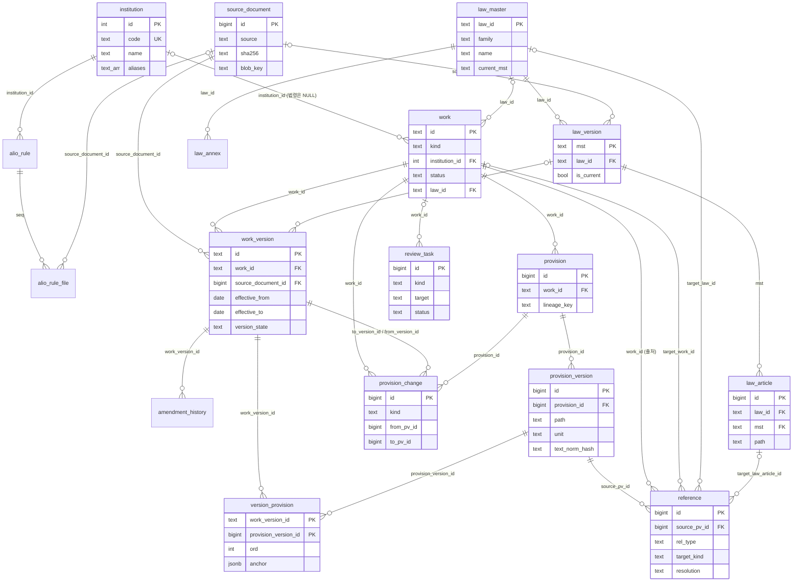
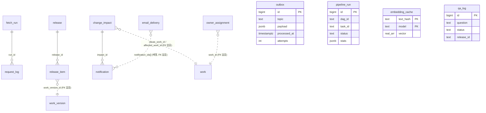

# 03. RDB(PostgreSQL) 데이터 모델

- 대상: NST·출연연 규정·법령 플랫폼의 DB를 운영하거나, 스키마를 고치거나, SQL로 분석하는 개발자
- DB: PostgreSQL 16.15, 데이터베이스 `nst_regulation` (컨테이너 `nais-postgres-1`, 호스트 포트 `127.0.0.1:21055`)
- 기준 코드: worktree `/data/project/nst-regulation-wt/m6-integration` (브랜치 `feat/m6-integration`, HEAD `bff3b1b`)
  - 마이그레이션: `src/reg/core/migrations/versions/`, `src/reg/sources/alio/migrations/versions/`, `src/reg/sources/lawgo/migrations/versions/`
- 현황 수치 기준 시각: **2026-10-03 14:40 KST** (DB `now()` = `05:40 UTC`). DB의 시간대는 `Etc/UTC`라서, 이 문서의 시각은 따로 적지 않으면 UTC다.
- 이 문서의 수치와 예시 행은 모두 읽기 전용 쿼리(SELECT, `information_schema`, `pg_indexes`, `pg_stat_*`, `EXPLAIN`)로 얻었다. 각 수치 옆에 SQL을 붙였다.
- 설계 근거 문서:
  - `docs/superpowers/specs/2026-10-01-regulation-platform-design.md` (이하 **설계 스펙**)
  - `docs/superpowers/specs/2026-10-02-batch-pipeline-design.md` (이하 **배치 스펙**, §1A 모듈 구조, §3A 법령 미러)
  - `docs/superpowers/plans/2026-10-02-m6-overview.md` (이하 **M6 개요**, §2.4 마이그레이션 계약, §2.7 outbox 주제, §2.8 기관 저장 규칙)
  - `docs/superpowers/specs/2026-10-03-graph-search-redesign.md` (이하 **M7 재설계**)

---

## 1. 개요

### 1.1 왜 전용 DB `nst_regulation`인가

처음 설계(설계 스펙 §4.1)는 nst-nexus의 `nais` DB 안에 `regulation` 스키마를 두는 방식이었다. 배치 스펙 §3A.2의 결정 **D-8**로 전용 DB로 바꿨다.

| 항목 | 이전 (`nais.regulation`) | 지금 (`nst_regulation`) |
|---|---|---|
| 위치 | nst-nexus DB 안의 스키마 하나. 같은 DB에 nst-nexus 스키마(audit, catalog, identity, project 등)가 함께 있다 | 같은 PostgreSQL 서버(21055)의 **별도 데이터베이스** |
| 권한·백업·마이그레이션 | nst-nexus와 섞임 | 완전히 분리. DB 소유자 `reg_migrator` |
| 법령 미러 | 넣을 곳 없음 | `law` 스키마로 분리. 같은 DB라 `regulation.reference → law.article` 같은 **실제 외래키**를 걸 수 있다 |
| 운영 테이블 | `regulation` 안에 섞임 | `ops` 스키마로 분리 (마이그레이션 0008) |

- 이전 방법(M6-0 계획 Task 6): `pg_dump -n regulation`으로 옮기고, 앱은 `REG_DATABASE_URL`·`REG_MIGRATOR_URL`의 DB 이름만 바꿨다.
- 원칙(설계 스펙 D-03): **PostgreSQL이 기준 데이터**다. OpenSearch 색인과 Neo4j 그래프는 PostgreSQL에서 다시 만들 수 있는 파생 저장소다. 원본 파일은 SeaweedFS에 있고, PostgreSQL은 그 키를 갖는다.
- 확인 사항: `nais` DB에는 옛 `regulation` 스키마가 아직 남아 있다(`SELECT nspname FROM pg_namespace WHERE nspname='regulation'`을 `nais`에서 실행하면 1행). 배치 스펙 §3A.2는 "옮긴 뒤 확인 후 지운다"고 적었다.

### 1.2 스키마 3개

| 스키마 | 담는 것 | 쓰는 모듈 (배치 스펙 §3A.2, §1A) | 테이블 수 |
|---|---|---|---|
| `regulation` | 내부규정 도메인: 기관, ALIO 목록·첨부, 원본 문서, 규범문서·버전·조항·변경, 참조, 검수 작업, 법령 시드 | `core`, `sources/alio` | 15 (+ 뷰 1, Alembic 이력 2) |
| `law` | 국내 법령 미러: 법령·판본·조문·별표·행정규칙 목록·동기화 이력·변경 기록 | `sources/lawgo`만 쓴다. 다른 모듈은 `reg.sources.lawgo.api`로만 읽는다 | 7 (+ Alembic 이력 1) |
| `ops` | 운영: outbox, 수집·배치 실행 이력, 외부 요청 로그, 색인 게시(release), 임베딩 캐시, 질의 로그, 개정 영향·담당자·알림·메일 | 공통 | 12 |

```sql
SELECT table_schema, table_name, table_type FROM information_schema.tables
WHERE table_schema IN ('regulation','law','ops') ORDER BY 1,2;
```

### 1.3 역할과 권한

`reg.platform.db.bootstrap.bootstrap()`(CLI `reg db bootstrap`)이 슈퍼유저 DSN으로 한 번 실행되어 아래를 만든다. 여러 번 실행해도 결과가 같다.

| 역할 | 하는 일 | 권한 (실제 DB에서 확인) |
|---|---|---|
| `reg_migrator` | DDL. Alembic 마이그레이션을 실행한다 | DB `nst_regulation`의 소유자. 스키마 `regulation`·`law`·`ops`의 소유자(`AUTHORIZATION reg_migrator`). 슈퍼유저·CREATEDB 아님 |
| `reg_app` | DML. API·배치·CLI가 이 역할로 접속한다 (`REG_DATABASE_URL`) | `CONNECT`, 세 스키마 `USAGE`(CREATE 없음). 테이블 `SELECT, INSERT, UPDATE, DELETE, TRUNCATE`, 시퀀스 `USAGE, SELECT` |
| `reg_airflow` | Airflow 메타 DB(`reg_airflow` DB) 전용 | `infra/airflow/metadata-db.sql`이 만든다. `nst_regulation`과 무관 |

- `reg_app`의 테이블 권한은 **기본 권한(default privileges)**으로 준다. 그래서 `reg_migrator`가 나중에 만드는 테이블에도 자동으로 붙는다.

```sql
-- 기본 권한: arwdD = INSERT·SELECT·UPDATE·DELETE·TRUNCATE, rU = SELECT·USAGE
SELECT pg_get_userbyid(defaclrole) owner, defaclnamespace::regnamespace, defaclobjtype, defaclacl FROM pg_default_acl;
--  reg_migrator | regulation | r | {reg_app=arwdD/reg_migrator}
--  reg_migrator | regulation | S | {reg_app=rU/reg_migrator}   (law, ops도 같음)

SELECT s, has_schema_privilege('reg_app', s, 'USAGE'), has_schema_privilege('reg_app', s, 'CREATE')
FROM unnest(ARRAY['regulation','law','ops']) s;   -- 모두 t, f
```

- `law_0001`은 `GRANT … ON ALL TABLES IN SCHEMA law TO reg_app`도 명시적으로 실행한다(기본 권한과 중복이지만 안전하다).
- `v_regulation_master` 뷰는 0008에서 `GRANT SELECT … TO reg_app`을 따로 준다.
- 접속 정보(비밀번호 포함)는 모두 환경변수(`.env`의 `REG_DATABASE_URL`, `REG_MIGRATOR_URL`)로 받는다. 이 문서에는 적지 않는다.

### 1.4 모듈별 Alembic 이력

M6 개요 §2.4의 계약: 모듈마다 **Alembic 이력(스크립트 폴더 + 이력 테이블)을 따로** 둔다. 한 출처의 테이블을 바꿀 때 다른 모듈의 이력을 건드리지 않기 위해서다(배치 스펙 §1A.1: "마이그레이션이 하나의 이력이라 법령 테이블만 따로 바꾸기 어렵다"를 해결).

| 위치(`MigrationLocation.name`) | 스크립트 폴더 | 이력 테이블 | 리비전 | 현재 head (DB 확인) |
|---|---|---|---|---|
| `core` | `src/reg/core/migrations/versions/` | `regulation.alembic_version` | `0001` → `0008` | `0008` |
| `alio` | `src/reg/sources/alio/migrations/versions/` | `regulation.alembic_version_alio` | `a001` → `a002` | `a002` |
| `lawgo` | `src/reg/sources/lawgo/migrations/versions/` | `law.alembic_version` | `law_0001` | `law_0001` |

- 실행: `reg.platform.db.migrate.upgrade(migrator_dsn, locations)`가 `core → alio → lawgo` 순서로 각 이력을 head까지 올린다(`reg.wiring.migration_locations()`). `reg_migrator` DSN으로 실행한다.
- 각 `env.py`는 같은 모양이다. `version_table_schema`와 `version_table`을 config에서 받아 이력 테이블 위치를 정한다.
- 규칙: core 이력(0001~0008)은 M6-0만 고친다. 트랙이 core 테이블을 더 바꿔야 하면 **자기 모듈 이력**에 넣는다. 예: `a002`가 core 테이블 `review_task`의 `kind` CHECK에 `ABOLISHED`를 더했고, `law_0001`이 `regulation.reference/work/work_version`에 법령 FK 열을 더했다(FK 대상이 `law`에 있으므로).
- 두 모듈이 같은 CHECK(`review_task_kind_check`)에 값을 더하므로, `a002`와 `law_0001`은 **현재 허용값을 읽어 자기 값만 더하는** 방식으로 CHECK를 다시 만든다. 서로의 값을 지우지 않는다.

```sql
SELECT * FROM regulation.alembic_version;       -- 0008
SELECT * FROM regulation.alembic_version_alio;  -- a002
SELECT * FROM law.alembic_version;              -- law_0001
```

### 1.5 마이그레이션 연대기

| 리비전 | 마일스톤 | 내용 |
|---|---|---|
| `0001` | M1 수집 | `institution`, `fetch_run`, `request_log`, `source_document`, `alio_rule`, `alio_rule_file`, `law_watch`, `outbox`(+부분 인덱스 `outbox_unprocessed`) |
| `0002` | M2a 구조화 | `work`, `work_version`, `amendment_history`, `provision`, `provision_version`, `version_provision`, `provision_change`. `outbox.last_error` |
| `0003` | M2b 참조·품질 | `reference`, `review_task`, `law_seed`. `source_document.view_blob_key/view_status`, `work_version.validation_status` |
| `0004` | | `version_provision.anchor` (버전별 원문 위치. 같은 조항 판본이 여러 버전에서 공유돼도 쪽 번호는 버전마다 다르다) |
| `0005` | M4 게시 | `release`, `release_item` (검색 색인과 답변 근거를 같은 스냅샷으로 묶는다, 설계 스펙 §7) |
| `0006` | M4b Q&A | `qa_log` |
| `0007` | M5a 영향·알림 | `change_impact`, `owner_assignment`, `notification`, `email_delivery` |
| `0008` | M6-0 | 운영 테이블 10개를 `regulation` → `ops`로 이동. `work.status/abolished_on`, `work_version.parser_version`, `source_document.ocr_*`, `institution.aliases`, `ops.pipeline_run`, `ops.embedding_cache`, 뷰 `v_regulation_master` |
| `a001` | M6-2 | `alio_rule.missing_since` |
| `a002` | M6-2 | `alio_rule.abolish_state/abolished_on`, `review_task.kind`에 `ABOLISHED` |
| `law_0001` | M6-1 | `law` 스키마 테이블 7개, `regulation` 쪽 법령 FK 열 4개, `review_task.kind`에 `REF_LAW_AMBIGUOUS`·`REF_LAW_GONE` |

---

## 2. ERD

### 2.1 규범 도메인 (`regulation` + `law` 연계)

`law_*` 엔터티는 `law` 스키마다(엔터티 이름에 `law_` 접두어를 붙였다). 나머지는 `regulation` 스키마다.



### 2.2 운영 (`ops`)



- 점선(`..`)은 논리적 연결이고 실제 FK는 없다. `ops`의 테이블은 `regulation` 테이블을 FK로 가리키지 않는다(0005·0007의 DDL 그대로). 마이그레이션·스펙에 그 이유는 적혀 있지 않다.

---

## 3. 설계 근거

### 3.1 규범문서 계보: work → work_version → provision → provision_version

규정은 개정될 때마다 새 파일이 올라온다. 조항은 번호가 바뀌기도 하고, 본문은 그대로인데 주석(`<개정 …>`)만 바뀌기도 한다. 그래서 **"무엇"(문서·조항의 정체성)과 "어느 시점의 모습"(판본)을 따로 둔다** (설계 스펙 §5.1, 배치 스펙 §5.1).

| 계층 | 테이블 | 한 행의 의미 | 키 | 예 |
|---|---|---|---|---|
| 규범문서 | `work` | 버전과 무관하게 하나로 식별되는 규정·법령 | `kr/reg/{기관코드}/{정규화한 규정명}`, `kr/law/{법령ID}` | `kr/reg/KASI/여비규정` |
| 버전 | `work_version` | 특정 시행일부터 효력을 갖는 판본 (원본 파일 1개에서 나온다) | `{work}@{시행일}[.{순번}]`, 시행일이 없으면 `{work}@undated-{source_document_id}` | `kr/reg/KASI/여비규정@2024-01-17` |
| 조항 계보 | `provision` | 버전이 바뀌어도 "같은 조항"인 단위. 번호가 이동해도 유지된다 | `id`, `(work_id, lineage_key)` 유일. `lineage_key` = `{처음 나온 경로}@{처음 나온 버전}` | `a27@kr/reg/KASI/여비규정@2015-08-01` |
| 조항 판본 | `provision_version` | 그 조항의 한 모습(경로·번호·제목·본문·주석) | `id` | `id=496898`, `a27` 제27조(출장증빙의 제출) |
| 연결 | `version_provision` | 이 버전에 이 조항 판본이 몇 번째로 들어 있는가 + 이 버전에서의 원문 위치 | `(work_version_id, provision_version_id)` | |
| 변경 | `provision_change` | 이웃한 두 버전 사이의 조항 변화 1건 | `id` | `MODIFIED`, `RENUMBERED`, … |

**판본 재사용**: 다음 버전에서 본문 해시·제목·삭제 여부·주석·조항별 시행일이 모두 같으면 새 판본을 만들지 않고 기존 `provision_version`을 연결만 한다(`core/ingest/loader.py` `rebuild_work`). 그래서 버전이 12,079개인데 조항 판본은 연결 수(1,460,368)보다 훨씬 적은 580,065개다.

실제 예: 천문연 여비규정 제27조의 계보 (계보 1개, 판본 5개, 버전 9개)

```sql
SELECT p.id provision_id, p.lineage_key, pv.id pv_id, pv.path, pv.number_label, pv.heading,
       left(pv.text_norm_hash,10) hash,
       (SELECT string_agg(split_part(vp.work_version_id,'@',2), ',' ORDER BY vp.work_version_id)
          FROM regulation.version_provision vp WHERE vp.provision_version_id = pv.id) in_versions
FROM regulation.provision p JOIN regulation.provision_version pv ON pv.provision_id = p.id
WHERE p.work_id = 'kr/reg/KASI/여비규정' AND pv.path = 'a27' ORDER BY pv.id;
```

| provision_id | lineage_key | pv_id | path | 번호 | 제목 | hash | 들어 있는 버전(시행일) |
|---|---|---|---|---|---|---|---|
| 372487 | `a27@kr/reg/KASI/여비규정@2015-08-01` | 496772 | a27 | 제27조 | 출장증빙의 제출 | 506e34ed7b | 2015-08-01, 2017-01-01 |
| 372487 | 〃 | 496830 | a27 | 제27조 | 〃 | 1002a6d3a7 | 2018-04-01 |
| 372487 | 〃 | 496883 | a27 | 제27조 | 〃 | 9130023bc7 | 2019-02-01 |
| 372487 | 〃 | 496898 | a27 | 제27조 | 〃 | 8fda31f2b3 | 2020-11-06, 2021-12-22, 2022-01-25, 2023-04-18 |
| 372487 | 〃 | 496970 | a27 | 제27조 | 〃 | 8fda31f2b3 | 2024-01-17 (본문 해시는 같고 주석이 달라 새 판본) |

**변경 판정** (`rebuild_work`, world_law_collect `loader.py` 방식 이식):

| `provision_change.kind` | 판정 |
|---|---|
| `ADDED` | 이전 버전에 같은 경로도, 같은 본문 해시도 없다 |
| `DELETED` | 이전 버전의 조항이 새 버전에서 짝을 못 찾았다 (`to_pv_id` NULL) |
| `MODIFIED` | 같은 경로인데 본문 해시·제목·삭제 여부가 다르다 |
| `RENUMBERED` | 경로는 없어졌지만 **본문 해시가 같은** 조·항·호가 다른 경로에 있다 (조·항·호만 대상) |
| `ANNOTATION_ONLY` | 본문은 같고 주석·조항별 시행일만 다르다. **실질 변경에서 제외**한다(설계 스펙 §6.6). 개정 알림·영향 분석은 이것을 거른다 |

**재구성 방식**: 규정 하나를 다시 적재할 때마다 그 규정의 `provision_change` → `version_provision` → `provision`(CASCADE로 `provision_version`, 그 판본을 출처로 하는 `reference`까지)을 지우고, `work_version.parsed`(파서 결과 JSON)에서 시행일 순으로 처음부터 다시 만든다. 그래서 `provision`·`provision_version`의 id는 재처리 때 바뀐다. 다른 테이블이 이 id를 오래 붙잡아 두지 않는 이유다(예: 참조 검수 작업 키를 id 대신 내용으로 만든다, §3.6).

### 3.2 version_state와 시행일

**시행일 판정** (`core/effective.py`, 설계 스펙 §6.5). 우선순위 순:

| `effective_basis` | 근거 | `effective_status` |
|---|---|---|
| `api` | 법령: law.go.kr XML의 시행일 | `CONFIRMED` |
| `supplement` | 마지막 부칙의 "이 규정은 ○○부터 시행한다" | `CONFIRMED`. 부칙 날짜와 머리부 개정 이력표가 어긋나면 `CONFLICT` |
| `history` | 문서 머리부 개정 이력표의 마지막 날짜 | `UNCERTAIN` |
| `alio` | ALIO 개정일(`retryRvsnYmd`). 그 규정의 **마지막 첨부 파일**에만 쓴다 | `UNCERTAIN` |
| `filename` | 파일명에 날짜 흔적이 있지만 날짜로 확정하지 않음 (`effective_from` NULL) | `UNCERTAIN` |
| `none` | 근거 없음 (`effective_from` NULL) | `UNCERTAIN` |

- 부칙에 "다만, 제○조는 ○○부터"가 있으면 그 조의 `provision_version.effective_from_override`에 넣는다(현재 103건).

**version_state** (`rebuild_work`가 오늘 날짜 기준으로 매번 다시 계산):

| 값 | 조건 |
|---|---|
| `UNDATED` | `effective_from` NULL. 계보 비교의 기준이 되지 않는다(이전 판본과 비교하지 않고 모두 새 조항으로 둔다) |
| `FUTURE` | `effective_from > 오늘` |
| `CURRENT` | 시행일이 지났고, 다음 판본이 없거나 다음 판본 시행일이 아직 오지 않았다. **규정당 최대 1개** |
| `HISTORICAL` | 다음 판본의 시행일이 이미 지났다 |

- `effective_to`는 저장하지 않고 계산한다: **다음 dated 판본의 `effective_from`**. 현행이면 NULL.
- 같은 날 시행하는 판본이 둘이면 id에 `.2`, `.3`을 붙인다.
- 기준일 D 조회 규칙(설계 스펙 §5.3): `effective_from ≤ D < effective_to`(또는 `effective_to` NULL)인 버전을 고르고, `effective_from_override`가 있는 조항은 그 날짜로 다시 거른다.
- 현재 `CURRENT`가 2개 이상인 규정은 없다.

```sql
SELECT w.id FROM regulation.work w
WHERE (SELECT count(*) FROM regulation.work_version v WHERE v.work_id=w.id AND v.version_state='CURRENT') > 1;  -- 0행
```

**validation_status** (`core/quality.py`): 검수 작업 중 `PARSE`·`CONFLICT`·`LOW_TEXT`(BLOCKING)가 하나라도 열려 있으면 `REVIEW`, 아니면 `PASSED`. `EFFECTIVE_DATE`·`REFERENCE`는 게시를 막지 않는다.

### 3.3 기관: 코드 + 이름 + 약칭 (M6 개요 §2.8)

사용자 요구(2026-10-02): "데이터 저장할 때 기관명도 저장 → 기관별 검색". 규칙은 **모든 저장 단계에서 기관을 코드와 이름 둘 다 남기고, 검색은 코드·정식명·약칭 어느 것으로도 거를 수 있게 한다**이다.

| 저장 위치 | 저장하는 것 |
|---|---|
| `regulation.institution` | `code`(예: `KASI`), `name`(정식명), `aliases text[]`(약칭: 천문연, 키스트, 에트리 …). 원천은 `config/sources/alio.yaml`. 수집할 때 `load_institutions()`가 `ON CONFLICT (code)`로 반영한다 |
| `regulation.work` | `institution_id` FK. id 자체에도 기관 코드가 들어 있다(`kr/reg/KASI/…`) |
| `regulation.source_document.source_meta` | `institution_code` + `institution_name`(수집 시점의 이름) |
| `regulation.v_regulation_master` | 규범문서 1행 = 기관 코드·이름·약칭 + 현행 버전 요약 |
| OpenSearch 문서 | `institution`(코드), `institution_name`, `institution_aliases` (PostgreSQL 밖) |
| 질의응답 | `qa/institutions.py`가 `institution`에서 `code, name, aliases`를 읽어 질문 속 기관명을 코드로 바꾼다 |
| 법령 | `institution_id` NULL. 소관부처는 `work.external_ids.ministry`, `law.law_master.ministry` |

- 현재 `source_meta.institution_name`은 ALIO 원본 12,286건 중 10,096건에만 있다. 나머지는 이 규칙이 생기기 전에 수집된 행이다.

### 3.4 원본 문서와 blob

- 받은 파일은 **내용 해시(sha256)로 한 번만 저장**한다. `source_document`는 `(source, sha256)`이 유일하고, 파일 자체는 SeaweedFS 버킷 `regulation`에 둔다.
  - 원본 키: `raw/{source}/{sha256[:2]}/{sha256}.{ext}` (`platform/storage/blob.py`)
  - 보기용 PDF 키(`view_blob_key`): HWP·HWPX를 변환한 PDF. 원본이 PDF면 원본 키를 그대로 쓰고 `view_status='not_needed'`
  - OCR 결과 키(`ocr_blob_key`): 글자 층이 없거나 깨진 PDF를 OCR한 결과(쪽·좌표가 있는 줄 목록)
- `work_version`은 원본 문서 1개에서 나온다(`work_version.source_document_id` NOT NULL, `(work_id, source_document_id)` 유일). 같은 파일을 다시 처리해도 버전이 늘지 않는다.
- 파서를 바꾸면 원본을 다시 받지 않고 `parsed`부터 다시 만든다(`work_version.parser_version`으로 대상 판별, 배치 스펙 §4.2). 현재 모든 버전이 `2026.10.6`이다.

### 3.5 참조와 해석 (`reference`)

조항 본문의 인용 문구 하나가 한 행이다. **근거 문구와 위치(span)를 함께 저장**해서, 화면에서 문구를 강조하고 사람이 검증할 수 있게 한다.

| 축 | 값 | 의미 |
|---|---|---|
| `rel_type` (설계 스펙 §5.1) | `BASIS` | 이 조항의 법적 근거 ("법 제n조에 따라") |
| | `DELEGATION` | 하위 규정에 정할 권한을 넘김 ("따로 정한다") |
| | `IMPLEMENTS` | 위임받아 구체화함 (세부지침 → 모규정) |
| | `MUTATIS` | 준용 ("~을 준용한다") |
| | `EXCEPTION` | 예외·우선 ("~에도 불구하고", "다만") |
| | `CITATION` | 위에 해당하지 않는 참조 |
| `target_kind` | `PROVISION` / `WORK` / `ANNEX` | 같은 DB의 조항 / 규범문서 전체 / 별표 |
| | `NONE` | 가리키는 대상이 없는 표현 (해석 완료로 본다) |
| | `EXTERNAL_UNRESOLVED` | 수집하지 않은 외부 법령·규정 (`target_name`에 이름) |
| `resolution` | `RESOLVED` / `AMBIGUOUS` / `UNRESOLVED` | 해석 결과 |

- 해석은 **규범문서 단위로 지우고 다시** 한다(`core/refs.py` `resolve_and_store`: `DELETE FROM regulation.reference WHERE work_id = …` 후 재삽입).
- 외부 법령으로 해석하지 못한 이름은 `law_seed`에 남는다(`origin='reference'`). 법령 미러 선별(`sources/lawgo/select.py`)이 이 목록을 읽는다.
- 법령 미러가 적재되면 `target_law_id`·`target_law_article_id`가 `law.law_master`·`law.article`을 FK로 가리킨다(배치 스펙 §3A.5). FK는 `ON DELETE SET NULL`이다. 현재는 미러가 비어 있어 0건이다.
- `extractor`는 규칙 이름이다(`rule`, `rule:name`, `rule:name-work`, `rule:list`, `rule:amend`, `rule:delegation`, `rule:same`). `review_status`는 설계상 사람 검수용이지만 현재 모두 `AUTO`다.

### 3.6 검수 작업 (`review_task`)

사람이 봐야 할 일을 한 줄씩 둔다. **`(kind, target)`이 유일**하다. 같은 문제가 다시 감지되면 새 행을 만들지 않고 `detail`만 갱신한다(`ON CONFLICT (kind, target) DO UPDATE`). 문제가 사라지면 자동으로 `RESOLVED`로 닫는다.

| kind | 만드는 곳 | target 형식 | 의미 |
|---|---|---|---|
| `PARSE` | `core/quality.py` | 버전 id | 조 번호 빠짐(`check: gap`), 목차와 본문 불일치(`check: toc`) |
| `EFFECTIVE_DATE` | `core/quality.py` | 버전 id | 시행일이 `UNCERTAIN` |
| `CONFLICT` | `core/quality.py` | 버전 id | 시행일 근거끼리 충돌 |
| `LOW_TEXT` | `sources/alio/handler.py`, `ocr/service.py`, `core/quality.py` | `source:{source_document_id}` 또는 버전 id | 글자를 거의 못 뽑음. OCR 대상(`ocr.needed.v1`)이 된다 |
| `REFERENCE` | `core/quality.py` `record_reference_tasks` | `ref:{work_id}:{path}:{span_start}:{target_name}` | 현행 버전의 미해석 외부 참조. 참조 id는 재처리 때 바뀌므로 **내용으로 키를 만든다** |
| `ABOLISHED` | `sources/alio/reconcile.py` (a002) | `work:{work_id}` | 폐지 후보 확인 요청 |
| `REF_LAW_AMBIGUOUS` | `sources/lawgo/link.py` (law_0001) | | 법령명이 여러 법령에 맞거나 아무 데도 안 맞음 |
| `REF_LAW_GONE` | `sources/lawgo/link.py` (law_0001) | | 인용한 법령이 폐지됐거나 조문이 삭제됨 |

### 3.7 outbox와 주제

PostgreSQL 변경과 "다음 단계가 할 일"을 **같은 트랜잭션에서** `ops.outbox`에 기록한다(설계 스펙 §7). 소비자는 `processed_at IS NULL`인 행을 `FOR UPDATE SKIP LOCKED`로 집어 처리하고, 성공하면 `processed_at`을, 실패하면 `attempts`와 `last_error`를 남긴다.

| 주제 (M6 개요 §2.7) | payload | 발행 | 소비 |
|---|---|---|---|
| `regulation.source_fetched` | `{source, seq, file_no, file_name, institution_code, source_document_id}` | `sources/alio/sync.py` | `core/ingest/process.py` (alio 처리기) |
| `regulation.law_fetched` | `{law_id, mst, name, source_document_id}` | `sources/lawgo/promote.py` | `core/ingest/process.py` (lawgo 처리기) |
| `regulation.version_loaded` | `{work_id, version_id}` | `core/ingest/process.py` | `alerts/scan.py` (개정 영향 분석) |
| `ocr.needed.v1` | `{source_document_id, topic, payload(원래 이벤트), reason}` | `platform/ocr_hooks.py` | `ocr/service.py` (OCR 후 원래 이벤트를 다시 발행) |

- 같은 규정의 이벤트는 묶음으로 처리한다. 묶음 기준은 처리기의 `group_field`(alio: `seq`, lawgo: `law_id`)이고, `pg_advisory_xact_lock(hashtext('{topic}:{key}'))`로 한 작업자만 맡는다.
- 재시도 한도: core 처리기·영향 분석 3회(`MAX_ATTEMPTS = 3`), OCR 2회. 한도를 넘은 이벤트는 "보류"로 하루 요약(`ops.tasks.daily_summary`의 `held_events`)에 나온다.
- 전체 재처리(파서 교체)에서는 개정 이벤트가 생기지 않아 알림이 폭주하지 않는다(배치 스펙 §4.2).

### 3.8 게시 버전 (`release` / `release_item`)

검색 색인과 질의응답 근거가 **같은 스냅샷**을 보게 한다(설계 스펙 §7, D-05).

1. `release`를 `BUILDING`으로 만든다. 새 OpenSearch 색인 이름을 `os_index`에 적는다(현재 규칙 `reg-provisions-r{id}`, 옛 규칙 `nais-regulations-r{id}`).
2. 색인에 넣은 버전 목록을 `release_item(release_id, work_version_id)`에 남긴다.
3. 품질 게이트(`index/release.py` `gate`)를 통과하면 별칭을 바꾸고, 이전 `PUBLISHED`를 `RETIRED`로, 이번 것을 `PUBLISHED`로 바꾼다. 실패하면 `FAILED`와 `error`.
4. 질의응답은 요청 시작 시 게시된 `release_id`를 고정하고, 근거 확장도 `release_item` 범위 안에서만 한다(`qa/evidence.py`: `id IN (SELECT work_version_id FROM ops.release_item WHERE release_id = …)`).

- 옛 청크 색인 줄과 새 조항 색인 줄이 한 테이블에 섞여 있어서, `index/release.py`는 `starts_with(os_index, 'reg-provisions-r')` 조건으로 자기 줄만 본다.

### 3.9 임베딩 캐시 (`embedding_cache`)

- 키: `(text_hash, model)`. 값: `vector real[]`(bge-m3, 1024차원).
- 같은 본문은 다시 임베딩하지 않는다. 매일 색인을 새로 만들어도 **바뀐 조각만** GPU 서버에 보낸다(배치 스펙 §5.4·§6.2). `index/cache.py`가 `WHERE model = %s AND text_hash = ANY(%s)`로 한 번에 찾고, 없는 것만 계산해 넣는다.
- 모델을 바꾸면 `model` 값이 달라져 자연스럽게 새로 계산된다.
- 현재 DB에서 가장 큰 테이블이다(1,568 MB, DB 전체 2,919 MB 중).

### 3.10 실행 이력: `fetch_run`과 `pipeline_run`

| 테이블 | 단위 | 기록 주체 | 용도 |
|---|---|---|---|
| `ops.fetch_run` | 수집·처리 한 번 (source = `alio`·`lawgo`·`process`, scope = 기관 코드 등) | `platform/runs.py` `run_logged` | 수집 통계(`stats`)와 실패 사유. `request_log`가 이 id를 가리킨다 |
| `ops.request_log` | 외부 HTTP 요청 1건 | `platform/runs.py` `db_logger` | 예의 지키는 수집의 증거(대기 시간 `waited_ms`). **autocommit 별도 연결**로 써서, 규정 작업이 롤백돼도 요청 기록은 남는다. 90일 후 삭제 |
| `ops.pipeline_run` | 배치 태스크 1회 (Airflow·CLI 공통) | `platform/runs.py` `task_run` 컨텍스트 | `dag_id`·`run_id`는 Airflow 환경변수(`AIRFLOW_CTX_*`)에서. CLI로 돌리면 NULL. 하루 요약(`dag_id='reg_summary'`)도 이 테이블에 한 줄로 저장한다 |

### 3.11 질의 로그 (`qa_log`)

- 질문 1건 = 1행. 질문 맥락(`institution`, `user_institution`, `as_of`), 결과(`status`, `verdict`), 고정한 `release_id`, 검색·인용·검증 결과(jsonb), 지연 시간, 사용자 피드백을 남긴다(설계 스펙 §8.5, §11).
- 1년(`QA_LOG_DAYS = 365`) 지나면 `reg_maintenance`가 지운다(운영 정책 확인 전 기본값).
- `release_id`는 `text`다(`ops.release.id`는 `integer`). FK가 아니다.

### 3.12 개정 영향·담당자·알림 (설계 스펙 §9)

1. `regulation.version_loaded` 이벤트마다 `alerts/scan.py`가 그 버전의 `provision_change`(ANNOTATION_ONLY 제외)를 읽는다.
2. 바뀐 조항을 가리키는 참조를 거꾸로 따라가 영향받는 조항을 찾고 `ops.change_impact`에 넣는다. `(cause_version_id, cause_path, affected_work_id, affected_path)`가 유일해서 같은 영향은 한 번만 생긴다.
3. `alerts/notify.py`가 `status='NEW'`인 영향마다 수신자를 정한다: `owner_assignment`(규정별 담당자)가 있으면 그 사람들, 없으면 기관 관리자. `(impact_id, recipient)`가 유일하다.
4. 수신자별로 묶어 `email_delivery` 한 통으로 보낸다(`notification_ids bigint[]`).

- `impact_kind`는 한글 문구다: `참조 대상 삭제`, `근거·위임·준용 대상 개정`, `참조 대상 개정`, `참조 번호 이동`, `관련 조문 신설`, `참조 규범문서 개정`.
- 현재 `change_impact`·`notification`·`email_delivery`·`owner_assignment`는 모두 0행이다. 전체 재처리에서는 개정 이벤트를 만들지 않기 때문이다(§3.7).

### 3.13 폐지 감지 (배치 스펙 §3.3, D-4)

- `alio_rule`이 폐지 상태의 원장이다. `work.status`는 원장을 투영한 결과다.
- 흐름: 기관 수집이 **정상 종료**된 날 목록에 없던 규정에 `missing_since`(처음 사라진 날) 기록 → 연속 3일째(`missing_since <= 오늘-2`) `abolish_state='CANDIDATE'`, `work.status='ABOLISHED_CANDIDATE'`, `ABOLISHED` 검수 작업 → 사람이 확정하면 `ABOLISHED`, `abolished_on = missing_since` → 목록에 다시 나타나면 세 열을 모두 비우고 현행으로 되돌린다.
- 바로 폐지하지 않는 이유: ALIO 장애나 일시적 누락으로 멀쩡한 규정이 통째로 사라지는 것을 막는다.
- 폐지된 규정은 현행 검색·질의응답에서 빠지지만, 과거 기준일 질의에는 계속 쓴다.

### 3.14 법령 미러 연계 (배치 스펙 §3A)

- `law` 스키마는 law.go.kr의 **현행 법령 전체**와 NST 산하에 필요한 행정규칙을 담는 미러다. 검색·질의응답 대상이 아니라 조회·링크용이다.
- 내부규정이 실제로 인용한 법령과 `config/sources/lawgo.yaml` 지정분만 `regulation.work`(`kr/law/{법령ID}`)로 **승격**한다(D-10). 승격된 것만 검색·질의응답·개정 알림 대상이다.
- 연계 FK 4개(모두 `ON DELETE SET NULL`):

| FK 열 | 가리키는 곳 | 의미 |
|---|---|---|
| `regulation.reference.target_law_id` | `law.law_master.law_id` | 「국가연구개발혁신법」 → 법령 |
| `regulation.reference.target_law_article_id` | `law.article.id` | … 제32조 → 그 법령 **현행 판본**의 조문 |
| `regulation.work.law_id` | `law.law_master.law_id` | 승격된 법령 work와 미러 연결 |
| `regulation.work_version.law_mst` | `law.law_version.mst` | 법령 버전과 미러 판본 연결 |

- **현재 상태: `law` 스키마는 설계·마이그레이션 완료, 미적재다 (law.go.kr 운영 OC 키 승인 대기, D-11).** 지금 DB의 법령 10건(`kr/law/*`)은 2026-10-01 lawgo 수집분이고, 같은 10건이 이전 방식의 `regulation.law_watch`에 남아 있다. 미러를 거치지 않았으므로 `work.law_id`·`work_version.law_mst`는 비어 있다.

---

## 4. 테이블 명세: `regulation` 스키마

표기: NULL 열의 "N"은 NOT NULL, "Y"는 NULL 허용. 타입의 `text[]`는 배열.

### 4.1 `regulation.institution` — 기관

규정을 제정하는 주체. NST 1곳 + 소관 출연연 25곳 = 26행. 원천은 `config/sources/alio.yaml`.

| 열 | 타입 | NULL | 기본값 | 의미 |
|---|---|---|---|---|
| `id` | integer (serial) | N | 시퀀스 | 내부 번호 |
| `code` | text | N | | 기관 코드 (`NST`, `KASI`, `ETRI` …). 규범문서 id에 들어간다 |
| `name` | text | N | | 정식 기관명 |
| `kind` | text | N | | `NST`(연구회) / `GRI`(출연연) |
| `alio_apba_id` | text | Y | | ALIO 기관 ID (예 `C0266`). ALIO에 없는 기관은 NULL |
| `alio_name` | text | Y | | ALIO에 표시되는 기관명 |
| `active` | boolean | N | `true` | 일 배치 수집 대상 여부 |
| `created_at` | timestamptz | N | `now()` | 행 생성 시각 |
| `aliases` | text[] | N | `'{}'` | 약칭 목록 (천문연, 천문연구원 …). 0008에서 추가 |

| 제약 | 정의 |
|---|---|
| PK | `institution_pkey (id)` |
| UNIQUE | `institution_code_key (code)`, `institution_alio_apba_id_key (alio_apba_id)` |
| CHECK | `kind IN ('NST','GRI')` |

| 인덱스 | 열 | 쓰는 쿼리 | 이유 |
|---|---|---|---|
| `institution_pkey` | id | `work`·`alio_rule`과 조인 (`alerts/inbox.py`, `v_regulation_master`) | PK |
| `institution_code_key` | code | `load_institutions()`의 `ON CONFLICT (code)`, `SELECT * FROM regulation.institution WHERE code = %s` (`sources/alio/sync.py`, `reconcile.py`) | 코드가 업무 키 |
| `institution_alio_apba_id_key` | alio_apba_id | 쓰는 쿼리 없음 (`idx_scan` 0) | 한 ALIO 기관이 두 코드에 붙지 않게 막는 유일성 보장 |

- `NSR`(국가보안기술연구소)은 ALIO 공시 대상이 아니라 `alio_apba_id` NULL, `active=false`다(`config/sources/alio.yaml` 주석).

### 4.2 `regulation.source_document` — 받은 원본 파일

외부에서 받은 파일 1개. 같은 내용은 한 번만 저장한다.

| 열 | 타입 | NULL | 기본값 | 의미 |
|---|---|---|---|---|
| `id` | bigint (bigserial) | N | 시퀀스 | 원본 번호. API `/api/v1/files/{id}`의 키 |
| `source` | text | N | | `alio` / `lawgo` |
| `sha256` | text | N | | 파일 내용 해시 |
| `blob_key` | text | N | | SeaweedFS 원본 키 `raw/{source}/{sha[:2]}/{sha}.{ext}` |
| `mime` | text | N | | 판별한 형식 (`application/pdf`, `application/x-hwp`, `application/hwp+zip`, `application/xml`) |
| `size_bytes` | bigint | N | | 크기 |
| `url` | text | N | | 받은 주소 (ALIO 다운로드, law.go.kr DRF. 인증키는 들어 있지 않다) |
| `fetched_at` | timestamptz | N | `now()` | 받은 시각 |
| `source_meta` | jsonb | N | `'{}'` | 출처별 메타. ALIO: `seq`, `file_no`, `file_name`, `institution_code`, `institution_name`. 법령: `law_id`, `mst`, `name` |
| `view_blob_key` | text | Y | | 보기용 PDF 키. 원본이 PDF면 `blob_key`와 같다 |
| `view_status` | text | N | `'pending'` | 보기용 PDF 상태 |
| `ocr_status` | text | Y | | OCR 상태. NULL = 판단 전/대상 아님 |
| `ocr_blob_key` | text | Y | | OCR 결과(줄·쪽·좌표) 키. 있으면 파서가 이것으로 파싱한다 |
| `ocr_engine` | text | Y | | 사용한 OCR 엔진 |

| 제약 | 정의 |
|---|---|
| PK | `source_document_pkey (id)` |
| UNIQUE | `source_document_source_sha256_key (source, sha256)` |
| CHECK | `source IN ('alio','lawgo')`; `view_status IN ('pending','ready','failed','not_needed')`; `ocr_status IN ('pending','ready','failed','not_needed')` |

| 인덱스 | 열 | 쓰는 쿼리 | 이유 |
|---|---|---|---|
| `source_document_pkey` | id | 거의 모든 처리 단계의 조인, 파일 다운로드 API | PK |
| `source_document_source_sha256_key` | (source, sha256) | `platform/archive.py`: `SELECT id, blob_key FROM regulation.source_document WHERE source = %s AND sha256 = %s` | 받은 파일 중복 제거 |

- 운영 노트: `ops.tasks.daily_summary`는 `fetched_at` 범위로 그날 받은 문서 수를 센다. `fetched_at` 인덱스는 없다(1.2만 행이라 순차 스캔).

### 4.3 `regulation.alio_rule` — ALIO 규정 목록 원장

ALIO "내부규정" 목록의 규정 1건. 폐지 감지의 원장이기도 하다.

| 열 | 타입 | NULL | 기본값 | 의미 |
|---|---|---|---|---|
| `seq` | text | N | | ALIO 규정 번호. 개정돼도 같다 |
| `institution_id` | integer | N | | 기관 FK |
| `title` | text | N | | 규정명 |
| `divis` | text | Y | | ALIO 분류 (예: `기타`) |
| `revised_on` | date | Y | | ALIO 개정일(`retryRvsnYmd`). 시행일 판정 3순위 |
| `posted_on` | date | Y | | ALIO 게시일 |
| `list_fingerprint` | text | Y | | 목록 행의 지문. 바뀌지 않았으면 상세·파일을 다시 받지 않는다 |
| `detail` | jsonb | N | `'{}'` | ALIO 상세 JSON 원문 (`idate`, `retryRvsnYmd`, `bFiles`, `ruleNo` 등 18개 키) |
| `first_seen_at` | timestamptz | N | `now()` | 처음 본 시각 |
| `last_seen_at` | timestamptz | N | `now()` | 마지막으로 목록에서 본 시각. 폐지 감지 기준 |
| `missing_since` | date | Y | | 목록에서 처음 사라진 날 (a001) |
| `abolish_state` | text | Y | | NULL(현행) / `CANDIDATE` / `ABOLISHED` (a002) |
| `abolished_on` | date | Y | | 폐지 확정일 (= `missing_since`) (a002) |

| 제약 | 정의 |
|---|---|
| PK | `alio_rule_pkey (seq)` |
| FK | `institution_id → regulation.institution(id)` |
| CHECK | `abolish_state IN ('CANDIDATE','ABOLISHED')` |

| 인덱스 | 열 | 쓰는 쿼리 | 이유 |
|---|---|---|---|
| `alio_rule_pkey` | seq | 수집 upsert `ON CONFLICT (seq)`, 처리기에서 규정 조회 | PK |

- `reconcile.py`는 `WHERE institution_id = %s AND last_seen_at < %s`로 기관 단위 갱신을 한다. 이 열들의 인덱스는 없다(3,905행).

### 4.4 `regulation.alio_rule_file` — 규정 첨부 파일

규정 하나에는 개정 때마다 올라온 파일이 여럿 있다. 파일 1개 = 1행.

| 열 | 타입 | NULL | 기본값 | 의미 |
|---|---|---|---|---|
| `file_no` | text | N | | ALIO 파일 번호 |
| `seq` | text | N | | 규정 FK |
| `file_name` | text | N | | 원래 파일명 (시행일 판정 4순위의 단서) |
| `ord` | integer | N | | 그 규정 안에서의 순서. 마지막 파일에만 ALIO 개정일을 시행일 근거로 쓴다 |
| `status` | text | N | | `fetched` / `rejected` |
| `reject_reason` | text | Y | | 거부 사유 (예: `형식 불명 (b'PK…')`) |
| `source_document_id` | bigint | Y | | 받은 원본 FK. 거부면 NULL |
| `fetched_at` | timestamptz | N | `now()` | 받은 시각 |

| 제약 | 정의 |
|---|---|
| PK | `alio_rule_file_pkey (file_no)` |
| FK | `seq → alio_rule(seq)`, `source_document_id → source_document(id)` |
| CHECK | `status IN ('fetched','rejected')` |

| 인덱스 | 열 | 쓰는 쿼리 | 이유 |
|---|---|---|---|
| `alio_rule_file_pkey` | file_no | `_record_file()`의 `ON CONFLICT (file_no)`(거부됐던 것만 덮어씀), `handler.py`의 `WHERE file_no = %s` | PK |

- `handler.py`의 `SELECT max(ord) … WHERE seq = %s`는 `seq` 인덱스 없이 돈다(1.2만 행).

### 4.5 `regulation.law_watch` — (이전 방식) 감시 법령

M1에서 법령 10건을 감시하던 테이블. 배치 스펙 §5.4는 "`law_watch` 폐기 (`law.law_master`가 대체)"로 정했다. 현재 10행이 남아 있고, `src/reg`에서 이 테이블을 읽거나 쓰는 코드는 없다(`grep law_watch` → 마이그레이션만).

| 열 | 타입 | NULL | 기본값 | 의미 |
|---|---|---|---|---|
| `law_id` | text | N | | law.go.kr 법령ID (PK) |
| `name` | text | N | | 법령명 |
| `kind` | text | Y | | 법률/대통령령/부령 |
| `last_mst` | text | Y | | 마지막으로 받은 법령일련번호 |
| `promulgated_on` | date | Y | | 공포일 |
| `effective_on` | date | Y | | 시행일 |
| `source_document_id` | bigint | Y | | 원본 XML FK → `source_document(id)` |
| `last_checked_at` | timestamptz | Y | | 마지막 확인 시각 |

- 인덱스: `law_watch_pkey (law_id)`만.

### 4.6 `regulation.law_seed` — 인용됐지만 미수집인 법령명

| 열 | 타입 | NULL | 기본값 | 의미 |
|---|---|---|---|---|
| `name` | text | N | | 법령명 (PK) |
| `origin` | text | N | | `config`(설정에서 지정) / `reference`(규정이 인용) |
| `first_seen_work_id` | text | Y | | 처음 인용한 규범문서 id (FK 아님) |
| `created_at` | timestamptz | N | `now()` | |

- CHECK: `origin IN ('config','reference')`. 인덱스: `law_seed_pkey (name)`.
- 쓰는 곳: `core/refs.py`가 해석하지 못한 외부 법령명을 `INSERT … ON CONFLICT DO NOTHING`. `sources/lawgo/select.py`가 미러 선별 때 `UNION SELECT name FROM regulation.law_seed`로 읽는다.

### 4.7 `regulation.work` — 규범문서

| 열 | 타입 | NULL | 기본값 | 의미 |
|---|---|---|---|---|
| `id` | text | N | | 안정 식별자. 내부규정 `kr/reg/{기관코드}/{공백·가운뎃점을 지운 규정명}`. 이름이 겹치면 `~{seq}`. 법령 `kr/law/{법령ID}` |
| `kind` | text | N | | `INTERNAL_REG` 또는 법령 종류(`법률`, `대통령령`, `과학기술정보통신부령` …) |
| `institution_id` | integer | Y | | 기관 FK. 법령은 NULL |
| `title` | text | N | | 현재 이름. 다시 적재할 때 갱신 |
| `external_ids` | jsonb | N | `'{}'` | 외부 식별자. 내부규정 `{alio_seq}`, 법령 `{law_id, mst, ministry, ministry_code}`. 갱신 시 기존 값과 병합(`||`) |
| `created_at` | timestamptz | N | `now()` | |
| `status` | text | N | `'ACTIVE'` | `ACTIVE` / `ABOLISHED_CANDIDATE` / `ABOLISHED` (0008). `alio_rule` 원장을 투영 |
| `abolished_on` | date | Y | | 폐지일 (0008) |
| `law_id` | text | Y | | 법령 미러 FK (law_0001). 현재 모두 NULL |

| 제약 | 정의 |
|---|---|
| PK | `work_pkey (id)` |
| FK | `institution_id → institution(id)`; `law_id → law.law_master(law_id) ON DELETE SET NULL` (`work_law_fk`) |
| CHECK | `status IN ('ACTIVE','ABOLISHED_CANDIDATE','ABOLISHED')` |

| 인덱스 | 열 | 쓰는 쿼리 | 이유 |
|---|---|---|---|
| `work_pkey` | id | 모든 조인 | PK |
| `work_alio_seq` (UNIQUE, 부분, 식) | `(external_ids->>'alio_seq') WHERE external_ids ? 'alio_seq'` | `loader.py` `work_key_for_regulation`: `SELECT id FROM regulation.work WHERE external_ids->>'alio_seq' = %s`; `reconcile.py`의 `JOIN … ON w.external_ids->>'alio_seq' = r.seq` | ALIO 규정 1건 = work 1건 보장. 규정명이 바뀌어도 같은 work로 잇는다 |

- **확인된 점**: 지금 코드의 조회문에는 부분 인덱스 조건(`external_ids ? 'alio_seq'`)이 없어서 planner가 이 인덱스를 쓰지 못한다. `idx_scan`이 0이고, `EXPLAIN`이 순차 스캔을 보인다. 조건을 같이 쓰면 Index Scan이 된다. 현재는 유일성 보장 역할만 한다.

```sql
EXPLAIN SELECT id FROM regulation.work WHERE external_ids->>'alio_seq' = '10512';
--  Seq Scan on work  Filter: ((external_ids ->> 'alio_seq') = '10512')
EXPLAIN SELECT id FROM regulation.work WHERE external_ids ? 'alio_seq' AND external_ids->>'alio_seq' = '10512';
--  Index Scan using work_alio_seq on work
```

### 4.8 `regulation.work_version` — 버전

| 열 | 타입 | NULL | 기본값 | 의미 |
|---|---|---|---|---|
| `id` | text | N | | `{work}@{시행일}[.{n}]` 또는 `{work}@undated-{source_document_id}` |
| `work_id` | text | N | | 규범문서 FK |
| `source_document_id` | bigint | N | | 이 버전을 만든 원본 파일 FK |
| `title` | text | N | | 그 판본의 제목 (문서에서 읽은 것, 없으면 work id) |
| `promulgated_on` | date | Y | | 공포·개정일 |
| `posted_on` | date | Y | | ALIO 게시일 |
| `effective_from` | date | Y | | 시행일 (§3.2) |
| `effective_to` | date | Y | | 다음 dated 판본의 시행일. 현행이면 NULL. `rebuild_work`가 계산 |
| `effective_basis` | text | N | | 시행일 근거: `api` / `supplement` / `history` / `alio` / `filename` / `none` |
| `effective_status` | text | N | | `CONFIRMED` / `UNCERTAIN` / `CONFLICT` |
| `version_state` | text | N | `'UNDATED'` | `FUTURE` / `CURRENT` / `HISTORICAL` / `UNDATED` |
| `amendment_kind` | text | Y | | 제정 / 개정 / 일부개정 / 전부개정 / 타법개정 / 폐지 (문서 메타 또는 개정 이력표 마지막 줄) |
| `amendment_no` | text | Y | | 개정 번호 (예: `339`) |
| `class_code` | text | Y | | 문서 머리부의 분류 번호 (예: `0508`). 대부분 NULL |
| `parsed` | jsonb | N | | 파서 결과 전체 (`title`, `class_code`, `history`, `provisions`, `meta`). 재구성의 입력 |
| `parse_stats` | jsonb | N | `'{}'` | 파서 통계 (`articles`, `paragraphs`, `items`, `annexes`, `supplements`, `unparsed_lines`) |
| `created_at` | timestamptz | N | `now()` | 적재 시각. 하루 요약의 "새 버전 수" 기준 |
| `validation_status` | text | N | `'PASSED'` | `PASSED` / `REVIEW` (0003) |
| `parser_version` | text | Y | | 파서 버전 문자열 (0008). 재파싱 대상 판별 |
| `law_mst` | text | Y | | 법령 미러 판본 FK (law_0001). 현재 모두 NULL |

| 제약 | 정의 |
|---|---|
| PK | `work_version_pkey (id)` |
| UNIQUE | `work_version_work_id_source_document_id_key (work_id, source_document_id)` |
| FK | `work_id → work(id)`; `source_document_id → source_document(id)`; `law_mst → law.law_version(mst) ON DELETE SET NULL` |
| CHECK | `effective_status IN ('CONFIRMED','UNCERTAIN','CONFLICT')`; `version_state IN ('FUTURE','CURRENT','HISTORICAL','UNDATED')`; `validation_status IN ('PASSED','REVIEW')` |

| 인덱스 | 열 | 쓰는 쿼리 | 이유 |
|---|---|---|---|
| `work_version_pkey` | id | 조항·참조·게시·질의응답의 모든 조인 | PK |
| `work_version_work_id_source_document_id_key` | (work_id, source_document_id) | `loader.py` `add_version`: `WHERE work_id = %s AND source_document_id = %s` (같은 파일 재처리 시 기존 버전 반환); `rebuild_work`: `WHERE work_id = %s ORDER BY effective_from` (선두 열 `work_id` 사용) | 파일 1개 = 버전 1개, 그리고 규정별 버전 조회 |

- 202 MB로 큰 편이다. 대부분 `parsed` jsonb다.

### 4.9 `regulation.amendment_history` — 개정 이력표

문서 머리부의 제정·개정 이력표를 그대로 옮긴 것. 버전마다 따로 저장한다(같은 규정이라도 판본마다 이력표 길이가 다르다).

| 열 | 타입 | NULL | 기본값 | 의미 |
|---|---|---|---|---|
| `work_version_id` | text | N | | 버전 FK (`ON DELETE CASCADE`) |
| `ord` | integer | N | | 이력표 안의 순서 (0부터) |
| `kind` | text | N | | 제정 / 개정 / 전부개정 / 일부개정 / 폐지 |
| `date` | date | N | | 날짜 |
| `number` | text | Y | | 번호 |

- PK `amendment_history_pkey (work_version_id, ord)`. `api/queries.py`가 `SELECT kind, date, number FROM regulation.amendment_history WHERE work_version_id = %s …`로 읽는다(PK 선두 열 사용).

### 4.10 `regulation.provision` — 조항 계보

| 열 | 타입 | NULL | 기본값 | 의미 |
|---|---|---|---|---|
| `id` | bigint (bigserial) | N | 시퀀스 | 계보 id (Neo4j `lineage`) |
| `work_id` | text | N | | 규범문서 FK |
| `lineage_key` | text | N | | `{처음 나온 경로}@{처음 나온 버전 id}` |

| 제약·인덱스 | 정의 | 쓰는 쿼리 |
|---|---|---|
| PK `provision_pkey` | (id) | `provision_version.provision_id`, `provision_change.provision_id` 조인 |
| UNIQUE `provision_work_id_lineage_key_key` | (work_id, lineage_key) | `rebuild_work`의 `DELETE FROM regulation.provision WHERE work_id = %s`, `SELECT count(*) … WHERE work_id = %s` (선두 열) |
| FK | `work_id → work(id)` | |

### 4.11 `regulation.provision_version` — 조항 판본

| 열 | 타입 | NULL | 기본값 | 의미 |
|---|---|---|---|---|
| `id` | bigint (bigserial) | N | 시퀀스 | 판본 id. API·OpenSearch·Neo4j의 `pv_id` |
| `provision_id` | bigint | N | | 계보 FK (`ON DELETE CASCADE`) |
| `path` | text | N | | 구조 경로. `a27`(제27조), `a3-2`(제3조의2), `a27.p1`(제1항), `a8.p3.i1`(제1호), `a8.p3.i3.s가`(가목), `c6`(제6장), `c3-s1`(제1절), `annex1`(별표), `supp@2023-04-18`(부칙), `supp@2023-04-18/a1`(부칙 제1조). 같은 경로가 또 나오면 `~2` |
| `unit` | text | N | | `article`, `paragraph`, `item`, `subitem`, `chapter`, `section`, `annex`, `supplement`, `supp_article` |
| `number_label` | text | N | | 원문 번호 표기 (`제27조`, `①`, `1.`, `가.`, `별표 제1호`, `부칙`) |
| `heading` | text | Y | | 조 제목 (`출장증빙의 제출`) |
| `parent_path` | text | Y | | 상위 단위 경로 (항 → 조, 조 → 장) |
| `text` | text | N | | 그 단위의 본문 |
| `text_norm_hash` | text | N | | `sha256(제목 + "|" + 본문)`에서 공백·가운뎃점을 지운 뒤의 앞 32자. 번호 이동 추적과 판본 재사용의 기준 |
| `annotations` | jsonb | N | `'[]'` | 주석 목록 (`["<개정 2025.12.30>"]`, `["[본조신설 '07.12.28]"]`) |
| `deleted` | boolean | N | `false` | `삭제` 표시된 조항 |
| `effective_from_override` | date | Y | | 조항별 시행일 (부칙 단서) |
| `source_anchor` | jsonb | Y | | 원문 위치 `{"page": 1, "bbox": [x0,y0,x1,y1]}` (판본을 처음 만든 버전 기준) |
| `meta` | jsonb | N | `'{}'` | 단위별 추가 정보. 부칙은 `date`, 일부는 `number` |

| 제약·인덱스 | 정의 | 쓰는 쿼리 |
|---|---|---|
| PK `provision_version_pkey` | (id) | 거의 모든 조회 (`idx_scan` 1,953만, DB에서 가장 많이 쓰는 인덱스) |
| FK | `provision_id → provision(id) ON DELETE CASCADE` | |

- `provision_id`에는 인덱스가 따로 없다. CASCADE 삭제와 계보 조회는 `provision_id`로 찾는다.

### 4.12 `regulation.version_provision` — 버전 ↔ 조항 판본 연결

| 열 | 타입 | NULL | 기본값 | 의미 |
|---|---|---|---|---|
| `work_version_id` | text | N | | 버전 FK (`ON DELETE CASCADE`) |
| `provision_version_id` | bigint | N | | 판본 FK (`ON DELETE CASCADE`) |
| `ord` | integer | N | | 그 버전 안에서의 순서 (원문 순서) |
| `anchor` | jsonb | Y | | **이 버전에서의** 원문 위치 `{"page": 7, "bbox": […]}` (0004). 같은 판본이 여러 버전에 공유돼도 쪽 번호는 버전마다 다르기 때문 |

| 인덱스 | 열 | 쓰는 쿼리 | 이유 |
|---|---|---|---|
| `version_provision_pkey` | (work_version_id, provision_version_id) | 버전의 조항 목록: `api/queries.py` `… WHERE vp.work_version_id = %s`, `alerts/inbox.py` `WHERE vp.work_version_id = %s AND pv.path = %s`, `rebuild_work`의 삭제 | 버전 → 조항 방향. 중복 연결 방지(`ON CONFLICT DO NOTHING`) |
| `version_provision_pv` | (provision_version_id) | 판본 → 버전 방향: `api/queries.py`의 "이 조를 인용하는 현행 조항" (`JOIN version_provision vp ON vp.provision_version_id = spv.id JOIN work_version sv … version_state='CURRENT'`), `core/quality.py` `record_reference_tasks`, `v_regulation_master` | 참조 출처 판본이 **현행 버전에 들어 있는지** 거꾸로 확인한다 |

- 146만 행, 509 MB로 `embedding_cache` 다음으로 크다.

### 4.13 `regulation.provision_change` — 버전 간 조항 변경

| 열 | 타입 | NULL | 기본값 | 의미 |
|---|---|---|---|---|
| `id` | bigint (bigserial) | N | 시퀀스 | |
| `work_id` | text | N | | 규범문서 FK |
| `from_version_id` | text | Y | | 이전 버전 FK (`ON DELETE CASCADE`) |
| `to_version_id` | text | N | | 새 버전 FK (`ON DELETE CASCADE`) |
| `provision_id` | bigint | N | | 계보 FK (`ON DELETE CASCADE`) |
| `from_pv_id` | bigint | Y | | 이전 판본. `ADDED`면 NULL |
| `to_pv_id` | bigint | Y | | 새 판본. `DELETED`면 NULL |
| `kind` | text | N | | `ADDED` / `MODIFIED` / `DELETED` / `RENUMBERED` / `ANNOTATION_ONLY` (§3.1) |

| 인덱스 | 열 | 쓰는 쿼리 | 이유 |
|---|---|---|---|
| `provision_change_pkey` | id | (쓰는 쿼리 없음) | PK |
| `provision_change_to` | (to_version_id) | `alerts/impact.py`·`alerts/inbox.py`: `WHERE c.to_version_id = %s AND c.kind <> 'ANNOTATION_ONLY'`; `graph/project.py`: `WHERE to_version_id = ANY(%s)` | "이 버전에서 무엇이 바뀌었나"가 영향 분석·그래프 계보의 입력 |

- 설계 스펙 §5.3에 있던 `diff jsonb` 열은 만들지 않았다. 차이는 두 판본의 본문을 비교해 화면에서 만든다.

### 4.14 `regulation.reference` — 참조

| 열 | 타입 | NULL | 기본값 | 의미 |
|---|---|---|---|---|
| `id` | bigint (bigserial) | N | 시퀀스 | 재해석 때마다 바뀐다 |
| `work_id` | text | N | | 출처 규범문서 FK |
| `source_pv_id` | bigint | N | | 출처 조항 판본 FK (`ON DELETE CASCADE`) |
| `evidence_text` | text | N | | 근거 문구 (`제1항`, `「여신전문금융업법」제2조 제3호`) |
| `span_start` | integer | N | | 출처 본문 안의 시작 위치 |
| `span_end` | integer | N | | 끝 위치 |
| `rel_type` | text | N | | 관계 유형 6종 (§3.5) |
| `target_kind` | text | N | | `PROVISION` / `WORK` / `ANNEX` / `NONE` / `EXTERNAL_UNRESOLVED` |
| `target_work_id` | text | Y | | 대상 규범문서 FK |
| `target_path` | text | Y | | 대상 조항 경로 (`a27.p1`) |
| `target_name` | text | Y | | 외부 대상의 이름 (미해석 법령명) |
| `resolution` | text | N | | `RESOLVED` / `AMBIGUOUS` / `UNRESOLVED` |
| `confidence` | real | N | `1.0` | 신뢰도 |
| `extractor` | text | N | `'rule'` | 추출 규칙 이름 |
| `review_status` | text | N | `'AUTO'` | `AUTO` / `PENDING` / `ACCEPTED` / `REJECTED` |
| `target_law_id` | text | Y | | 법령 미러 FK (law_0001) |
| `target_law_article_id` | bigint | Y | | 법령 조문 FK (law_0001) |

| 제약 | 정의 |
|---|---|
| PK | `reference_pkey (id)` |
| FK | `work_id → work(id)`; `source_pv_id → provision_version(id) ON DELETE CASCADE`; `target_work_id → work(id)`; `target_law_id → law.law_master(law_id) ON DELETE SET NULL`; `target_law_article_id → law.article(id) ON DELETE SET NULL` |
| CHECK | `rel_type`, `target_kind`, `resolution`, `review_status` 각각 위 값만 |

| 인덱스 | 열 | 쓰는 쿼리 | 이유 |
|---|---|---|---|
| `reference_source` | (source_pv_id) | `api/queries.py`: 조항의 나가는 참조 `WHERE r.source_pv_id = ANY(%s) ORDER BY spv.path, r.span_start`; `qa/evidence.py`: 근거 확장 `WHERE r.source_pv_id = ANY(%s) AND r.resolution = 'RESOLVED'`; CASCADE 삭제 | 조항 → 그 조항이 인용하는 것 |
| `reference_target` | (target_work_id, target_path) | `api/queries.py`: 들어오는 참조 `WHERE r.target_work_id = %(w)s AND (r.target_path = %(p)s OR … LIKE %(p)s || '.%%')`; `qa/evidence.py`: 이 조항에 대한 예외 조항 `WHERE r.rel_type = 'EXCEPTION' AND r.target_work_id = %s AND (r.target_path = %s OR r.target_path LIKE %s)`; `graph/project.py` | 조항 → 그 조항을 인용하는 것 (역방향). 개정 영향 분석의 핵심 경로 |
| `reference_target_law_article` | (target_law_article_id) | `sources/lawgo/api.py`: "이 법령 조문을 인용하는 내부규정" `WHERE r.target_law_article_id = ANY(%s)`; `mirror.py`: 삭제 조문이 인용 중인지 `WHERE target_law_article_id = %s LIMIT 1` | 법령 → 내부규정 역방향 조회 (배치 스펙 §3A.6) |

### 4.15 `regulation.review_task` — 검수 작업

| 열 | 타입 | NULL | 기본값 | 의미 |
|---|---|---|---|---|
| `id` | bigint (bigserial) | N | 시퀀스 | |
| `kind` | text | N | | 8종 (§3.6) |
| `target` | text | N | | 대상 키 (버전 id, `source:{id}`, `ref:…`, `work:{id}`) |
| `work_id` | text | Y | | 관련 규범문서 FK (`ON DELETE CASCADE`) |
| `detail` | jsonb | N | `'{}'` | 감지 내용 (`{"basis": "history"}`, `{"check": "gap", "missing": [37]}`, `{"name": "상법", "evidence": "「상법」 제169조", "path": "a18.p2"}`) |
| `status` | text | N | `'OPEN'` | `OPEN` / `RESOLVED` / `DISMISSED` |
| `assignee` | text | Y | | 담당자 |
| `decision` | jsonb | Y | | 처리 결정 (예: 자동 반려 `{"auto": "not_candidate"}`) |
| `created_at` | timestamptz | N | `now()` | |
| `resolved_at` | timestamptz | Y | | |

| 제약 | 정의 |
|---|---|
| PK | `review_task_pkey (id)` |
| UNIQUE | `review_task_kind_target_key (kind, target)` |
| FK | `work_id → work(id) ON DELETE CASCADE` |
| CHECK | `status IN ('OPEN','RESOLVED','DISMISSED')`; `kind IN ('CONFLICT','EFFECTIVE_DATE','LOW_TEXT','PARSE','REFERENCE','ABOLISHED','REF_LAW_AMBIGUOUS','REF_LAW_GONE')` (core 5종 + a002 1종 + law_0001 2종) |

| 인덱스 | 열 | 쓰는 쿼리 | 이유 |
|---|---|---|---|
| `review_task_kind_target_key` | (kind, target) | 모든 작성 경로의 `ON CONFLICT (kind, target)` | 같은 문제는 한 행 (멱등) |

- `core/quality.py` `record()`의 `UPDATE … WHERE target = %s AND status = 'OPEN'`과 `record_reference_tasks`의 `WHERE kind = 'REFERENCE' AND work_id = %s` 같은 조건은 맞는 인덱스가 없어 순차 스캔이다(3만 행).

### 4.16 뷰 `regulation.v_regulation_master` — 목록 마스터

0008에서 만들었다. 규범문서 1행 = 기관 코드·이름·약칭 + 현행 버전 요약 (M6 개요 §2.8 "기관별 조회" 요구).

| 열 | 원천 |
|---|---|
| `work_id`, `title`, `kind`, `status`, `abolished_on` | `work` |
| `institution_code`, `institution_name`, `institution_aliases` | `institution` (LEFT JOIN, 법령은 NULL) |
| `current_version_id`, `effective_from`, `effective_status` | `version_state='CURRENT'`인 `work_version` (LEFT JOIN) |
| `version_count` | 그 규정의 버전 수 |
| `provisions` | 현행 버전의 `version_provision` 수 |
| `last_collected_at` | 그 규정 버전들의 원본 중 가장 최근 `fetched_at` |

```sql
SELECT work_id, title, institution_code, institution_name, current_version_id, effective_from,
       effective_status, version_count, provisions, last_collected_at
FROM regulation.v_regulation_master WHERE work_id IN ('kr/reg/KASI/여비규정','kr/law/013774');
```

| work_id | title | institution_code | institution_name | current_version_id | effective_from | status | 버전 수 | 조항 수 | 마지막 수집 (UTC) |
|---|---|---|---|---|---|---|---|---|---|
| kr/law/013774 | 국가연구개발혁신법 | | | kr/law/013774@2026-09-11 | 2026-09-11 | CONFIRMED | 1 | 370 | 2026-10-01 15:12 |
| kr/reg/KASI/여비규정 | 여비규정 | KASI | 한국천문연구원 | kr/reg/KASI/여비규정@2024-01-17 | 2024-01-17 | CONFIRMED | 9 | 154 | 2026-10-01 15:44 |

- 배치 스펙 §5.4에 있던 `v_provision_current`(현행 조항 평탄화 뷰)는 만들어지지 않았다.

---

## 5. 테이블 명세: `law` 스키마

> **상태: 설계 완료·미적재 (law.go.kr OC 승인 대기).** `law_0001`로 테이블·인덱스·FK가 모두 만들어져 있지만, 7개 테이블 모두 0행이다. 운영 OC 키가 승인되면 `reg_law_daily`(01:00)와 최초 전체 적재(`sync_full`)가 채운다. 아래 "쓰는 쿼리"는 `src/reg/sources/lawgo/`의 코드 기준이다.

```
law.law_master    법령 1건 (법령ID 기준, 개정돼도 같은 행)
   ─< law.law_version   판본 (법령일련번호 MST 기준)
        ─< law.article  조문 단위 본문 (현행 판본만)
   ─< law.annex       별표·서식 메타데이터 + 보관 HTML 키 (본문 파싱 안 함)
   law.admrul_catalog 행정규칙 전체 목록 (인용 매칭용, 본문 없음)
   law.sync_run / law.change_log   일 배치 실행 이력, 바뀐 조문 기록
```

### 5.1 `law.law_master` — 법령·행정규칙 1건 (설계 완료·미적재)

| 열 | 타입 | NULL | 기본값 | 의미 |
|---|---|---|---|---|
| `law_id` | text | N | | 법령은 법령ID(예 `013774`), 행정규칙은 `admrul:{행정규칙ID}` (`ids.py` `master_id`) |
| `family` | text | N | | `law` / `admrul` |
| `source_id` | text | N | | law.go.kr 원래 ID (접두어 없음) |
| `name` | text | N | | 법령명 |
| `name_norm` | text | N | | 띄어쓰기·가운뎃점을 정규화한 이름. 인용 매칭 키 |
| `name_abbr` | text | Y | | 약칭 (`lsAbrv`) |
| `abbr_norm` | text | Y | | 정규화한 약칭 |
| `kind` | text | Y | | 법률 / 대통령령 / 부령 / 훈령 / 예규 / 고시 … |
| `ministry` | text | Y | | 소관부처명 (기관 저장 규칙 §3.3) |
| `ministry_code` | text | Y | | 소관부처 코드 |
| `current_mst` | text | Y | | 현행 판본의 MST |
| `status` | text | N | `'현행'` | `현행` / `폐지` |
| `missing_since` | date | Y | | 목록에서 사라진 날 |
| `first_seen_at` | timestamptz | N | `now()` | |
| `last_synced_at` | timestamptz | Y | | 마지막 동기화 시각 |
| `url` | text | N | | law.go.kr 법령 화면 링크 |

| 제약·인덱스 | 정의 | 쓰는 쿼리 | 이유 |
|---|---|---|---|
| PK `law_master_pkey` | (law_id) | `mirror.py` upsert `ON CONFLICT (law_id)` | |
| CHECK | `family IN ('law','admrul')`, `status IN ('현행','폐지')` | | |
| `law_master_name_norm` | (name_norm) | `link.py`: `WHERE name_norm = %s OR abbr_norm = %s` | 법령명 해석 3단계(정식명 → 약칭 → 정규화) 중 정규화 매칭 |
| `law_master_abbr` (부분) | (name_abbr) `WHERE name_abbr IS NOT NULL` | `link.py`: `WHERE name_abbr = %s` | 약칭 매칭. 약칭 없는 행은 색인하지 않는다 |
| `law_master_abbr_norm` (부분) | (abbr_norm) `WHERE abbr_norm IS NOT NULL` | `link.py`의 `OR abbr_norm = %s` | 정규화 약칭 매칭 |

### 5.2 `law.law_version` — 판본 (설계 완료·미적재)

| 열 | 타입 | NULL | 기본값 | 의미 |
|---|---|---|---|---|
| `mst` | text | N | | 법령일련번호 (PK) |
| `law_id` | text | N | | 법령 FK |
| `promulgated_on` | date | Y | | 공포일 |
| `promulgation_no` | text | Y | | 공포번호 |
| `effective_on` | date | Y | | 시행일 |
| `revision_kind` | text | Y | | 제정 / 일부개정 / 타법개정 … |
| `is_current` | boolean | N | `false` | 현행 판본 여부. **법령당 1개** |
| `source_document_id` | bigint | Y | | 원본 XML (`regulation.source_document`) FK |
| `xml_url` | text | N | | DRF 원문 XML 주소 (조회 시 OC 키가 필요해 서버가 중계) |
| `html_url` | text | N | | law.go.kr 판본 화면 |
| `articles_loaded` | boolean | N | `false` | 조문을 `law.article`에 적재했는지. 재시작 시 건너뛰기 판단 |
| `seen_at` | timestamptz | N | `now()` | |

| 제약·인덱스 | 정의 | 쓰는 쿼리 | 이유 |
|---|---|---|---|
| PK `law_version_pkey` | (mst) | `mirror.py`: `WHERE mst = %s AND articles_loaded`; `api.py`: `WHERE mst = %s` | |
| FK | `law_id → law_master`; `source_document_id → regulation.source_document(id)` | | 원본은 `regulation.source_document`에 함께 둔다 |
| `law_version_one_current` (UNIQUE, 부분) | (law_id) `WHERE is_current` | `mirror.py`: `WHERE law_id = %s AND is_current`; `api.py`: 현행 판본 조회 | **법령당 현행 1개를 DB가 강제**한다. 교체할 때는 이전 것을 `false`로 바꾼 뒤 새 것을 `true`로 한다 |
| `law_version_source` | (source_document_id) | 원본 → 판본 역조회, FK 검사 | |

### 5.3 `law.article` — 조문 (설계 완료·미적재)

현행 판본의 조문만 둔다. 개정되면 같은 행을 새 판본 값으로 갱신하므로(`UNIQUE (law_id, path)`), 내부규정의 FK는 항상 **현행 조문**을 가리킨다.

| 열 | 타입 | NULL | 기본값 | 의미 |
|---|---|---|---|---|
| `id` | bigint (bigserial) | N | 시퀀스 | `reference.target_law_article_id`가 가리키는 키 |
| `law_id` | text | N | | 법령 FK |
| `mst` | text | N | | 이 행이 마지막으로 반영한 판본 FK |
| `path` | text | N | | 내부규정과 같은 경로 규칙 (`a32.p1.i2`, 부칙 `supp@날짜`, 별표 `annexN`) |
| `unit` | text | N | | 단위 |
| `parent_path` | text | Y | | 상위 경로 |
| `jo_code` | text | Y | | DRF 조문 코드 6자리 (예 `003200`) |
| `label` | text | N | | `제32조` |
| `heading` | text | Y | | 조 제목 |
| `text` | text | N | `''` | 본문 |
| `ord` | integer | N | | 순서 |
| `effective_on` | date | Y | | 조문 시행일 |
| `text_hash` | text | N | | 본문 해시. 판본 사이 변경 판정 |
| `deleted` | boolean | N | `false` | 삭제 표시 |
| `gone_in_mst` | text | Y | | 이 조문이 사라진 판본. 행을 지우지 않고 표시만 해서, 인용하던 FK가 끊기지 않는다(`REF_LAW_GONE`) |
| `url` | text | Y | | law.go.kr 조문 화면 |

| 제약·인덱스 | 정의 | 쓰는 쿼리 | 이유 |
|---|---|---|---|
| PK `article_pkey` | (id) | `api.py`: `WHERE id = %s` | |
| UNIQUE `article_law_id_path_key` | (law_id, path) | `link.py`: `WHERE law_id = %s AND path = ANY(%s)`; `api.py`: `WHERE law_id = %s AND gone_in_mst IS NULL`, `… AND path LIKE %s ORDER BY ord`; `mirror.py`: 법령의 기존 조문 전체 | 조문 해석 (법령 + 경로 → 조문) |
| `article_mst` | (mst) | 현재 `mst` 단독 조건 쿼리는 코드에 없다. `law_version` 삭제·갱신 시 FK 검사에 쓰인다 | |
| FK | `law_id → law_master`; `mst → law_version` | | |

### 5.4 `law.annex` — 별표·서식 (설계 완료·미적재)

사용자 결정(2026-10-02): 별표·서식은 **파싱하지 않고 HTML 원본을 저장**해 뷰어·링크로 보여준다.

| 열 | 타입 | NULL | 기본값 | 의미 |
|---|---|---|---|---|
| `seq` | text | N | | 별표일련번호 (PK) |
| `family` | text | N | | `law` / `admrul` |
| `law_id` | text | N | | 법령 FK |
| `mst` | text | Y | | 관련 판본 (FK 아님) |
| `number` | text | Y | | 별표 번호 |
| `kind` | text | Y | | 별표 / 서식 |
| `title` | text | N | | 별표명 |
| `promulgated_on` | date | Y | | 공포일 |
| `file_path` | text | Y | | law.go.kr 목록이 주는 첨부 파일 경로 |
| `pdf_path` | text | Y | | law.go.kr PDF 경로 (설정 `annex_store_pdf`일 때 받는다) |
| `view_url` | text | N | | law.go.kr 별표 화면 링크 |
| `html_key` | text | Y | | 보관 HTML 키 (`law/annex/{seq}.html`) |
| `pdf_key` | text | Y | | 보관 PDF 키 |
| `fetched_at` | timestamptz | Y | | 본문을 받은 시각 |
| `is_current` | boolean | N | `true` | 현재 목록에 있는지. 빠지면 `false` (메타·저장본은 남김) |
| `first_seen_at` | timestamptz | N | `now()` | |

| 제약·인덱스 | 정의 | 쓰는 쿼리 | 이유 |
|---|---|---|---|
| PK `annex_pkey` | (seq) | `mirror.py` upsert `ON CONFLICT (seq)` | |
| CHECK | `family IN ('law','admrul')` | | |
| FK | `law_id → law_master` | | |
| `annex_law` | (law_id) | `api.py`: `WHERE law_id = %s AND is_current`; `mirror.py`: 목록에서 빠진 별표 `is_current=false` | 법령별 별표 목록 |
| `annex_backlog` (부분) | (first_seen_at) `WHERE html_key IS NULL AND is_current` | `sync.py` `fetch_annex_bodies`: `WHERE is_current AND html_key IS NULL ORDER BY first_seen_at, seq LIMIT %s` | **밀린 별표 본문을 오래된 것부터** 받는 작업 큐. 받은 것은 색인에서 빠져 인덱스가 작게 유지된다 |

### 5.5 `law.admrul_catalog` — 행정규칙 전체 목록 (설계 완료·미적재)

본문 없이 이름·ID·소관부처만 둔다. 내부규정이 인용한 행정규칙 이름을 맞춰 보고, 필요한 것만 `law_master`로 들인다(D-9).

| 열 | 타입 | NULL | 기본값 | 의미 |
|---|---|---|---|---|
| `admrul_id` | text | N | | 행정규칙ID (PK) |
| `name` | text | N | | 이름 |
| `name_norm` | text | N | | 정규화 이름 |
| `kind` | text | Y | | 훈령 / 예규 / 고시 / 지침 |
| `ministry`, `ministry_code` | text | Y | | 소관부처 |
| `current_seq` | text | Y | | 현행 행정규칙일련번호 |
| `issued_on` | date | Y | | 발령일 |
| `issue_no` | text | Y | | 발령번호 |
| `effective_on` | date | Y | | 시행일 |
| `revision_kind` | text | Y | | 제개정 구분 |
| `status` | text | N | `'현행'` | 목록에서 빠지면 `폐지` (CHECK 없음) |
| `last_seen_at` | timestamptz | N | `now()` | |

| 인덱스 | 열 | 쓰는 쿼리 |
|---|---|---|
| `admrul_catalog_pkey` | (admrul_id) | upsert, `WHERE admrul_id = %s` |
| `admrul_catalog_name_norm` | (name_norm) | `select.py`: `WHERE status = '현행' AND name_norm = ANY(%s)` (인용된 이름 → 행정규칙) |

### 5.6 `law.sync_run` — 동기화 실행 이력 (설계 완료·미적재)

| 열 | 타입 | NULL | 기본값 | 의미 |
|---|---|---|---|---|
| `id` | bigint (bigserial) | N | 시퀀스 | |
| `kind` | text | N | | `daily` / `full` / `annex` |
| `since` | date | Y | | 증분 기준일 (마지막 성공일 − 7일 여유) |
| `started_at` | timestamptz | N | `now()` | |
| `finished_at` | timestamptz | Y | | |
| `status` | text | N | `'running'` | `running` / `succeeded` / `failed` |
| `stats` | jsonb | N | `'{}'` | 통계 |
| `error` | text | Y | | |

- 인덱스: PK만. CHECK: `kind`, `status`.

### 5.7 `law.change_log` — 법령 변경 기록 (설계 완료·미적재)

| 열 | 타입 | NULL | 기본값 | 의미 |
|---|---|---|---|---|
| `id` | bigint (bigserial) | N | 시퀀스 | |
| `run_id` | bigint | Y | | `sync_run` FK |
| `law_id` | text | N | | 법령 FK |
| `from_mst`, `to_mst` | text | Y | | 이전·새 판본 |
| `path` | text | Y | | 바뀐 조문 경로 (법령 단위 변경이면 NULL) |
| `change` | text | N | | `added` / `modified` / `deleted` / `law_added` / `law_abolished` |
| `label` | text | Y | | `제32조` |
| `at` | timestamptz | N | `now()` | |

| 인덱스 | 열 | 이유 |
|---|---|---|
| `change_log_law` | (law_id, at) | 법령별 변경 이력을 시간순으로 본다. 배치 스펙 §3A.5: 이 기록이 개정 영향 분석의 입력이 된다. 현재 `mirror.py`는 쓰기만 하고, 읽는 코드는 아직 없다 |

---

## 6. 테이블 명세: `ops` 스키마

0001~0007에서 `regulation`에 만들었다가 0008에서 `ALTER TABLE … SET SCHEMA ops`로 옮긴 10개 + 0008에서 새로 만든 2개(`pipeline_run`, `embedding_cache`).

### 6.1 `ops.outbox` — 이벤트 대기열

| 열 | 타입 | NULL | 기본값 | 의미 |
|---|---|---|---|---|
| `id` | bigint (bigserial) | N | 시퀀스 | 처리 순서 |
| `topic` | text | N | | 주제 (§3.7) |
| `payload` | jsonb | N | | 내용 |
| `created_at` | timestamptz | N | `now()` | |
| `claimed_at` | timestamptz | Y | | 마지막으로 집은 시각 |
| `processed_at` | timestamptz | Y | | 처리 완료 시각. NULL이면 대기 |
| `attempts` | integer | N | `0` | 실패 횟수 |
| `last_error` | text | Y | | 마지막 오류 (0002) |

| 인덱스 | 열 | 쓰는 쿼리 | 이유 |
|---|---|---|---|
| `outbox_pkey` | id | `UPDATE … WHERE id = %s` | |
| `outbox_unprocessed` (부분) | (id) `WHERE processed_at IS NULL` | `process.py`: `WHERE processed_at IS NULL AND attempts < %s AND topic = ANY(%s) ORDER BY id LIMIT 1 FOR UPDATE SKIP LOCKED`; `alerts/scan.py`, `ocr/service.py` 같은 모양; `ops/tasks.py` 보류 건수 | **처리된 수만 건은 빼고 대기 중인 것만** 색인한다. `id` 순으로 집으므로 정렬도 인덱스가 해 준다 |

```sql
EXPLAIN SELECT id, topic FROM ops.outbox
WHERE processed_at IS NULL AND attempts < 3 AND topic = ANY('{regulation.source_fetched}') ORDER BY id LIMIT 1;
--  Limit -> Index Scan using outbox_unprocessed on outbox  Filter: (topic = ANY …) AND (attempts < 3)
```

### 6.2 `ops.fetch_run` — 수집·처리 실행

| 열 | 타입 | NULL | 기본값 | 의미 |
|---|---|---|---|---|
| `id` | bigint (bigserial) | N | 시퀀스 | |
| `source` | text | N | | `alio` / `lawgo` / `process` |
| `scope` | text | Y | | 기관 코드 등 |
| `started_at` | timestamptz | N | `now()` | |
| `finished_at` | timestamptz | Y | | |
| `status` | text | N | `'running'` | `running` / `succeeded` / `failed` |
| `stats` | jsonb | N | `'{}'` | ALIO 예: `complete`, `rules_seen`, `details_fetched`, `files_fetched`, `files_rejected`, `files_new_content`, `started_at`. `complete`가 폐지 감지의 "정상 종료" 판단 |
| `error` | text | Y | | |

- PK만. 하루 요약이 `started_at` 범위로 세지만 102행이라 인덱스가 없다.

### 6.3 `ops.request_log` — 외부 요청 로그

| 열 | 타입 | NULL | 기본값 | 의미 |
|---|---|---|---|---|
| `id` | bigint (bigserial) | N | 시퀀스 | |
| `run_id` | bigint | Y | | `fetch_run` FK |
| `source` | text | N | | `alio` / `lawgo` |
| `url` | text | N | | 요청 주소 |
| `status` | integer | Y | | HTTP 상태 |
| `bytes` | integer | Y | | 응답 크기 |
| `elapsed_ms` | integer | Y | | 응답 시간 |
| `waited_ms` | integer | Y | | 요청 간격을 지키려고 기다린 시간 |
| `error` | text | Y | | |
| `at` | timestamptz | N | `now()` | |

- PK만. `reg_maintenance`가 `WHERE at < now() - 90일`로 지운다(`at` 인덱스 없음, 1.7만 행).

### 6.4 `ops.pipeline_run` — 배치 태스크 실행

| 열 | 타입 | NULL | 기본값 | 의미 |
|---|---|---|---|---|
| `id` | bigint (bigserial) | N | 시퀀스 | |
| `dag_id` | text | Y | | Airflow DAG (`reg_alio_daily`, `reg_process`, `reg_publish`, `reg_notify`, `reg_ocr`, `reg_maintenance`, `reg_summary`). CLI면 NULL |
| `run_id` | text | Y | | Airflow DAG run id. 하루 요약은 `summary:{날짜}` |
| `task_id` | text | N | | 태스크 이름 (`alio.collect:KASI`, `index.build` …) |
| `started_at` | timestamptz | N | `now()` | |
| `finished_at` | timestamptz | Y | | |
| `status` | text | N | `'running'` | `running` / `success` / `failed` (`fetch_run`과 철자가 다르다) |
| `stats` | jsonb | N | `'{}'` | 태스크가 돌려준 dict. 하루 요약은 요약 전체 |
| `error` | text | Y | | 예외 (2,000자까지) |

| 인덱스 | 열 | 쓰는 쿼리 | 이유 |
|---|---|---|---|
| `pipeline_run_started_at_idx` | (started_at) | `ops/tasks.py` 하루 요약: `WHERE status = 'failed' AND stats->>'source' = %(src)s AND started_at >= %(lo)s AND started_at < %(hi)s` | 날짜 범위 조회. 매일 행이 쌓이는 테이블 |

### 6.5 `ops.release` — 게시 버전

| 열 | 타입 | NULL | 기본값 | 의미 |
|---|---|---|---|---|
| `id` | integer (serial) | N | 시퀀스 | release 번호. 색인 이름 접미사 |
| `state` | text | N | | `BUILDING` / `PUBLISHED` / `RETIRED` / `FAILED` |
| `os_index` | text | N | | OpenSearch 색인 이름 |
| `embedding_model` | text | N | | `bge-m3` |
| `stats` | jsonb | N | `'{}'` | 문서 수, 지문(fingerprint), 게이트 결과 등. 변화 없는 날 생략 판단에 쓴다 |
| `error` | text | Y | | 실패 사유 |
| `created_at` | timestamptz | N | `now()` | |
| `published_at` | timestamptz | Y | | |

- PK만. CHECK `state`. `WHERE state = 'PUBLISHED' AND starts_with(os_index, …)` 같은 조회는 16행이라 인덱스가 필요 없다.

### 6.6 `ops.release_item` — 게시 스냅샷의 버전 목록

| 열 | 타입 | NULL | 기본값 | 의미 |
|---|---|---|---|---|
| `release_id` | integer | N | | `release` FK (`ON DELETE CASCADE`) |
| `work_version_id` | text | N | | 그 게시에 들어간 버전 (FK 없음) |

| 인덱스 | 열 | 쓰는 쿼리 |
|---|---|---|
| `release_item_pkey` | (release_id, work_version_id) | `qa/evidence.py`: `id IN (SELECT work_version_id FROM ops.release_item WHERE release_id = %(rel)s)` — 답변 근거를 게시 스냅샷으로 제한 |

### 6.7 `ops.embedding_cache` — 임베딩 캐시

| 열 | 타입 | NULL | 기본값 | 의미 |
|---|---|---|---|---|
| `text_hash` | text | N | | 임베딩 입력 문자열의 해시 |
| `model` | text | N | | 모델 이름 |
| `vector` | real[] | N | | 벡터 (bge-m3 1024차원) |
| `created_at` | timestamptz | N | `now()` | |

| 인덱스 | 열 | 쓰는 쿼리 |
|---|---|---|
| `embedding_cache_pkey` | (text_hash, model) | `index/cache.py`: `WHERE model = %s AND text_hash = ANY(%s)` (`idx_scan` 261만) |

### 6.8 `ops.qa_log` — 질의 로그

| 열 | 타입 | NULL | 기본값 | 의미 |
|---|---|---|---|---|
| `id` | bigint (bigserial) | N | 시퀀스 | API 피드백의 키 |
| `created_at` | timestamptz | N | `now()` | |
| `question` | text | N | | 질문 (개인정보 마스킹 후, `qa/mask.py`) |
| `institution` | text | Y | | 질문이 겨냥한 기관 코드 |
| `user_institution` | text | Y | | 사용자 소속 기관 |
| `as_of` | date | Y | | 기준일 질의 |
| `status` | text | N | | `answered`, `evidence_only`, `need_institution`, `not_found` 등 |
| `verdict` | text | Y | | 결론 (`충족` / `미충족` / `판단불가`) |
| `release_id` | text | Y | | 고정한 게시 버전 |
| `model` | text | Y | | 답변 생성 경로 |
| `retrieved` | jsonb | N | `'[]'` | 검색 후보 |
| `cited` | jsonb | N | `'[]'` | 인용 |
| `verification` | jsonb | N | `'{}'` | 인용 검증 결과 |
| `answer` | jsonb | Y | | 답변 JSON |
| `latency_ms` | integer | Y | | 처리 시간 |
| `feedback` | text | Y | | 사용자 피드백 (`UPDATE ops.qa_log SET feedback = %s WHERE id = %s`) |

- PK만.

### 6.9 `ops.change_impact` — 개정 영향

| 열 | 타입 | NULL | 기본값 | 의미 |
|---|---|---|---|---|
| `id` | bigint (bigserial) | N | 시퀀스 | |
| `cause_work_id` | text | N | | 바뀐 규범문서 |
| `cause_version_id` | text | N | | 바뀐 버전 |
| `cause_from_version_id` | text | Y | | 비교한 이전 버전 |
| `cause_path` | text | N | | 바뀐 조항 경로 |
| `cause_change` | text | N | | `ADDED` / `MODIFIED` / `DELETED` / `RENUMBERED` |
| `affected_work_id` | text | N | | 영향받는 규범문서 |
| `affected_version_id` | text | Y | | 영향받는 버전 |
| `affected_path` | text | N | | 영향받는 조항 경로 |
| `rel_type` | text | N | | 연결한 참조의 관계 유형 |
| `evidence` | text | Y | | 참조 근거 문구 |
| `impact_kind` | text | N | | 한글 영향 유형 (§3.12) |
| `severity` | text | N | | `HIGH` / `MEDIUM` / `LOW` |
| `hops` | integer | N | `1` | 참조 사슬 단계 수 |
| `status` | text | N | `'NEW'` | `NEW` / `ACKED` / `ACTION_REQUIRED` / `NO_ACTION` / `RESOLVED` |
| `resolution_note` | text | Y | | 처리 메모 |
| `resolved_by_version_id` | text | Y | | 이 영향을 해소한 개정 버전 |
| `created_at`, `updated_at` | timestamptz | N | `now()` | |

| 인덱스 | 열 | 쓰는 쿼리 | 이유 |
|---|---|---|---|
| UNIQUE `change_impact_cause_version_id_cause_path_affected_work_id__key` | (cause_version_id, cause_path, affected_work_id, affected_path) | `alerts/impact.py` 삽입 | 같은 영향 중복 방지 |
| `change_impact_status_severity_idx` | (status, severity) | `alerts/inbox.py` 알림함: `WHERE ci.status = ANY(%s) [AND ci.severity = %s]`; `alerts/notify.py`: `WHERE ci.status = 'NEW'` | 열린 영향을 상태·심각도로 거른다 |

### 6.10 `ops.owner_assignment` — 규정별 담당자

| 열 | 타입 | NULL | 기본값 | 의미 |
|---|---|---|---|---|
| `id` | bigint (bigserial) | N | 시퀀스 | |
| `work_id` | text | N | | 규범문서 (FK 없음) |
| `email` | text | N | | 담당자 메일 |
| `name` | text | Y | | 이름 |
| `org_unit` | text | Y | | 소관부서 |
| `role` | text | N | `'OWNER'` | `OWNER` / `DEPUTY` |

| 인덱스 | 열 | 쓰는 쿼리 |
|---|---|---|
| UNIQUE `owner_assignment_work_id_email_key` | (work_id, email) | `alerts/notify.py`: `SELECT email FROM ops.owner_assignment WHERE work_id = %s ORDER BY role, email` |

- 설계 스펙은 Keycloak `user_sub`를 담는 모양이었지만, 구현은 메일 주소를 키로 한다(D-08: 관리자가 규정별로 지정).

### 6.11 `ops.notification` — 알림

| 열 | 타입 | NULL | 기본값 | 의미 |
|---|---|---|---|---|
| `id` | bigint (bigserial) | N | 시퀀스 | |
| `impact_id` | bigint | N | | `change_impact` FK (`ON DELETE CASCADE`) |
| `recipient` | text | N | | 받는 사람 메일 |
| `channel` | text | N | `'email'` | |
| `severity` | text | N | | 영향의 심각도 복사 |
| `created_at` | timestamptz | N | `now()` | |
| `read_at` | timestamptz | Y | | 앱에서 읽은 시각 |
| `sent_at` | timestamptz | Y | | 메일로 보낸 시각 |

| 인덱스 | 열 | 쓰는 쿼리 |
|---|---|---|
| UNIQUE `notification_impact_id_recipient_key` | (impact_id, recipient) | `INSERT … ON CONFLICT DO NOTHING` (같은 영향·수신자는 한 번), `JOIN ops.change_impact ci ON ci.id = n.impact_id` |

### 6.12 `ops.email_delivery` — 메일 발송

| 열 | 타입 | NULL | 기본값 | 의미 |
|---|---|---|---|---|
| `id` | bigint (bigserial) | N | 시퀀스 | |
| `recipient` | text | N | | |
| `subject` | text | N | | |
| `body` | text | N | | |
| `notification_ids` | bigint[] | N | | 이 메일에 묶인 알림들 |
| `status` | text | N | `'pending'` | `pending` / `sent` / `failed` |
| `attempts` | integer | N | `0` | 재시도 횟수 |
| `last_error` | text | Y | | |
| `created_at` | timestamptz | N | `now()` | |
| `sent_at` | timestamptz | Y | | |

- PK만. CHECK `status`.

---

## 7. 현황 (2026-10-03 14:40 KST)

### 7.1 테이블별 행 수와 크기

```sql
SELECT s.schemaname||'.'||s.relname AS t,
       (xpath('/row/c/text()', query_to_xml(format('select count(*) as c from %I.%I', s.schemaname, s.relname),
                                            false, true, '')))[1]::text::bigint AS rows
FROM pg_stat_user_tables s WHERE schemaname IN ('regulation','law','ops') ORDER BY 1;

SELECT n.nspname||'.'||c.relname, pg_size_pretty(pg_total_relation_size(c.oid))
FROM pg_class c JOIN pg_namespace n ON n.oid = c.relnamespace
WHERE n.nspname IN ('regulation','law','ops') AND c.relkind = 'r'
ORDER BY pg_total_relation_size(c.oid) DESC LIMIT 10;

SELECT pg_size_pretty(pg_database_size('nst_regulation'));   -- 2919 MB
```

| 테이블 | 행 수 | 크기 (상위 10) |
|---|---:|---:|
| `regulation.institution` | 26 | |
| `regulation.alio_rule` | 3,905 | |
| `regulation.alio_rule_file` | 12,561 | |
| `regulation.source_document` | 12,296 | 10 MB |
| `regulation.law_watch` | 10 | |
| `regulation.law_seed` | 3,283 | |
| `regulation.work` | 3,839 | |
| `regulation.work_version` | 12,079 | 202 MB |
| `regulation.amendment_history` | 57,361 | 11 MB |
| `regulation.provision` | 453,627 | 161 MB |
| `regulation.provision_version` | 580,065 | 269 MB |
| `regulation.version_provision` | 1,460,368 | 509 MB |
| `regulation.provision_change` | 273,968 | 67 MB |
| `regulation.reference` | 193,520 | 73 MB |
| `regulation.review_task` | 30,324 | 15 MB |
| `law.*` (7개 테이블) | **모두 0** (설계 완료·미적재) | |
| `ops.outbox` | 12,567 | |
| `ops.fetch_run` | 102 | |
| `ops.request_log` | 17,498 | |
| `ops.pipeline_run` | 192 | |
| `ops.release` | 16 | |
| `ops.release_item` | 40,844 | |
| `ops.embedding_cache` | 283,919 | 1,568 MB |
| `ops.qa_log` | 165 | |
| `ops.change_impact` / `notification` / `email_delivery` / `owner_assignment` | 0 / 0 / 0 / 0 | |

### 7.2 기관별

```sql
SELECT kind, count(*), count(*) FILTER (WHERE active) active,
       count(*) FILTER (WHERE cardinality(aliases) > 0) with_alias
FROM regulation.institution GROUP BY 1;
--  NST 1 (활성 1, 약칭 1) / GRI 25 (활성 24, 약칭 25)

SELECT i.code, i.name, i.aliases, i.alio_apba_id,
  (SELECT count(*) FROM regulation.alio_rule r WHERE r.institution_id = i.id) alio_rules,
  (SELECT count(*) FROM regulation.work w WHERE w.institution_id = i.id) works,
  (SELECT count(*) FROM regulation.work w JOIN regulation.work_version v ON v.work_id = w.id
    WHERE w.institution_id = i.id) versions,
  (SELECT count(*) FROM regulation.work w JOIN regulation.work_version v ON v.work_id = w.id
    WHERE w.institution_id = i.id AND v.version_state = 'CURRENT') current_v
FROM regulation.institution i ORDER BY i.kind, i.code;
```

| 코드 | 기관명 | 약칭 | ALIO ID | ALIO 규정 | 규범문서 | 버전 | 현행 버전 |
|---|---|---|---|---:|---:|---:|---:|
| NST | 국가과학기술연구회 | 과기연구회, 연구회 | C0909 | 110 | 109 | 452 | 109 |
| ETRI | 한국전자통신연구원 | 전자통신연구원, 에트리 | C0251 | 179 | 158 | 560 | 158 |
| KAERI | 한국원자력연구원 | 원자력연구원, 원자력연 | C0235 | 211 | 202 | 651 | 202 |
| KARI | 한국항공우주연구원 | 항공우주연구원, 항우연 | C0292 | 184 | 184 | 498 | 184 |
| KASI | 한국천문연구원 | 천문연구원, 천문연 | C0266 | 137 | 136 | 493 | 136 |
| KBSI | 한국기초과학지원연구원 | 기초과학지원연구원, 기초지원연 | C0177 | 183 | 182 | 699 | 182 |
| KERI | 한국전기연구원 | 전기연구원, 전기연 | C0245 | 205 | 199 | 768 | 199 |
| KFE | 한국핵융합에너지연구원 | 핵융합에너지연구원, 핵융합연 | C0382 | 134 | 134 | 478 | 134 |
| KFRI | 한국식품연구원 | 식품연구원, 식품연 | C0226 | 158 | 157 | 411 | 157 |
| KICT | 한국건설기술연구원 | 건설기술연구원, 건설연 | C0154 | 124 | 124 | 384 | 124 |
| KIER | 한국에너지기술연구원 | 에너지기술연구원, 에너지연 | C0229 | 151 | 151 | 683 | 151 |
| KIGAM | 한국지질자원연구원 | 지질자원연구원, 지자연 | C0263 | 194 | 185 | 211 | 185 |
| KIMM | 한국기계연구원 | 기계연구원, 기계연 | C0174 | 189 | 184 | 696 | 184 |
| KIMS | 한국재료연구원 | 재료연구원, 재료연 | C0381 | 198 | 192 | 422 | 192 |
| KIOM | 한국한의학연구원 | 한의학연구원, 한의학연 | C0291 | 144 | 143 | 444 | 143 |
| KIST | 한국과학기술연구원 | 키스트 | C0159 | 168 | 167 | 631 | 167 |
| KISTI | 한국과학기술정보연구원 | 과학기술정보연구원, 키스티 | C0161 | 160 | 160 | 367 | 160 |
| KIT | 안전성평가연구소 | 안전성평가연 | C0384 | 134 | 131 | 330 | 131 |
| KITECH | 한국생산기술연구원 | 생산기술연구원, 생기원 | C0213 | 154 | 154 | 561 | 154 |
| KRIBB | 한국생명공학연구원 | 생명공학연구원, 생명연 | C0212 | 170 | 168 | 463 | 168 |
| KRICT | 한국화학연구원 | 화학연구원, 화학연 | C0300 | 142 | 140 | 508 | 140 |
| KRISS | 한국표준과학연구원 | 표준과학연구원, 표준연 | C0286 | 127 | 127 | 462 | 127 |
| KRRI | 한국철도기술연구원 | 철도기술연구원, 철도연 | C0269 | 137 | 134 | 295 | 134 |
| NIMS | 국가수리과학연구소 | 수리과학연구소, 수리연 | C0441 | 140 | 139 | 388 | 139 |
| NSR | 국가보안기술연구소 | 보안기술연구소, 보안연 | (없음) | 0 | 0 | 0 | 0 |
| WIKIM | 세계김치연구소 | 김치연구소, 김치연 | C0431 | 72 | 69 | 214 | 69 |
| **합계** | | | | **3,905** | **3,829** | **12,069** | **3,829** |

- ALIO 규정 3,905건 중 규범문서가 없는 것은 76건이다. 그중 61건은 첨부 원본에 `LOW_TEXT` 검수 작업이 있고, 9건은 받은 파일이 없다(첨부가 모두 `rejected`이거나 없음).

```sql
SELECT count(*) FROM regulation.alio_rule r
WHERE NOT EXISTS (SELECT 1 FROM regulation.work w WHERE w.external_ids->>'alio_seq' = r.seq);          -- 76
SELECT count(*) FROM regulation.alio_rule r
WHERE NOT EXISTS (SELECT 1 FROM regulation.work w WHERE w.external_ids->>'alio_seq' = r.seq)
  AND EXISTS (SELECT 1 FROM regulation.alio_rule_file f JOIN regulation.review_task t
              ON t.target = 'source:'||f.source_document_id AND t.kind = 'LOW_TEXT' WHERE f.seq = r.seq);  -- 61
SELECT count(*) FROM regulation.alio_rule r
WHERE NOT EXISTS (SELECT 1 FROM regulation.alio_rule_file f WHERE f.seq = r.seq AND f.status = 'fetched');  -- 9
```
- 기관 없는 규범문서 10건 = 법령(`kr/law/*`)이다. 버전 10개, 모두 현행.

### 7.3 규범문서와 버전

```sql
SELECT kind, status, count(*) FROM regulation.work GROUP BY 1,2 ORDER BY 1,2;
SELECT count(*) FILTER (WHERE institution_id IS NULL) no_inst,
       count(*) FILTER (WHERE law_id IS NOT NULL) law_linked FROM regulation.work;      -- 10, 0
SELECT version_state, count(*) FROM regulation.work_version GROUP BY 1 ORDER BY 1;
SELECT effective_status, effective_basis, count(*) FROM regulation.work_version GROUP BY 1,2 ORDER BY 1,2;
SELECT validation_status, count(*) FROM regulation.work_version GROUP BY 1;
SELECT parser_version, count(*) FROM regulation.work_version GROUP BY 1;            -- 2026.10.6: 12079
SELECT amendment_kind, count(*) FROM regulation.work_version GROUP BY 1 ORDER BY 2 DESC;
SELECT count(*) FILTER (WHERE law_mst IS NOT NULL) FROM regulation.work_version;    -- 0
```

| work.kind | status | 건수 |
|---|---|---:|
| INTERNAL_REG | ACTIVE | 3,829 |
| 법률 | ACTIVE | 4 |
| 대통령령 | ACTIVE | 5 |
| 과학기술정보통신부령 | ACTIVE | 1 |

- 폐지 후보·폐지 0건(`alio_rule.abolish_state`도 모두 NULL, `missing_since` 0건).

| version_state | 건수 |
|---|---:|
| CURRENT | 3,839 (= 규범문서 수, 규범문서당 정확히 1개) |
| HISTORICAL | 7,665 |
| UNDATED | 574 |
| FUTURE | 1 |
| **합계** | **12,079** |

| effective_status | effective_basis | 건수 |
|---|---|---:|
| CONFIRMED | supplement | 9,318 |
| CONFIRMED | api | 10 |
| CONFLICT | supplement | 1,351 |
| UNCERTAIN | history | 614 |
| UNCERTAIN | filename | 409 |
| UNCERTAIN | alio | 212 |
| UNCERTAIN | none | 165 |

| validation_status | 건수 |
|---|---:|
| PASSED | 8,948 |
| REVIEW | 3,131 |

| amendment_kind | 건수 |
|---|---:|
| 개정 | 5,791 |
| (NULL) | 4,516 |
| 제정 | 1,460 |
| 전부개정 | 274 |
| 일부개정 | 26 |
| 폐지 | 9 |
| 타법개정 | 3 |

### 7.4 조항

```sql
-- 저장된 조항 판본 전체 (모든 버전)
SELECT unit, count(*), count(*) FILTER (WHERE deleted) deleted,
       count(*) FILTER (WHERE effective_from_override IS NOT NULL) override
FROM regulation.provision_version GROUP BY 1 ORDER BY 2 DESC;

-- 현행 버전에 들어 있는 조항
SELECT pv.unit, count(*)
FROM regulation.version_provision vp
JOIN regulation.provision_version pv ON pv.id = vp.provision_version_id
JOIN regulation.work_version v ON v.id = vp.work_version_id AND v.version_state = 'CURRENT'
GROUP BY 1 ORDER BY 2 DESC;

SELECT kind, count(*) FROM regulation.provision_change GROUP BY 1 ORDER BY 2 DESC;
SELECT count(*) FILTER (WHERE anchor IS NOT NULL), count(*) FROM regulation.version_provision;
```

| unit | 의미 | 판본 전체 | 그중 삭제 | 조항별 시행일 | 현행 버전 안 |
|---|---|---:|---:|---:|---:|
| paragraph | 항 | 182,415 | 1,804 | 0 | 111,071 |
| item | 호 | 162,155 | 1,332 | 0 | 102,827 |
| article | 조 | 106,102 | 944 | 103 | 71,576 |
| supplement | 부칙 | 35,349 | 0 | 0 | 26,495 |
| supp_article | 부칙 조 | 31,143 | 175 | 0 | 20,252 |
| annex | 별표 | 30,194 | 17 | 0 | 13,870 |
| subitem | 목 | 21,878 | 155 | 0 | 10,785 |
| chapter | 장 | 9,214 | 0 | 0 | 7,368 |
| section | 절 | 1,615 | 0 | 0 | 1,065 |
| **합계** | | **580,065** | | | **365,309** |

| provision_change.kind | 건수 |
|---|---:|
| ADDED | 91,352 |
| MODIFIED | 89,841 |
| DELETED | 56,178 |
| RENUMBERED | 28,951 |
| ANNOTATION_ONLY | 7,646 |

- `version_provision` 1,460,368행 중 원문 위치(`anchor`)가 있는 것 1,344,976행(92.1%).

### 7.5 참조

```sql
SELECT resolution, count(*) FROM regulation.reference GROUP BY 1 ORDER BY 2 DESC;
SELECT rel_type, count(*), count(*) FILTER (WHERE resolution = 'RESOLVED') resolved
FROM regulation.reference GROUP BY 1 ORDER BY 2 DESC;
SELECT target_kind, resolution, count(*) FROM regulation.reference GROUP BY 1,2 ORDER BY 1,2;
SELECT extractor, review_status, count(*) FROM regulation.reference GROUP BY 1,2;
SELECT count(*) FILTER (WHERE target_law_id IS NOT NULL) FROM regulation.reference;   -- 0
SELECT origin, count(*) FROM regulation.law_seed GROUP BY 1;                          -- reference 3283
```

| resolution | 건수 | 비율 |
|---|---:|---:|
| RESOLVED | 128,308 | 66.3% |
| UNRESOLVED | 65,009 | 33.6% |
| AMBIGUOUS | 203 | 0.1% |

| rel_type | 전체 | RESOLVED | 해석률 |
|---|---:|---:|---:|
| CITATION | 158,284 | 112,143 | 70.8% |
| BASIS | 21,921 | 4,945 | 22.6% |
| DELEGATION | 4,780 | 4,643 | 97.1% |
| MUTATIS | 3,647 | 2,482 | 68.1% |
| EXCEPTION | 3,343 | 3,242 | 97.0% |
| IMPLEMENTS | 1,545 | 853 | 55.2% |

| target_kind | resolution | 건수 |
|---|---|---:|
| PROVISION | RESOLVED | 83,759 |
| PROVISION | UNRESOLVED | 9,545 |
| ANNEX | RESOLVED | 34,448 |
| ANNEX | UNRESOLVED | 17,366 |
| EXTERNAL_UNRESOLVED | UNRESOLVED | 38,098 |
| EXTERNAL_UNRESOLVED | AMBIGUOUS | 203 |
| WORK | RESOLVED | 5,680 |
| NONE | RESOLVED | 4,421 |

| extractor | 건수 (모두 review_status = AUTO) |
|---|---:|
| rule | 162,720 |
| rule:name | 20,666 |
| rule:name-work | 6,470 |
| rule:list | 1,873 |
| rule:amend | 1,361 |
| rule:delegation | 359 |
| rule:same | 71 |

- `BASIS` 해석률이 낮은 것은 근거 법령 대부분이 미수집 외부 법령(`EXTERNAL_UNRESOLVED`)이기 때문이다. 법령 미러 적재 후 `target_law_id`로 연결될 대상이다.

### 7.6 검수 작업

```sql
SELECT kind, status, count(*) FROM regulation.review_task GROUP BY 1,2 ORDER BY 1,2;
```

| kind | OPEN | RESOLVED | 합계 |
|---|---:|---:|---:|
| REFERENCE | 21,680 | 3,458 | 25,138 |
| EFFECTIVE_DATE | 1,400 | 0 | 1,400 |
| CONFLICT | 1,351 | 0 | 1,351 |
| LOW_TEXT | 1,130 | 258 | 1,388 |
| PARSE | 1,047 | 0 | 1,047 |
| ABOLISHED / REF_LAW_AMBIGUOUS / REF_LAW_GONE | 0 | 0 | 0 |
| **합계** | **26,608** | **3,716** | **30,324** |

- `EFFECTIVE_DATE` 1,400 = `UNCERTAIN` 버전 수(614+409+212+165), `CONFLICT` 1,351 = `CONFLICT` 버전 수와 같다.
- `LOW_TEXT` RESOLVED 258건은 모두 `source:{id}` 대상이고, 그 원본은 모두 `ocr_status='ready'`다. OCR 결과로 다시 파싱해 닫힌 것이다.

```sql
SELECT count(*) FROM regulation.review_task t JOIN regulation.source_document sd ON t.target = 'source:'||sd.id
WHERE t.kind = 'LOW_TEXT' AND t.status = 'RESOLVED' AND sd.ocr_status = 'ready';   -- 258
```

### 7.7 원본 문서

```sql
SELECT source, mime, view_status, coalesce(ocr_status,'(null)') ocr, count(*)
FROM regulation.source_document GROUP BY 1,2,3,4 ORDER BY 5 DESC;
SELECT status, count(*) FROM regulation.alio_rule_file GROUP BY 1;
```

| source | mime | view_status | ocr_status | 건수 |
|---|---|---|---|---:|
| alio | application/x-hwp | ready | NULL | 6,936 |
| alio | application/pdf | not_needed | NULL | 4,711 |
| alio | application/pdf | not_needed | ready | 258 |
| alio | application/x-hwp | failed | NULL | 158 |
| alio | application/x-hwp | pending | NULL | 110 |
| alio | application/pdf | pending | not_needed | 106 |
| lawgo | application/xml | pending | NULL | 10 |
| alio | application/hwp+zip | ready | NULL | 5 |
| alio | application/hwp+zip | failed | NULL | 1 |
| alio | application/pdf | pending | ready | 1 |

- `alio_rule_file`: `fetched` 12,339, `rejected` 222 (형식 불명 ZIP 등).

### 7.8 outbox

```sql
SELECT topic, count(*) total, count(*) FILTER (WHERE processed_at IS NULL) pending,
       count(*) FILTER (WHERE processed_at IS NULL AND attempts >= 3) held
FROM ops.outbox GROUP BY 1 ORDER BY 1;
```

| topic | 전체 | 대기 | 보류(3회 실패) |
|---|---:|---:|---:|
| regulation.source_fetched | 12,286 | 1 | 1 |
| ocr.needed.v1 | 259 | 0 | 0 |
| regulation.version_loaded | 12 | 0 | 0 |
| regulation.law_fetched | 10 | 0 | 0 |

### 7.9 배치 실행 (`pipeline_run`, `fetch_run`)

```sql
SELECT status, count(*) FROM ops.pipeline_run GROUP BY 1;   -- success 170, failed 21, running 1

SELECT coalesce(dag_id,'(CLI)') dag, task_id, count(*) runs,
       count(*) FILTER (WHERE status = 'failed') failed, max(started_at)::timestamp(0) last
FROM ops.pipeline_run GROUP BY 1,2 ORDER BY last DESC;

SELECT id, dag_id, task_id, status, started_at::timestamp(0), finished_at::timestamp(0),
       left(stats::text, 90), left(error, 60)
FROM ops.pipeline_run ORDER BY id DESC LIMIT 15;
```

DAG·태스크별 요약 (상위, UTC):

| DAG | 태스크 | 실행 | 실패 | 마지막 시작 (UTC) |
|---|---|---:|---:|---|
| reg_notify | alerts.notify | 20 | 0 | 2026-10-03 05:05 |
| (CLI) | index.publish | 4 | 0 | 2026-10-03 01:10 |
| (CLI) | index.gate | 4 | 0 | 2026-10-03 01:10 |
| (CLI) | index.build | 8 | 2 | 2026-10-03 00:43 |
| reg_publish | reg.ops.tasks.daily_summary | 4 | 0 | 2026-10-02 22:21 |
| reg_publish | alerts.scan | 4 | 0 | 2026-10-02 22:21 |
| reg_publish | index.build | 10 | 7 | 2026-10-02 22:19 |
| reg_publish | graph.sync | 4 | 0 | 2026-10-02 22:19 |
| reg_process | core.annex_tables | 9 | 0 | 2026-10-02 20:15 |
| reg_process | core.annex_render | 9 | 0 | 2026-10-02 20:14 |
| reg_ocr | ocr.run_pending | 8 | 0 | 2026-10-02 20:14 |
| reg_process | core.quality_summary | 9 | 0 | 2026-10-02 20:14 |
| reg_process | core.process_all | 10 | 1 | 2026-10-02 20:05 |
| reg_maintenance | reg.ops.tasks.maintenance | 3 | 0 | 2026-10-02 19:00 |
| reg_alio_daily | alio.reconcile | 3 | 0 | 2026-10-02 18:25 |
| reg_alio_daily | alio.collect:KRIBB | 8 | 8 | 2026-10-02 18:25 |
| reg_alio_daily | alio.collect:{그 외 24개 기관} | 각 2~3 | 0 | 2026-10-02 17:01~18:06 |

최근 실행 10건 (UTC):

| id | DAG | 태스크 | 상태 | 시작 | 종료 | stats·error 요약 |
|---:|---|---|---|---|---|---|
| 194 | reg_notify | alerts.notify | success | 10-03 05:05:01 | 05:05:01 | 알림 0, 메일 0 |
| 193 | reg_notify | alerts.notify | success | 10-03 04:05:05 | 04:05:05 | 알림 0 |
| 192 | reg_notify | alerts.notify | success | 10-03 03:05:01 | 03:05:01 | 알림 0 |
| 191 | reg_notify | alerts.notify | success | 10-03 02:05:01 | 02:05:01 | 알림 0 |
| 190 | (CLI) | index.publish | success | 10-03 01:10:17 | 01:10:17 | `reg-provisions-r16` 게시, release 16 |
| 189 | (CLI) | index.gate | success | 10-03 01:10:15 | 01:10:17 | 스모크 `kasi-yeobi-ok` 적중 (`kr/reg/KASI/여비규정|a27.p1`) |
| 188 | reg_notify | alerts.notify | success | 10-03 01:05:11 | 01:05:12 | 알림 0 |
| 187 | (CLI) | index.build | success | 10-03 00:43:37 | 01:10:14 | 문서 1,418,701, `reg-provisions-r16` |
| 186 | (CLI) | index.build | failed | 10-03 00:33:58 | 00:35:09 | `RuntimeError: bulk 오류: illegal_argument_exception` |
| 185 | (CLI) | index.publish | success | 10-03 00:14:11 | 00:14:11 | `nais-regulations-r14` 게시 |

- `status='running'`으로 남은 1건은 `id=162`, `index.build`, 2026-10-02 21:10 시작이다. 같은 시각에 만든 `release` 10도 `BUILDING`으로 남아 있다. 종료 기록 없이 끊긴 실행으로 보인다.
- `ops.fetch_run`: alio 성공 58·실패 8, process 성공 16·실패 14·running 1, lawgo 성공 3·실패 2. 마지막 alio 실행은 2026-10-02 18:25(KRIBB, 실패).

```sql
SELECT source, status, count(*), max(started_at)::timestamp(0) FROM ops.fetch_run GROUP BY 1,2;
```

### 7.10 게시 버전

```sql
SELECT id, state, os_index, embedding_model, created_at::timestamp(0), published_at::timestamp(0),
       (SELECT count(*) FROM ops.release_item i WHERE i.release_id = r.id) items
FROM ops.release r ORDER BY id;
```

| id | state | os_index | 만든 시각 (UTC) | 게시 시각 (UTC) | release_item |
|---:|---|---|---|---|---:|
| 1 | RETIRED | nais-regulations-r1 | 10-01 17:22 | 10-01 17:22 | 2,084 |
| 2 | RETIRED | nais-regulations-r2 | 10-01 17:59 | 10-01 17:59 | 2,104 |
| 3 | RETIRED | nais-regulations-r3 | 10-02 10:22 | 10-02 10:30 | 2,141 |
| 4~9 | FAILED | nais-regulations-r4~r9 | 10-02 18:03~20:52 | | 0 |
| 10 | BUILDING | nais-regulations-r10 | 10-02 21:10 | | 0 |
| 11 | RETIRED | nais-regulations-r11 | 10-02 21:17 | 10-02 22:18 | 11,505 |
| 12, 13 | FAILED | nais-regulations-r12, r13 | 10-02 21:19, 22:04 | | 0 |
| 14 | **PUBLISHED** | nais-regulations-r14 | 10-02 23:52 | 10-03 00:14 | 11,505 |
| 15 | FAILED | reg-provisions-r15 | 10-03 00:33 | | 0 |
| 16 | **PUBLISHED** | reg-provisions-r16 | 10-03 00:43 | 10-03 01:10 | 11,505 |

- `PUBLISHED`가 2개인 것은 의도된 상태다. 옛 청크 색인 줄(`nais-regulations-*`)과 M7 조항 색인 줄(`reg-provisions-*`)을 `index/release.py`가 접두어로 나눠 따로 관리한다(§3.8).
- 11,505 = dated 버전 수(전체 12,079 − UNDATED 574). release 16의 `release_item`은 모두 시행일이 있는 버전이다.

```sql
SELECT count(*), count(*) FILTER (WHERE v.effective_from IS NULL) FROM ops.release_item i
LEFT JOIN regulation.work_version v ON v.id = i.work_version_id WHERE i.release_id = 16;   -- 11505, 0
```
- 모든 release의 `embedding_model`은 `bge-m3`. `embedding_cache`도 bge-m3 283,919건, 1024차원이다.

```sql
SELECT model, count(*), min(array_length(vector,1)) dim FROM ops.embedding_cache GROUP BY 1;
```

### 7.11 질의 로그

```sql
SELECT status, verdict, count(*) FROM ops.qa_log GROUP BY 1,2 ORDER BY 3 DESC;
```

| status | verdict | 건수 |
|---|---|---:|
| answered | 미충족 | 46 |
| answered | 충족 | 45 |
| answered | 판단불가 | 13 |
| evidence_only | | 40 |
| need_institution | | 20 |
| not_found | | 1 |

### 7.12 예시 행 (핵심 테이블, 잘라서 표시)

**`regulation.institution`**

```sql
SELECT id, code, name, kind, alio_apba_id, aliases, active FROM regulation.institution
WHERE code IN ('NST','KASI','KIST','NSR') ORDER BY id;
```

| id | code | name | kind | alio_apba_id | aliases | active |
|---:|---|---|---|---|---|---|
| 1 | NST | 국가과학기술연구회 | NST | C0909 | {과기연구회,연구회} | t |
| 2 | KASI | 한국천문연구원 | GRI | C0266 | {천문연구원,천문연} | t |
| 3 | KIST | 한국과학기술연구원 | GRI | C0159 | {키스트} | t |
| 31 | NSR | 국가보안기술연구소 | GRI | | {보안기술연구소,보안연} | f |

**`regulation.work`** (법령 예시)

```sql
SELECT id, kind, institution_id, title, external_ids, status FROM regulation.work
WHERE id LIKE 'kr/law/%' ORDER BY id LIMIT 3;
```

| id | kind | institution_id | title | external_ids | status |
|---|---|---|---|---|---|
| kr/law/000695 | 법률 | | 국가를 당사자로 하는 계약에 관한 법률 | `{"mst": "283877", "law_id": "000695", "ministry": "재정경제부", "ministry_code": "1053000"}` | ACTIVE |
| kr/law/002652 | 대통령령 | | 국가를 당사자로 하는 계약에 관한 법률 시행령 | `{"mst": "285893", …, "ministry": "재정경제부"}` | ACTIVE |
| kr/law/009402 | 대통령령 | | 공무원 여비 규정 | `{"mst": "287535", …, "ministry": "인사혁신처"}` | ACTIVE |

**`regulation.alio_rule` / `alio_rule_file` / `source_document`** (천문연 여비규정)

```sql
SELECT seq, institution_id, title, divis, revised_on, posted_on FROM regulation.alio_rule WHERE seq = '10512';
SELECT file_no, file_name, ord, status, source_document_id FROM regulation.alio_rule_file WHERE seq = '10512' ORDER BY ord;
SELECT id, source, left(sha256,12), mime, size_bytes, view_status, source_meta FROM regulation.source_document WHERE id = 530;
```

| seq | institution_id | title | divis | revised_on | posted_on |
|---|---:|---|---|---|---|
| 10512 | 2 | 여비규정 | 기타 | 2024-01-17 | 2016-12-29 |

| file_no | file_name | ord | status | source_document_id |
|---|---|---:|---|---:|
| 10794 | 여비규정.pdf | 0 | fetched | 522 |
| 76581 | 여비규정(20190121).pdf | 3 | fetched | 525 |
| 186618 | 여비규정(2024년도 1월 개정).pdf | 8 | fetched | 530 |
| (9개 중 3개) | | | | |

| id | source | sha256 | mime | size_bytes | view_status | source_meta |
|---:|---|---|---|---:|---|---|
| 530 | alio | 9a068e02d7c7… | application/pdf | 216,940 | not_needed | `{"seq": "10512", "file_no": "186618", "file_name": "여비규정(2024년도 1월 개정).pdf", "institution_code": "KASI"}` |

**`regulation.work_version`** (천문연 여비규정 9개 버전 중 4개)

```sql
SELECT id, source_document_id sd, effective_from, effective_to, effective_basis, effective_status,
       version_state, validation_status, amendment_kind, amendment_no
FROM regulation.work_version WHERE work_id = 'kr/reg/KASI/여비규정' ORDER BY effective_from NULLS LAST;
```

| id | sd | effective_from | effective_to | basis | status | state | validation | 개정 | 번호 |
|---|---:|---|---|---|---|---|---|---|---|
| kr/reg/KASI/여비규정@2015-08-01 | 522 | 2015-08-01 | 2017-01-01 | supplement | CONFIRMED | HISTORICAL | REVIEW | 개정 | 201 |
| kr/reg/KASI/여비규정@2020-11-06 | 526 | 2020-11-06 | 2021-12-22 | supplement | CONFIRMED | HISTORICAL | PASSED | 개정 | 290 |
| kr/reg/KASI/여비규정@2023-04-18 | 529 | 2023-04-18 | 2024-01-17 | supplement | CONFIRMED | HISTORICAL | PASSED | 개정 | 326 |
| kr/reg/KASI/여비규정@2024-01-17 | 530 | 2024-01-17 | | supplement | CONFIRMED | CURRENT | PASSED | 개정 | 339 |

**`regulation.provision_version`** (현행 버전의 제27조)

```sql
SELECT pv.id, pv.path, pv.unit, pv.number_label, pv.heading, pv.parent_path, left(pv.text,40), pv.annotations
FROM regulation.version_provision vp JOIN regulation.provision_version pv ON pv.id = vp.provision_version_id
WHERE vp.work_version_id = 'kr/reg/KASI/여비규정@2024-01-17' AND pv.path LIKE 'a27%' ORDER BY vp.ord;
```

| id | path | unit | 번호 | 제목 | parent | text (앞 40자) | annotations |
|---:|---|---|---|---|---|---|---|
| 496970 | a27 | article | 제27조 | 출장증빙의 제출 | c6 | (조 본문 없음) | `["[본조신설 '07.12.28]"]` |
| 496971 | a27.p1 | paragraph | ① | | a27 | 출장자는 출장 종료일 다음 날을 기점으로 7일 이내에 출장을 확인할 수 | `["<개정 '19.1.21., 2020.11.6.>"]` |
| 496900 | a27.p2 | paragraph | ② | | a27 | 출장 증빙은 승차권, 출장지 결제 영수증, 사진(날짜․위치정보 포함), | `["<신설 2020.11.6.>"]` |
| 496901 | a27.p3 | paragraph | ③ | | a27 | 제1항에도 불구하고 제13조의 근무지내 출장의 경우는 증빙서 제출을 생략 | `["<신설 2020.11.6.>"]` |

- 제2항·제3항의 id(4969xx)가 제1항보다 작은 것은 2020-11-06 버전에서 만든 판본을 그대로 연결했기 때문이다(판본 재사용, §3.1).

**`regulation.reference`** (위 제3항의 참조)

```sql
SELECT r.id, pv.path src, r.evidence_text, r.span_start, r.span_end, r.rel_type, r.target_kind,
       r.target_work_id, r.target_path, r.resolution, r.extractor
FROM regulation.reference r JOIN regulation.provision_version pv ON pv.id = r.source_pv_id
WHERE r.source_pv_id = 496901 ORDER BY r.id;
```

| id | 출처 | 근거 문구 | span | rel_type | target_kind | target_work_id | target_path | resolution |
|---:|---|---|---|---|---|---|---|---|
| 442737 | a27.p3 | 제1항 | 0–3 | EXCEPTION | PROVISION | kr/reg/KASI/여비규정 | a27.p1 | RESOLVED |
| 442738 | a27.p3 | 제13조 | 11–15 | CITATION | PROVISION | kr/reg/KASI/여비규정 | a13 | RESOLVED |

미해석 외부 참조 예:

| rel_type | target_kind | target_name | resolution | 근거 문구 |
|---|---|---|---|---|
| BASIS | EXTERNAL_UNRESOLVED | 여신전문금융업법 | UNRESOLVED | 「여신전문금융업법」제2조 제3호 |

**`regulation.review_task`** (kind별 첫 행)

```sql
SELECT kind, target, work_id, status, left(detail::text, 110) FROM regulation.review_task
WHERE id IN (SELECT min(id) FROM regulation.review_task GROUP BY kind) ORDER BY kind;
```

| kind | target | status | detail |
|---|---|---|---|
| CONFLICT | kr/reg/NST/본부장임용등에관한규칙@2014-08-29 | OPEN | `{"basis": "supplement"}` |
| EFFECTIVE_DATE | kr/reg/KASI/초빙연구원운영기준@2022-05-24 | OPEN | `{"basis": "history"}` |
| LOW_TEXT | kr/reg/NST/본부장임용등에관한규칙@2020-11-05 | OPEN | `{"articles": 13}` |
| PARSE | kr/reg/NST/취업규칙@2019-11-07 | OPEN | `{"check": "gap", "missing": [37]}` |
| REFERENCE | ref:kr/law/013774:a18.p2:0:상법 | OPEN | `{"name": "상법", "path": "a18.p2", "evidence": "「상법」 제169조"}` |

**`ops.outbox`** (주제별 마지막 행)

```sql
SELECT id, topic, left(payload::text, 100), attempts, processed_at IS NOT NULL done FROM ops.outbox
WHERE id IN (SELECT max(id) FROM ops.outbox GROUP BY topic);
```

| id | topic | payload (잘림) | attempts | 처리됨 |
|---:|---|---|---:|---|
| 12330 | regulation.source_fetched | `{"seq": "44810", "source": "alio", "file_no": "125804", "file_name": "0101_원규관리규정(2020년도 11월 제정).pdf…` | 0 | t |
| 10 | regulation.law_fetched | `{"mst": "287535", "name": "공무원 여비 규정", "law_id": "009402", "source_document_id": 10}` | 0 | t |
| 12559 | ocr.needed.v1 | `{"topic": "regulation.source_fetched", "reason": "broken_digits", "payload": {"seq": "24992", …` | 0 | t |
| 12567 | regulation.version_loaded | `{"work_id": "kr/reg/KRICT/동호회운영지침", "version_id": "kr/reg/KRICT/동호회운영지침@2018-07-16"}` | 0 | t |

---

## 8. 확인된 차이와 주의점

실제 DB·코드에서 확인한 것만 적는다.

### 8.1 인덱스와 쿼리가 맞지 않는 곳

```sql
SELECT schemaname||'.'||relname, indexrelname, idx_scan FROM pg_stat_user_indexes
WHERE schemaname IN ('regulation','ops') ORDER BY 1,2;
SELECT relname, seq_scan, seq_tup_read, idx_scan FROM pg_stat_user_tables
WHERE schemaname = 'regulation' AND relname IN ('reference','provision_change','review_task','work');
```

| 대상 | 관찰 | 근거 |
|---|---|---|
| `work_alio_seq` | `idx_scan` 0. 조회문에 부분 인덱스 조건 `external_ids ? 'alio_seq'`가 없어서 planner가 못 쓴다 (§4.7 EXPLAIN) | `loader.py:24`, `reconcile.py:23,54,85` |
| `provision_change.work_id` | 인덱스 없음. `rebuild_work`의 `DELETE … WHERE work_id = %s`가 규정마다 27만 행을 순차 스캔. `seq_scan` 96,269회, `seq_tup_read` 약 225억 행 | `EXPLAIN SELECT 1 FROM regulation.provision_change WHERE work_id = …` → Parallel Seq Scan |
| `reference.work_id` | 인덱스 없음. `resolve_and_store`의 `DELETE … WHERE work_id = %s`가 순차 스캔. `seq_scan` 23,693회, `seq_tup_read` 약 20억 행 | `EXPLAIN SELECT 1 FROM regulation.reference WHERE work_id = …` → Parallel Seq Scan |
| `review_task.target` 단독, `review_task.work_id` | 인덱스 없음. `record()`의 `WHERE target = %s AND status = 'OPEN'`이 순차 스캔(3만 행) | `EXPLAIN` → Seq Scan |
| `law.change_log_law`, `law.article_mst` | 쓰는 읽기 쿼리가 아직 코드에 없다 | `grep` |

### 8.2 설계 문서와 구현의 차이

| 설계 문서 | 구현 (DB) |
|---|---|
| 설계 스펙 §5.3 `work_alias`, `attachment`, `user_profile`, `audit_event` | 만들지 않았다. 별표는 `provision_version.unit='annex'`로 둔다 |
| 설계 스펙 `provision_change.diff jsonb`, `work_version.quality_grade` | 없다 |
| 설계 스펙 `validation_status` PENDING/PASSED/FAILED/REVIEW | `PASSED` / `REVIEW` 두 값 |
| 설계 스펙 `owner_assignment.user_sub` (Keycloak) | `email` |
| 배치 스펙 §5.4 "`law_watch` 폐기" | 테이블과 10행이 남아 있다. 쓰는 코드는 없다 |
| 배치 스펙 §5.4 뷰 `v_provision_current` | 없다. `v_regulation_master`만 있다 |
| 배치 스펙 §3A.2 "옮긴 뒤 `nais`의 `regulation` 스키마 삭제" | `nais` DB에 `regulation` 스키마가 남아 있다 |
| 배치 스펙 §5.4 "law 스키마는 마이그레이션 0008" | 실제로는 lawgo 모듈 이력 `law_0001`에 들어갔다(M6 개요 §2.4 규칙) |

### 8.3 운영 데이터

- `ops.pipeline_run` `id=162`(`index.build`)와 `ops.release` `id=10`이 `running`/`BUILDING`으로 남아 있다(2026-10-02 21:10 UTC 시작). 종료 기록이 없다.
- `ops.fetch_run`에도 `process` `running` 1건이 남아 있다(2026-10-02 14:28 UTC 시작).
- `outbox`에 3회 실패로 보류된 `regulation.source_fetched` 1건이 있다.
- KRIBB 수집(`alio.collect:KRIBB`)이 8회 연속 실패했다(마지막 2026-10-02 18:25 UTC).
- `law` 스키마 7개 테이블과 `regulation` 쪽 법령 FK 열 4개는 모두 비어 있다. law.go.kr 운영 OC 키 승인 후 채워진다.
