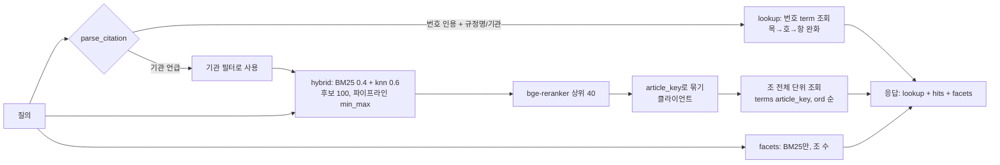
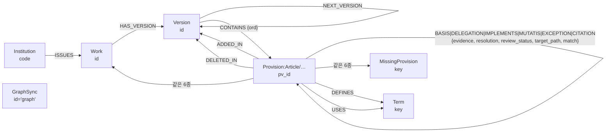

# 04. 검색(OpenSearch)과 구조 그래프(Neo4j)

- 대상: NST·출연연 규정·법령 플랫폼 (`nst-regulation`, 브랜치 `feat/m6-integration`, 커밋 `bff3b1b` 기준)
- 작성: 2026-10-03
- 근거 자료
  - 코드: `src/reg/index`, `src/reg/search`, `src/reg/graph`, `src/reg/alerts/impact.py`, `src/reg/api/graph_routes.py`, `src/reg/qa/evidence.py`, `config/search_*.txt`
  - 설계: `docs/superpowers/specs/2026-10-03-graph-search-redesign.md`
  - 계획: `docs/superpowers/plans/2026-10-03-m7-search.md`, `2026-10-03-m7-graph.md`
  - 판정 기록: SDD ledger (`m7-search`, `m7-graph` 작업트리의 `.superpowers/sdd/…/progress.md`)
- 실측값은 모두 2026-10-03에 운영 클러스터에서 **읽기 전용 요청**으로 확인했다. 요청문은 각 표 아래에 적었다.
  - OpenSearch: GET, `_search`, `_count`, `_mapping`, `_settings`, `_analyze`
  - Neo4j: `MATCH`/`RETURN`/`SHOW`
- 비밀번호·계정 비밀값은 이 문서에 적지 않는다. `.env`의 변수 이름만 쓴다.

---

## Part A. OpenSearch — 조·항·호·목 단위 검색

### A1. 클러스터

| 항목 | 값 | 확인 방법 |
|---|---|---|
| 위치 | GPU PC `192.168.0.2:8005` (컨테이너 9200 → 8005) | `infra/gpu-opensearch/docker-compose.yml` |
| 버전 | OpenSearch **2.19.1** (Lucene 9.12.1), `cluster_name: nst-regulation`, 단일 노드 | `GET /` |
| 이미지 | `opensearchproject/opensearch:2.19.1` + `analysis-nori` 플러그인 설치 | `infra/gpu-opensearch/Dockerfile` |
| 힙 | 8 GB (`-Xms8g -Xmx8g`), `bootstrap.memory_lock: true` | compose · `GET /_nodes/stats/jvm` (heap_max 8,589,934,592) |
| 주요 플러그인 | `analysis-nori`, `opensearch-knn`, `opensearch-neural-search`(hybrid 질의·검색 파이프라인), `opensearch-security` 외 기본 번들 | `GET /_cat/plugins?v` |
| 보안 | security 플러그인 켬, **HTTP**(TLS 끔: `plugins.security.ssl.http.enabled=false`), 계정 인증 | compose |
| 방화벽 | 플랫폼 서버 `192.168.0.3`만 8005 허용 (Windows `New-NetFirewallRule … -RemoteAddress 192.168.0.3`) | compose 주석 |
| 상태 | `yellow`. 노드 1개라 복제본을 둘 수 없는 감사 로그·`top_queries` 색인 4개 샤드가 미할당이다. 서비스 색인은 replicas=0이라 green | `GET /_cluster/health` |

**계정** (`GET /_plugins/_security/api/internalusers`, `…/rolesmapping`, admin 계정으로 조회)

| 계정 | 용도 | 역할 매핑 | `.env` 변수 |
|---|---|---|---|
| `admin` | 관리 (reserved) | `admin` 백엔드 역할 | `REG_GPU_OS_ADMIN_PASSWORD` |
| `reg_app` | 규정 플랫폼 앱 (색인 빌드·검색) | `all_access` | `REG_OS_URL`, `REG_GPU_OS_URL` (URL 안에 계정 포함) |
| `nais_app` | NAIS(nst-nexus) 앱 | `all_access` | (NAIS 쪽 설정) |
| `kibanaserver` | Dashboards 서버 | `kibana_server` | — |
| `logstash`, `kibanaro`, `readall`, `snapshotrestore`, `anomalyadmin` | 보안 플러그인 데모 기본 계정 (그대로 남아 있음) | 각 기본 역할 | — |

> 주의(실측): `reg_app`과 `nais_app`이 모두 `all_access`에 매핑돼 있다. 두 앱이 서로의 색인을 바꾸거나 지울 수 있다.
> 코드 쪽 방어는 있다. `reg.index.os.OpenSearch.create_index`·`delete_index`는 이름이 `reg-provisions-`로 시작하는지 assert하고, `prune`은 `reg-provisions-r\d+`만 지운다.

**이 서버(192.168.0.3)에서 중계하는 포트** (`docker ps`, `ss -ltn`)

| 포트 | 컨테이너 | 대상 |
|---|---|---|
| 21069 | `nst-regulation-opensearch-dashboards-1` (5601) | GPU PC OpenSearch Dashboards. Dev Tools 예시(§A9)를 여기서 실행한다 |
| 21056 | `nais-gateway-1` (nginx, nst-nexus 소유) | `http://192.168.0.2:8005`로 프록시한다. 앞단은 Basic auth, 뒤로는 OpenSearch 서비스 계정을 붙인다 (`/data/project/nst-nexus/infra/nginx/nais.conf`). 주석: "GPU PC 전용 OpenSearch (2026-10-03, nst-regulation과 공유)" |

### A2. 색인과 별칭 (실측)

요청: `GET /_cat/indices?v&s=index&h=index,health,docs.count,store.size` · `GET /_cat/aliases?v`

| 색인 | 별칭 | 문서 수 | 크기 | 소유·상태 |
|---|---|---:|---:|---|
| `reg-provisions-r16` | **`reg-provisions`** | 1,418,701 | 4.8 GB | **규정 플랫폼 운영 색인** (조항 단위, M7) |
| `nais-regulations-r14` | `nais-regulations` | 497,158 | 8.4 GB | 규정 플랫폼의 **옛 조 단위 청크 색인**. 운영 코드는 더 이상 쓰지 않는다. `ops.release` 14번이 아직 `PUBLISHED`로 남아 있다(옛 줄) |
| `nais-datasets-v2` | `nais-datasets` | 5 | 24 KB | **NAIS 소유**. 이 플랫폼은 건드리지 않는다 |
| `.kibana*`, `.opendistro_security`, `.plugins-ml-config`, `security-auditlog-*`, `top_queries-*` 등 | — | — | — | 시스템 색인 |

- 검색 파이프라인 `reg-provisions-hybrid` 1개 (`GET /_search/pipeline/reg-provisions-hybrid`)
- `ops.release` 기록 (PostgreSQL, 읽기 전용 SELECT)

| id | 상태 | 색인 | 비고 |
|---|---|---|---|
| 16 | PUBLISHED (2026-10-03 01:10 UTC) | `reg-provisions-r16` | 게이트 통과. 빌드 1,597.3초 |
| 15 | FAILED | `reg-provisions-r15` | `title_suggest`를 nori로 분석하다 shingle 오류가 났다. 실제 제목 26건이 문제였다(판정 Task 8). 그래서 `standard` 분석기로 바꿨다 |
| 14 | PUBLISHED (옛 줄) | `nais-regulations-r14` | 청크 497,158 |
| 11~13 | RETIRED / FAILED | `nais-regulations-r11~13` | 옛 줄 |

### A3. release 모델 (빌드 → 게이트 → 게시 → 정리)

코드: `reg.index.indexer.build_release`, `reg.index.release` (`publish_release`, `gate_release`, `prune_releases`), `reg.index.tasks`
진입점: CLI `reg index build|gate|publish|prune|smoke|status`, Airflow `reg_publish` DAG (`embed_check → index_build → index_gate → index_publish`)

| 단계 | 하는 일 | 실패하면 |
|---|---|---|
| 지문 | `fingerprint()` = sha256(`INDEX_FORMAT`·모델명·dated 판본 수·판본/규범문서/기관/조항 목록 해시) | 직전 게시본의 `stats.fingerprint`와 같으면 **빌드하지 않는다** (`skipped`) |
| 빌드 | `ops.release` 행을 `BUILDING`으로 넣는다. 색인 `reg-provisions-r{id}`를 첫 벡터가 나온 묶음에서 그 차원으로 만든다. 500건 묶음마다 캐시 조회 → 없는 것만 임베딩 → `_bulk`. 끝나면 `_count`가 문서 수와 같은지 확인한다 | 색인을 지우고 `FAILED` |
| 게이트 | ① 문서 수가 직전 게시본보다 2% 넘게 줄지 않았나 ② `_count` = 빌드 기록 ③ 스모크 질의 5개(`config/index_smoke.yaml`)가 상위 5위 안에서 기대 조를 찾나 | 품질 미달이면 `FAILED`, 재시도하지 않는다. 임베딩·리랭커 장애로 hybrid/rerank가 빠졌으면 `ProviderError`를 내고 다시 시도한다(품질 문제가 아니므로) |
| 게시 | DB에서 기존 게시본을 `RETIRED`, 새 행을 `PUBLISHED`로 바꾼다. `POST /_aliases`(remove+add 한 요청)로 별칭을 옮긴 뒤 커밋한다 | 별칭 교체가 실패하면 DB를 롤백한다. 커밋이 실패하면 별칭을 되돌린다. **별칭을 바꾼 뒤에는 어떤 실패에도 색인을 지우지 않는다** |
| 정리 | 게시본, 직전 게시본, 6시간 안의 진행 중 빌드, 현재 별칭 대상만 남긴다 | 색인 목록을 먼저 읽고 DB·별칭을 나중에 읽는다. 그 사이 만들어진 색인을 지우지 않기 위해서다 |

**왜 이렇게 했나**

- 별칭 교체는 원자적이다. 검색은 끊기지 않고, 나쁜 빌드는 별칭에 닿지 않는다.
- 지문 덕분에 변화가 없는 날은 GPU 임베딩을 돌리지 않는다.
- 직전 게시본을 남겨 두므로 `publish <이전 id>`로 되돌릴 수 있다. `publish`는 같은 id를 두 번 불러도 `already=True`가 되고, DB와 별칭이 어긋났으면 맞춘다.
- `ops.release`를 옛 `nais-regulations-r*` 줄과 함께 쓴다. 그래서 모든 판단을 `starts_with(os_index, 'reg-provisions-r')`로 자기 줄에만 한정한다. `LIKE`의 `%`는 psycopg 매개변수 자리와 겹치므로 쓰지 않았다(판정 Task 2).

### A4. 설정과 분석기 (실측 `GET /reg-provisions-r16/_settings`)

| 설정 | 값 | 이유 |
|---|---|---|
| `index.knn` | true | `embedding` knn_vector |
| shards / replicas | 1 / 0 | 단일 노드, 140만 문서·4.8 GB면 샤드 1개로 충분하다 |
| `analysis` | 색인을 만들 때 **인라인**으로 보낸다 | 클러스터가 원격(GPU PC)이라 노드에 사전 파일을 둘 수 없다. 규칙이 바뀌면 다음 빌드부터 반영된다(판정) |

**토크나이저·분석기**

| 이름 | 구성 | 쓰는 곳 | 이유 |
|---|---|---|---|
| `nori_mixed` | `nori_tokenizer`, `decompound_mode: mixed`, `user_dictionary_rules` = `config/search_userdict.txt` | 분석기 `ko` | 복합어와 그 부분을 모두 색인한다. 예: `출장복명서` → `출장복명서`·`출장`·`복명서` |
| `nori_discard` | 같은 사전, `decompound_mode: discard` | 분석기 `ko_syn` | mixed는 같은 위치에 복합어와 부분을 함께 낸다. 그러면 `synonym_graph`가 `출장비` 같은 규칙을 읽지 못하고, `lenient` 때문에 그 규칙이 조용히 버려진다(판정 Task 1). 색인 쪽(mixed)에는 부분 토큰이 다 있으므로 검색은 부분만으로도 맞는다 |
| `ko` | `nori_mixed` + `lowercase`, `nori_readingform` | 색인 분석기(모든 text 필드), `title`·`full_label`·`institution_name` 검색 | 한국어 형태소 |
| `ko_syn` | `nori_discard` + `lowercase`, `nori_readingform`, `ko_synonyms`(synonym_graph, lenient) | `text`·`heading`·`article_text`·`breadcrumb`의 `search_analyzer` | 동의어는 **검색할 때만** 붙인다. 동의어를 고쳐도 색인 크기는 늘지 않는다 |
| `standard` | 기본 | `title_suggest`(search_as_you_type) | nori mixed는 같은 자리에 토큰을 겹쳐 내서 `_2gram`·`_3gram` shingle이 깨진다. r15가 이 때문에 실패했다. 자동완성은 낱말 앞부분으로 찾으므로 형태소 분석이 필요 없다(판정 Task 8) |

**동의어·사용자 사전** (`config/search_synonyms.txt` 34줄, `config/search_userdict.txt` 13줄 — 라이브 settings와 같음)

| 파일 | 내용 | 규칙 |
|---|---|---|
| `search_synonyms.txt` | 규정 용어 9줄(출장비↔여비, 지출결의↔정산, 연차↔연가, 복명↔출장복명서↔복명서, 월급↔급여↔보수, 퇴직금↔퇴직급여, 숙박비↔숙박료, 법인카드↔신용카드, 결과보고↔결과보고서) + 기관 약칭 25줄(예: `천문연, 천문연구원, 한국천문연구원`) | Solr 형식. 한 줄 = 서로 같은 말 |
| `search_userdict.txt` | 기관 약칭 5개(과기연구회·키스트·키스티·생기원·에트리) + 규정 용어 8개(여비·증빙서·출장복명서·복명서·지출결의·재해구호휴가·법인카드·퇴직급여, 복합어는 부분 지정) | `천문연`처럼 정식명의 앞부분인 약칭은 사전에 넣지 않는다. 넣으면 `한국천문연구원`이 `천문연+구원`으로 쪼개진다. 이런 약칭은 동의어로 잇는다(판정 Task 1) |

`_analyze` 실측 (`POST /reg-provisions/_analyze`)

| 분석기 | 입력 `천문연 출장비 정산` → 토큰(위치) |
|---|---|
| `ko` | 천(0) 문연(1) 문(1) 연(2) 출장비(3) 출장(3) 비(4) 정산(5) |
| `ko_syn` | 천문(0) 한국(0) 천(0) 연구(1) 원(2) 천문(3) 연구(4) 원(5) 문(6) 연(7) **여비(8)** 출장(8) 비(9) **지출(10)** 정산(10) **결의(11)** |

### A5. 매핑 — 모든 필드 (실측 `GET /reg-provisions/_mapping`, `dynamic: strict`)

문서 1개 = **조항 판본 1개(provision_version)를 한 판본(work_version)에서 본 것**이다. 문서를 만드는 코드는 `reg.index.units.unit_docs`다.

- 포함: 조·항·호·목·별표·서식·부칙·부칙조
- 제외: 장·절. 별도 문서를 만들지 않고 `breadcrumb` 문맥으로만 쓴다.

**식별·위치**

| 필드 | 형식 | 뜻 | 쓰는 기능 |
|---|---|---|---|
| `doc_id` | keyword | `{version_id}\|{path}` (창이면 `…#n`). `_id`와 같다 | bulk id |
| `release_id` | keyword | `ops.release.id` | 검색 응답 `release_id`, QA가 근거 판본을 release 안에서 찾을 때 |
| `pv_id` | long | `regulation.provision_version.id` = Neo4j `Provision.pv_id` | 검색 결과 → 관계도·그래프 근거 확장으로 잇는 열쇠 |
| `work_id` | keyword | 규범문서 id (`kr/reg/KASI/여비규정`, `kr/law/013774`) | 결과 표시, 스모크 판정, suggest collapse |
| `version_id` | keyword | 판본 id (`…@2024-01-17`) | 결과 표시, 근거 |
| `path` | keyword | 조항 경로 (`a27.p1.i3.s가`, `annex1`, `form2`, `supp@2024-01-17/a1`). 창이면 `#n`을 붙인다 | 표시 |
| `base_path` | keyword | 창 접미사를 뗀 경로 | 묶음 안 matches/units 경로 |
| `parent_path` | keyword | 부모 조항 경로 | 웹 카드에서 계층 들여쓰기 |
| `article_path` | keyword | 소속 최상위 단위(조·별표·부칙조) 경로 | 묶음 대표 |
| `article_key` | keyword | `{version_id}\|{article_path}` | **클라이언트 묶음 키**, 조 전체 단위 가져오기, facets 조 수(cardinality) |
| `unit` | keyword | article/paragraph/item/subitem/annex/form/supplement/supp_article | 단위 필터, 인용 조회 |
| `window` | integer | 0 = 나누지 않음, 1..n = 긴 단위의 n번째 창 | 조회는 첫 창만(`window ≤ 1`), 정렬 |
| `ord` | integer | 판본 안 문서 순서 | 조 전체 단위 정렬, 조회 동점 정렬 |

**번호 직접 조회용** (`numbers()`. 부칙 안 조문에는 번호 필드를 넣지 않는다. 본칙 번호 조회에 섞이지 않게 하기 위해서다)

| 필드 | 형식 | 예 (`제27조의2 제1항 제3호의2 가목`) |
|---|---|---|
| `article_no` / `article_branch` | integer | 27 / 2 (가지번호 없으면 0) |
| `paragraph_no` | integer | 1 |
| `item_no` / `item_branch` | integer | 3 / 2 |
| `subitem` | keyword | 가 |
| `annex_no` / `annex_branch` | integer | 별표·별지 번호 / 가지번호 |

**라벨·본문**

| 필드 | 형식·분석기 | 뜻 | 쓰는 기능 |
|---|---|---|---|
| `label` | keyword | 정식 라벨: `제1항`, `제3호의2`, `가목`, `부칙(2024. 1. 17.)` | 결과 matches |
| `marker` | keyword, `index:false` | 원문 번호 표기 (`①`, `3.`) | 카드 표시, 리랭크 입력 |
| `full_label` | text `ko` + `.kw` | `여비규정 제27조 제1항` (장·절 제외) | BM25 필드(가중 1). facets에서는 뺀다 |
| `heading` | text `ko`/`ko_syn` | 소속 조의 제목 (`출장증빙의 제출`) | BM25 `heading^2` |
| `title` | text `ko` + `.kw` | 규범문서 제목 | 인용 조회(정확 일치 boost 20), facets 규정별, suggest 정확 일치 boost |
| `title_suggest` | search_as_you_type, `standard`, max_shingle 3 | 제목 | 자동완성 (`_2gram`·`_3gram` bool_prefix). 응답 `_source`에서는 뺀다 |
| `text` | text `ko`/`ko_syn` | **그 단위 자신의 본문** (창이면 그 조각) | BM25 `text^3`, 하이라이트(`<mark>`) |
| `article_text` | text `ko`/`ko_syn` | 조 전체 본문(머리 + 항·호·목). **조 문서(창이면 첫 창)에만** 둔다 | BM25 문맥, 결과 카드 본문, 리랭크 입력 |
| `breadcrumb` | text `ko`/`ko_syn` | `한국천문연구원 > 여비규정 > 제5장 … > 제27조(출장증빙의 제출) > 제1항` | BM25 문맥 |
| `context` | text, `index:false` | 하위 단위의 문맥: 조 머리 + 조 본문 + 사이의 항·호 | 리랭크 입력만 |
| `annex_image` | keyword, `index:false` | `/api/v1/annex?version=…&path=…` | 별표·서식 이미지 보기 |

**기관·종류·시점**

| 필드 | 형식 | 뜻 | 쓰는 기능 |
|---|---|---|---|
| `institution` | keyword | 기관 코드(KASI…). 법령·행정규칙은 `LAW` | 필터, facets 기관별 |
| `institution_name` | text `ko` + `.kw` | 정식 기관명. 법령은 소관부처(`work.external_ids.ministry`) | 필터(정식명 정확 일치), BM25 가산점(`should`) |
| `institution_aliases` | keyword | 약칭 배열 | 필터(약칭) |
| `family` | keyword | reg / law / admrul (work_id 접두로 정한다) | 종류 필터·facets. 기관 필터를 걸어도 법령은 늘 함께 나온다 |
| `work_kind` | keyword | `regulation.work.kind` | 표시 |
| `effective_from` / `effective_to` | date | 판본 시행 구간. 폐지되면 끝을 폐지일로 자른다 | 기준일(`as_of`) 필터 |
| `version_state` | keyword | CURRENT / HISTORICAL / FUTURE / ABOLISHED | 기본 필터 `CURRENT` |

**벡터**

| 필드 | 형식 | 뜻 |
|---|---|---|
| `embedding` | knn_vector 1024, HNSW, engine `lucene`, `cosinesimil` | bge-m3 벡터. 일부 문서에만 있다(§A6) |
| `embedding_model` | keyword | `bge-m3` |

### A6. 임베딩

| 항목 | 값 | 근거 |
|---|---|---|
| 모델·서버 | **bge-m3**, 1024차원, GPU PC `:8002` (`REG_EMBED_URL`), 빌드 때 묶음 32 | `settings.py`, `tasks.build` |
| 벡터를 넣는 문서 | **현행(CURRENT) 판본**의 **조·항·별표**(창 포함). 서식(form)과 호·목, 부칙, 과거·미래 판본에는 넣지 않는다 | `VECTOR_UNITS`, `VECTOR_STATES` |
| 이유 | 공간을 아낀다. 과거 기준일 검색은 BM25로 한다. 호·목은 항 벡터의 임베딩 입력에 포함된다 | spec §2.1 |
| 임베딩 입력 | 조·별표 = 조 머리 + 조 전체(M6 청크와 같은 형식이라 옛 캐시를 그대로 쓴다). 항 = 조 머리 + 항 + 그 아래 호·목. 창 = 머리 + 조각 | `unit_docs` |
| 긴 단위 | 머리 + 본문이 1,200자를 넘으면 같은 머리말로 `#n` 창을 나눈다 (실측 창 문서 34,693건) | `MAX_CHARS` |
| 자르기 | 임베딩 입력만 **4,000자**에서 자른다. bge-m3 한도가 8,192토큰이고 넘으면 400 오류가 난다(실측). BM25 본문은 자르지 않는다 | `cache.EMBED_MAX_CHARS` |
| 캐시 | `ops.embedding_cache(text_hash=sha256(text), model, vector real[])`. 없는 것만 임베딩하고 묶음마다 **커밋**한다. GPU가 꺼져 빌드가 실패해도 이미 한 것은 다시 하지 않는다 | `cache.embed_cached` |
| 캐시 규모 (실측) | 283,919행(bge-m3), 1,568 MB | `SELECT model, count(*) FROM ops.embedding_cache GROUP BY model` |
| GPU 양보 | `--embed-pause` / `REG_INDEX_EMBED_PAUSE`: 새로 임베딩한 묶음 사이에 쉰다 | `_Sink.flush` |
| r16 빌드 | 벡터 193,324 · 고유 텍스트 180,647 · 새로 임베딩 94,832 · 1,597초 (26분 41초, RSS 400 MB) | `ops.release.stats`, ledger Task 8 |

### A7. 검색 파이프라인



| 단계 | 구현 | 값·규칙 | 이유·판정 |
|---|---|---|---|
| 1. 인용 해석 | `reg.search.citation.parse_citation` | 정규식: 조 `제?N조(의M)?`, 항 `제N항`·①~⑳, 호 `제N호(의M)?`, 목 `가목`, 별표·별지 `별표 제N호(의M)`. 번호가 없으면 인용이 아니다. 기관은 약칭표에서 긴 것부터 찾고, 둘 이상 보이면 정하지 않는다. 남은 앞부분이 규정명이 된다 | `천문연 여비규정 27조 1항` → `{institution: KASI, title: 여비규정, article: 27, paragraph: 1}` |
| 2. 번호 조회 | `reg.search.lookup` | filter: 단위·번호 term + `window ≤ 1` + 현행(또는 as_of). must: `title.kw` 정확 일치(공백 포함/제거 각 boost 20) ∨ `match_phrase`(5) ∨ `match` and(2). 정렬 `_score, title.kw, ord`. 결과가 없으면 목→호→항 순으로 넓히고 `relaxed=true` | 단일 항 조문을 "제2조 제1항"으로 인용하는 경우가 흔하다(Task 7). 제목은 모든 낱말이 맞아야 한다. 60% 완화를 뺀 것은 `공사관리규정`이 `여비규정`에 잡혔기 때문이다(Task 8) |
| 3. 기관 전파·인용 조 고정 | `reg.search.service.search` | 요청에 기관이 없으면 질의가 말한 기관(인용의 기관, 인용이 아니면 `mentioned_institution`: 약칭표에서 하나만 보일 때)을 hybrid·facets 필터로 쓴다. 요청의 기관이 늘 우선이다. lookup은 규정명 또는 기관이 있을 때만 하고, 3건을 돌려준다. 기관이 정해졌고 lookup 1위가 `kind`에 맞으면 그 조를 hits 1위로 둔다(이미 있으면 앞으로 옮기고, 없으면 `reg.index.service.cited_hit`로 만든다) | 다른 기관의 제27조가 섞이는 문제(Task 8), 같은 기관 다른 규정의 제27조(스쿨운영규정 제27조(여비))가 리랭크 1위가 되는 문제, 기관만 말한 질의(`천문연 출장 증빙`)에 다른 기관이 섞이는 문제가 실화면에서 보였다(search-inst) |
| 4. 하이브리드 | `reg.index.service.search` | `query.hybrid.queries = [BM25, knn]`. BM25 = `multi_match(text^3, heading^2, full_label, breadcrumb, article_text)` + `should match institution_name` + filter. knn = `k=100` + 같은 filter. `search_pipeline=reg-provisions-hybrid` (min_max 정규화, arithmetic_mean, 가중치 **0.4/0.6**). `size=100`, highlight `text`(조각 0 = 전체) | 임베딩 서버 장애(`ProviderError`)면 BM25만 쓰고 `mode=bm25` |
| 5. 리랭크 | 같은 함수 | 상위 40개를 **bge-reranker**(`:8003`, `REG_RERANK_URL`)로 리랭크. 입력 = 제목 + context + (조 문서면 조 전체, 아니면 marker+본문), 1,500자 | 리랭커가 실패하면 하이브리드 점수를 그대로 쓴다 |
| 6. 조 단위 묶기 | `_group` | `article_key`로 묶는다. 묶음 순위는 대표 단위의 (rerank_score, score) 순. 묶음마다 matches(최고 단위 + 하이라이트가 있는 단위, 최대 5개) | **OS 2.19는 hybrid 아래에서 `collapse`·`inner_hits`를 거부한다**("hybrid query must be a top level query", 전용 클러스터에서 확인). 그래서 묶기를 클라이언트에서 한다. 비용은 검색당 단위 조회 1회가 더 드는 것이다(판정) |
| 7. 조 전체 단위 | `_fetch_units` | `terms article_key` (size 2000, `ord, window` 정렬) | 카드 본문(`article_text`)과 항·호 목록(`units`) |
| 8. 집계 | `reg.search.facets` | `size:0`. `multi_match cross_fields`, `minimum_should_match: 2<75%`, 필드 `text^3, heading^2, breadcrumb, article_text`(full_label 제외). 축은 institution(50)·family(5)·title.kw(10). 값마다 `cardinality(article_key)` = **조 수**. 각 축은 자기 필터만 빼고 센다 | knn은 언제나 이웃 k개를 돌려주므로 건수에 뜻이 없다. 그래서 BM25만 쓴다. 한 낱말만 맞아도 세면 '규정'·'1' 같은 말 때문에 거의 모든 조가 잡힌다(Task 4·8) |
| 9. 자동완성 | `reg.search.suggest` | `multi_match bool_prefix` on `title_suggest`, `._2gram`, `._3gram` + `should term title.kw`(boost 5). 현행만, `collapse: work_id`. 입력으로 시작하는 제목과 짧은 제목을 앞에 둔다 | 규범문서마다 한 번만 나온다 |

**API** (`src/reg/api/app.py`)

| 경로 | 내용 |
|---|---|
| `GET /api/v1/hsearch?q&institution&as_of&kind=reg\|law\|admrul&unit&current_only&rerank&size&facets` | 위 1~8단계 (`with_units=True`) |
| `GET /api/v1/search/lookup?q&as_of&size` | 번호 직접 조회만 |
| `GET /api/v1/search/suggest?q&institution&size` | 자동완성 |
| (QA) `reg.qa.service.ask` | 같은 `reg.search.service.search`를 `facets=False, with_units=False`로 부른다. 직접 인용된 조 1개를 앞에 둔다(Task 7) |

**성능·품질 (ledger Task 8, r16)**

| 지표 | 값 | 목표 |
|---|---|---|
| `reg search check-lookups` | 9/9가 1위 | 평가 세트 전부 1위 |
| 검색 bench (n=66) | p50 239 ms, p95 380 ms | p95 < 1.5초 |
| `reg eval qa --no-log` | 인용 정확도 0.917, 결론 1.0, 상태 1.0, p95 2,054 ms | 인용 ≥ 0.90 |

### A8. 실측 수치 (`reg-provisions` → r16)

요청 1 — 단위·상태·종류·벡터

```json
POST /reg-provisions/_search
{"size":0,"track_total_hits":true,"aggs":{
  "unit":{"terms":{"field":"unit","size":20}},
  "state":{"terms":{"field":"version_state","size":10}},
  "family":{"terms":{"field":"family","size":5}},
  "vectors":{"filter":{"exists":{"field":"embedding"}},"aggs":{"unit":{"terms":{"field":"unit"}}}},
  "windows":{"filter":{"range":{"window":{"gte":1}}}},
  "works":{"cardinality":{"field":"work_id","precision_threshold":10000}},
  "articles":{"cardinality":{"field":"article_key","precision_threshold":40000}}}}
```

| 단위 | 문서 | 벡터 |
|---|---:|---:|
| paragraph | 423,103 | 111,100 |
| item | 385,615 | — |
| article | 273,475 | 71,578 |
| supplement | 134,545 | — |
| supp_article | 87,618 | — |
| subitem | 43,679 | — |
| annex | 42,101 | 10,646 |
| form | 28,565 | — |
| **합계** | **1,418,701** | **193,324** |

| 구분 | 값 |
|---|---|
| version_state | HISTORICAL 1,055,422 · CURRENT 363,213 · FUTURE 66 |
| family | reg 1,414,776 · law 3,925 (admrul 0) |
| 창(`window ≥ 1`) 문서 | 34,693 |
| 규범문서 | 3,839 (cardinality) |
| 판본 | 11,505 (`ops.release.stats.versions`) |
| 조 묶음(`article_key`) | 약 543,054 (cardinality 근사) |
| 저장 크기 | 4.8 GB (세그먼트 최대 ≈ 548 MB) |

요청 2 — 기관별

```json
POST /reg-provisions/_search
{"size":0,"aggs":{"inst":{"terms":{"field":"institution","size":60},"aggs":{
  "name":{"terms":{"field":"institution_name.kw","size":1}},
  "cur":{"filter":{"term":{"version_state":"CURRENT"}}},
  "vec":{"filter":{"exists":{"field":"embedding"}}},
  "works":{"cardinality":{"field":"work_id"}}}}}}
```

| 코드 | 기관 | 규범문서 | 문서(전체) | 현행 문서 | 벡터 |
|---|---|---:|---:|---:|---:|
| ETRI | 한국전자통신연구원 | 158 | 97,325 | 18,133 | 9,904 |
| KIER | 한국에너지기술연구원 | 151 | 90,185 | 15,268 | 7,991 |
| KIMM | 한국기계연구원 | 184 | 86,726 | 17,318 | 8,230 |
| KIST | 한국과학기술연구원 | 167 | 86,407 | 18,376 | 9,032 |
| KERI | 한국전기연구원 | 199 | 79,508 | 17,566 | 8,953 |
| KITECH | 한국생산기술연구원 | 154 | 77,645 | 17,465 | 8,562 |
| KBSI | 한국기초과학지원연구원 | 182 | 76,805 | 17,846 | 9,310 |
| KRICT | 한국화학연구원 | 140 | 74,244 | 14,938 | 8,705 |
| KARI | 한국항공우주연구원 | 184 | 66,549 | 17,419 | 8,680 |
| KIOM | 한국한의학연구원 | 143 | 58,600 | 14,660 | 5,884 |
| NST | 국가과학기술연구회 | 109 | 58,290 | 11,921 | 7,016 |
| KRIBB | 한국생명공학연구원 | 168 | 57,379 | 16,064 | 8,405 |
| KASI | 한국천문연구원 | 136 | 55,570 | 12,290 | 6,831 |
| KRISS | 한국표준과학연구원 | 127 | 51,058 | 10,852 | 6,213 |
| KFRI | 한국식품연구원 | 157 | 50,484 | 15,679 | 8,430 |
| NIMS | 국가수리과학연구소 | 139 | 47,773 | 12,548 | 7,095 |
| KISTI | 한국과학기술정보연구원 | 160 | 47,704 | 17,379 | 10,173 |
| KIMS | 한국재료연구원 | 192 | 41,104 | 16,067 | 8,884 |
| KICT | 한국건설기술연구원 | 124 | 39,180 | 12,094 | 6,694 |
| KIT | 안전성평가연구소 | 131 | 38,521 | 11,375 | 6,730 |
| KFE | 한국핵융합에너지연구원 | 134 | 38,397 | 11,530 | 7,081 |
| WIKIM | 세계김치연구소 | 69 | 29,218 | 6,876 | 3,574 |
| KRRI | 한국철도기술연구원 | 134 | 28,337 | 11,923 | 6,436 |
| KAERI | 한국원자력연구원 | 202 | 21,208 | 8,298 | 4,450 |
| KIGAM | 한국지질자원연구원 | 185 | 16,559 | 15,403 | 8,069 |
| LAW | 법령 (소관부처: 재정경제부·과학기술정보통신부·인사혁신처) | 10 | 3,925 | 3,925 | 1,992 |

법령 10건(현행만 있음): 국가를 당사자로 하는 계약에 관한 법률(·시행령), 국가연구개발혁신법(·시행령·시행규칙), 공공기관의 운영에 관한 법률(·시행령), 과학기술분야 정부출연연구기관 등의 설립ㆍ운영 및 육성에 관한 법률(·시행령), 공무원 여비 규정. 이 목록은 `config/sources/lawgo.yaml`의 `promote.laws`와 같다.

### A9. Dev Tools 예시 (Dashboards `:21069` → Dev Tools)

```json
# 1) 번호 직접 조회: 천문연 여비규정 제27조 제1항 (lookup.citation_query와 같은 꼴)
GET reg-provisions/_search
{"_source":["full_label","pv_id","text","article_key"],
 "query":{"bool":{
   "filter":[{"term":{"version_state":"CURRENT"}},{"term":{"institution":"KASI"}},
             {"term":{"unit":"paragraph"}},{"term":{"article_no":27}},{"term":{"article_branch":0}},
             {"term":{"paragraph_no":1}},{"bool":{"must_not":{"range":{"window":{"gt":1}}}}}],
   "must":[{"term":{"title.kw":"여비규정"}}]}}}
# 실측 결과: 1건 — doc_id "kr/reg/KASI/여비규정@2024-01-17|a27.p1", pv_id 496971,
#   full_label "여비규정 제27조 제1항", "출장자는 출장 종료일 다음 날을 기점으로 7일 이내에 …"

# 2) BM25 부분만 (hybrid의 첫 질의), 하이라이트
GET reg-provisions/_search
{"size":10,"_source":{"excludes":["embedding","title_suggest"]},
 "highlight":{"pre_tags":["<mark>"],"post_tags":["</mark>"],"fields":{"text":{"number_of_fragments":0}}},
 "query":{"bool":{"must":{"multi_match":{"query":"출장비 증빙 제출 기한",
            "fields":["text^3","heading^2","full_label","breadcrumb","article_text"]}},
          "should":[{"match":{"institution_name":"출장비 증빙 제출 기한"}}],
          "filter":[{"term":{"version_state":"CURRENT"}},{"term":{"institution":"KASI"}}]}}}

# 3) hybrid (벡터는 bge-m3 :8002로 만든 1024개 실수. Dev Tools는 임베딩을 만들지 못하므로 붙여 넣어야 한다)
GET reg-provisions/_search?search_pipeline=reg-provisions-hybrid
{"size":100,"query":{"hybrid":{"queries":[
   {"bool":{"must":{"multi_match":{"query":"출장비 증빙","fields":["text^3","heading^2","full_label","breadcrumb","article_text"]}},
            "filter":[{"term":{"version_state":"CURRENT"}}]}},
   {"knn":{"embedding":{"vector":[/* 1024 floats */],"k":100,
            "filter":{"bool":{"filter":[{"term":{"version_state":"CURRENT"}}]}}}}}]}}}

# 4) 한 조의 모든 단위 (결과 카드)
GET reg-provisions/_search
{"size":200,"_source":["path","unit","label","marker","text"],
 "query":{"bool":{"filter":[{"term":{"article_key":"kr/reg/KASI/여비규정@2024-01-17|a27"}}]}},
 "sort":[{"ord":"asc"},{"window":"asc"}]}

# 5) 과거 기준일 검색 (2020-01-01에 시행 중이던 판본, BM25만)
GET reg-provisions/_search
{"query":{"bool":{"must":{"match":{"text":"증빙서"}},"filter":[
   {"term":{"work_id":"kr/reg/KASI/여비규정"}},
   {"range":{"effective_from":{"lte":"2020-01-01"}}},
   {"bool":{"should":[{"range":{"effective_to":{"gt":"2020-01-01"}}},
                      {"bool":{"must_not":{"exists":{"field":"effective_to"}}}}],"minimum_should_match":1}}]}}}

# 6) 자동완성 "여비" (실측 상위: 공무원 여비 규정, 여비규정, 여비업무 처리기준 …)
GET reg-provisions/_search
{"size":8,"_source":["title","work_id","institution"],
 "query":{"bool":{"filter":[{"term":{"version_state":"CURRENT"}}],
   "must":{"multi_match":{"query":"여비","type":"bool_prefix",
     "fields":["title_suggest","title_suggest._2gram","title_suggest._3gram"]}}}},
 "collapse":{"field":"work_id"}}

# 7) 분석기 확인
POST reg-provisions/_analyze
{"analyzer":"ko_syn","text":"천문연 출장비 정산"}

# 8) 집계: 기관별 조 수 (facets와 같은 기준)
GET reg-provisions/_search
{"size":0,"query":{"bool":{"must":{"multi_match":{"query":"출장 증빙서 제출","type":"cross_fields",
   "fields":["text^3","heading^2","breadcrumb","article_text"],"minimum_should_match":"2<75%"}},
   "filter":[{"term":{"version_state":"CURRENT"}}]}},
 "aggs":{"inst":{"terms":{"field":"institution","size":50},"aggs":{"articles":{"cardinality":{"field":"article_key"}}}}}}
```

### A10. 옛 청크 색인과 비교

| 항목 | 옛 `nais-regulations-r14` (M4~M6) | 새 `reg-provisions-r16` (M7) |
|---|---|---|
| 문서 단위 | 조 단위 청크(`reg.index.chunks`). 1,200자를 넘으면 항 단위 | **조항 판본 1개** (조·항·호·목·별표·서식·부칙·부칙조), 긴 단위는 `#n` 창 |
| 문서 수 / 크기 | 497,158 / 8.4 GB | 1,418,701 / 4.8 GB |
| 벡터 | **모든 문서**(과거 판본 포함) 497,158 | 현행 조·항·별표만 193,324 |
| 필드 | `chunk_id, path, path_label, text, context_text, title, institution*, effective_*, version_state, work_kind, embedding…` | §A5의 42개 필드 (번호·계층·`article_key`·`pv_id`·`breadcrumb`·`title_suggest`…) |
| 분석기 | `ko`(nori mixed)만, 동의어·사용자 사전 없음 | `ko` + `ko_syn`(discard + synonym_graph) + 사용자 사전, `standard`(자동완성) |
| 번호 조회 | 불가 (조 덩어리) | 번호 term 조회 + 목→호→항 완화 |
| 결과 단위 | 청크 | 조 묶음 + 맞은 항·호 `matches` + 하이라이트 + 조 전체 `units` |
| 집계·자동완성 | 없음 | 기관·종류·규정별 조 수 / 규정명 |
| 그래프 연결 | 없음 | `pv_id` = Neo4j `Provision.pv_id` |
| 호환 | — | 응답에 옛 필드(`chunk_id`=article_key, `path`, `path_label`, `text`, `score`, `rerank_score`)를 남겨 QA·게이트·웹이 그대로 동작한다 |

---

## Part B. Neo4j — 법령·규정 구조 그래프

### B1. 서버

| 항목 | 값 |
|---|---|
| 위치 | GPU PC `bolt://192.168.0.2:8006`, 브라우저 HTTP `:8007` (`infra/gpu-neo4j/docker-compose.yml`) |
| 버전 | **Neo4j 5.26.31 community** (`CALL dbms.components()`) |
| 메모리 | heap 4 GB, page cache 8 GB |
| 방화벽 | 192.168.0.3만 8006-8007 허용 (compose 주석) |
| 중계 | 이 서버 `21064` → bolt (`nst-regulation-neo4j-proxy-1`), `21065` → 브라우저 (`nst-regulation-neo4j-browser-proxy-1`) |
| 접속 설정 | `REG_NEO4J_URL`(또는 `REG_NEO4J_TARGET=gpu` + `REG_GPU_NEO4J_URL`), 사용자 `neo4j`, `REG_NEO4J_PASSWORD` |
| **NAIS와 공유** | community 판이라 사용자 DB는 하나(`neo4j`)다. NAIS는 `Nais*` 라벨을 쓸 예정이다(현재 0개). 우리 재투영은 **자기 라벨 6개(`Institution, Work, Version, Provision, Term, MissingProvision`)와 옛 `Reg*` 라벨만** 지운다(`sync.LABELS`, `_delete_loop`). 그러므로 NAIS는 ① 이 6개 라벨과 `GraphSync`를 쓰면 안 되고 ② `Reg`로 시작하는 라벨도 쓰면 안 된다 |

### B2. 모델



**핵심 설계**

| 결정 | 내용 | 이유 (판정) |
|---|---|---|
| Provision = 조항 판본 | 노드 1개 = `regulation.provision_version` 1행(`pv_id`). 바뀌지 않은 판본은 여러 판본에 공유되므로 `version_ids`, `valid_from/valid_to`(그 판본들 시행 구간의 합), `current`를 단다 | 판본마다 노드를 복제하지 않는다. 그래도 기준일 질의를 할 수 있다 |
| 계보 `lineage` | `provision.id` (같은 조항의 판본들이 공유) | 기준일에 유효한 판본으로 옮기기, 이력, 영향 분석의 열쇠 |
| CONTAINS에 `versions[]` | 공유된 부모 판본이 판본마다 다른 자식을 가질 수 있다 | Task 3 |
| 날짜는 ISO 문자열 | `valid_from` 등을 문자열로 둔다. 사전순 비교 = 날짜 비교이고, API JSON에 그대로 쓸 수 있다 | Cypher 날짜 함수는 쓰지 못한다(Task 3) |
| 제외 | `UNDATED` 판본, `REJECTED` 참조 | Task 3 |
| 단위 라벨 | `Provision`에 단위 라벨을 하나 더 붙인다(`Article, Paragraph, Item, Subitem, Annex, Supplement, SuppArticle, Chapter, Section`). 코드에는 `Form`도 있지만 PostgreSQL에서 서식의 unit이 `annex`라 실제로는 **서식도 `Annex`**(path `form…`)다 | 실측: Annex 25,159 = annex 14,209 + form 10,950 |

### B3. 라벨과 속성 (실측 개수: `MATCH (n) UNWIND labels(n) AS l RETURN l, count(*)`)

| 라벨 | 개수 | 키(UNIQUE) | 속성 |
|---|---:|---|---|
| `Institution` | 25 | `code` | `name`, `aliases[]` |
| `Work` | 3,839 | `id` | `title`, `kind`(INTERNAL_REG 3,829 · 대통령령 5 · 법률 4 · 과학기술정보통신부령 1), `family`(reg/law/admrul), `status`, `institution`(코드, 법령은 null), **`fp`**(증분 지문) |
| `Version` | 11,505 | `id` | `work_id`, `effective_from`, `effective_to`, `state`(CURRENT 3,839 · HISTORICAL 7,665 · FUTURE 1), `amendment_kind`, `promulgated_on` |
| `Provision` | 547,927 | `pv_id` | `work_id`, `lineage`, `path`, `parent_path`, `unit`, `label`(원문 번호 `①`), `heading`, `text`, `full_label`(`여비규정 제27조 제1항`, 마지막 판본 기준 사슬), `valid_from`, `valid_to`(열린 끝은 null), `current`(true 365,309 · false 182,618), `version_ids[]` |
|  ↳ `Paragraph` | 174,803 | | |
|  ↳ `Item` | 154,664 | | |
|  ↳ `Article` | 99,371 | | |
|  ↳ `Supplement` | 33,310 | | |
|  ↳ `SuppArticle` | 29,685 | | |
|  ↳ `Annex` | 25,159 | | (서식 포함) |
|  ↳ `Subitem` | 20,841 | | |
|  ↳ `Chapter` | 8,663 | | |
|  ↳ `Section` | 1,431 | | |
| `Term` | 9,512 | `key` = `{work_id}\|{name}` | `work_id`, `name`, `definition`(정의 문장, 여러 판본에 같은 이름이 있으면 가장 늦은 판본의 정의) |
| `MissingProvision` | 6 | `key` = `{work_id}\|{path}` | `work_id`, `path` |
| `GraphSync` | 1 | `id='graph'` | `synced_at`(2026-10-03T01:16:29Z), `mode`(rebuild), `works`(3,839), `state`(done) |

- **용어 추출** (`model.extract_terms`)
  - 대상은 제목에 '정의'가 들어간 조(`is_definition_article`)와 그 아래 항·호다.
  - 형식: `"X"이란/라 함은 … 말한다`
  - 약칭 정의 `(이하 "법"이라 한다)`는 '말한다'가 없으므로 잡히지 않는다.
  - `USES`는 같은 규범문서에서 그 용어(두 글자 이상)를 본문에 쓴 조항이다. 장·절과 정의 조항 자신은 뺀다.

### B4. 관계와 속성 (실측 `MATCH ()-[r]->() RETURN type(r), count(*)`)

| 관계 | 개수 | 방향 | 속성 | 뜻 |
|---|---:|---|---|---|
| `CONTAINS` | 753,449 | Version→Provision (최상위), Provision→Provision | `ord`; Provision 간에는 `versions[]` 추가 | 판본의 최상위 단위 / 조→항→호→목 계층(`parent_path` 기준, 판본마다) |
| `USES` | 193,345 | Provision→Term | — | 그 조항이 용어를 씀 |
| `AMENDED_TO` | 126,438 | Provision→Provision | `kind`(MODIFIED 89,841 · RENUMBERED 28,951 · ANNOTATION_ONLY 7,646), `from_version`, `to_version` | 판본 간 계보 (`regulation.provision_change`) |
| `CITATION` | 102,004 | Provision→Provision/Work/Missing | 참조 공통 | 인용 |
| `ADDED_IN` | 91,352 | Provision→Version | — | 그 판본에서 신설 |
| `DELETED_IN` | 56,178 | Provision→Version | — | 그 판본에서 삭제 (이전 판본의 조항에서 나감) |
| `DEFINES` | 11,977 | Provision→Term | — | 정의 조항 |
| `HAS_VERSION` | 11,505 | Work→Version | — | |
| `NEXT_VERSION` | 7,666 | Version→Version | — | 시행일 순 (= 11,505 − 3,839) |
| `BASIS` | 4,569 | 참조 | 참조 공통 | 근거 |
| `ISSUES` | 3,829 | Institution→Work | — | 법령 10건은 기관이 없어 이 관계도 없다 |
| `EXCEPTION` | 3,081 | 참조 | 참조 공통 | 예외 |
| `MUTATIS` | 2,228 | 참조 | 참조 공통 | 준용 |
| `IMPLEMENTS` | 836 | 참조 | 참조 공통 | 시행(하위 → 상위) |
| `DELEGATION` | 215 | 참조 | 참조 공통 | 위임 |

**참조 공통 속성**

| 속성 | 뜻 |
|---|---|
| `evidence` | 원문 근거 문구 (예: `제1항`, `별지 제1호`) |
| `resolution` | `RESOLVED`만 들어간다 |
| `review_status` | AUTO 등 (`REJECTED` 제외) |
| `target_path` | PostgreSQL 참조가 가리킨 경로 |
| `match` | 대상 연결 방식 `as_of` / `current` / `historical` / `article` / `work` / `missing` (§B6) |

참조 분포 (실측)

| 대상·연결 방식 | 개수 |
|---|---:|
| Provision, `as_of` | 98,767 |
| Work, `work` | 4,864 |
| Provision, `article` | 4,844 |
| Provision, `current` | 3,898 |
| Provision, `historical` | 554 |
| MissingProvision, `missing` | 6 |
| 조항 간 참조 중 같은 규범문서 / 다른 규범문서 | 98,533 / 9,530 |
| 그중 법령(`kr/law/`) 조항을 가리키는 것 | CITATION 4,515 · BASIS 842 · MUTATIS 67 · EXCEPTION 40 · IMPLEMENTS 29 |

```cypher
MATCH (s:Provision)-[r:BASIS|DELEGATION|IMPLEMENTS|MUTATIS|EXCEPTION|CITATION]->(t)
RETURN labels(t)[0] AS tgt, r.match AS m, count(*) AS n ORDER BY n DESC
```

- MissingProvision 6건은 모두 법령 경로다: `kr/law/013774|a59`, `|a7-3`, `kr/law/002652|a2-2`, `|a9-2.p1.i3`, `kr/law/013933|a45-2.p2`, `|a48-2.p2`.
- 이렇게 된 이유: `reg.core.refs`는 대상이 `kr/law/`이면 경로가 그 법령의 현행 판본에 없어도 `RESOLVED`로 둔다. 그래서 그래프에서는 대상 판본을 찾지 못해 missing이 된다.

### B5. 제약·인덱스 (실측 `SHOW CONSTRAINTS`, `SHOW INDEXES`, 모두 ONLINE)

| 이름 | 종류 | 대상 | 이유 |
|---|---|---|---|
| `provision_pv` | UNIQUE (RANGE) | `Provision.pv_id` | 모든 쓰기·질의의 진입점 (`MATCH (p:Provision {pv_id})`). 검색 결과 `pv_id`와 같다 |
| `version_id` | UNIQUE | `Version.id` | CONTAINS·ADDED_IN 쓰기, 영향 분석 신선도 확인 |
| `work_id` | UNIQUE | `Work.id` | 증분 삭제, 규범문서 참조, `fp` 비교 |
| `institution_code` | UNIQUE | `Institution.code` | `MERGE` |
| `term_key` | UNIQUE | `Term.key` | DEFINES·USES 쓰기 |
| `missing_key` | UNIQUE | `MissingProvision.key` | `MERGE`, 영향 분석 `Q1_MISSING` |
| `provision_lineage` | RANGE | `Provision.lineage` | 기준일 판본으로 옮기기(expand), 이력, 영향 분석 Q1·Q2 |
| `provision_work` | RANGE | `Provision.work_id` | 증분 때 하위 그래프 삭제 |
| `provision_path` | RANGE | `Provision.path` | Browser 탐색, 경로 질의 |
| `provision_full_label` | RANGE | `Provision.full_label` | `여비규정 제27조 제1항` 정확 조회 |
| `version_work`, `term_work`, `missing_work` | RANGE | 각 `work_id` | 증분 삭제 |
| `term_name` | FULLTEXT (`cjk` 분석기) | `Term.name` | 용어 검색 (`db.index.fulltext.queryNodes('term_name','여비')` → 가족여비 …) |
| `index_343aff4e`, `index_f7700477` | LOOKUP | 라벨·관계 타입 | Neo4j 기본 |

- 재투영할 때 옛 보조 그래프의 제약(`reg_prov_key`, `reg_work_id`, `reg_inst_code`, `reg_prov_work`)을 지운다(`LEGACY`).

### B6. 참조 대상 해석 (판본을 넘나드는 연결)

코드: `project.reference_batches`, `project.resolve_target`

1. PostgreSQL `regulation.reference`에서 다음 조건을 모두 만족하는 참조만 읽는다.
   - `resolution='RESOLVED'`, `review_status<>'REJECTED'`
   - `target_work_id`가 있음
   - `target_kind ∈ {PROVISION, WORK, ANNEX}`
   - 6종 관계
2. 참조는 출처 조항 판본에 붙어 있다. 그 판본이 속한 dated 판본들의 **시행일마다** 대상을 다시 해석한다.
3. 대상 규범문서 300개씩(`TARGET_BATCH`) 묶어 `(work_id, path) → [{pv, vf, vt, cur}]` 색인을 만든다.

| 순서 | 시도 | `match` |
|---|---|---|
| 1 | 같은 경로, 출처 시행일 `d`에 유효한 대상 판본 (`vf ≤ d < vt`) | `as_of` |
| 2 | 같은 경로, 현행 판본 | `current` |
| 3 | 같은 경로, 가장 늦은 과거 판본 | `historical` |
| 4 | 소속 조(`a27.p1` → `a27`)로 1~3 반복 | `article` |
| 5 | 대상이 규범문서 전체(`target_kind=WORK` 또는 경로 없음) | `work` → `Work` 노드 |
| 6 | 어디에도 없음 | `missing` → `MissingProvision{key: work\|path}` (`MERGE`) |

- 같은 `(관계, 출처, 대상, evidence)`는 한 관계로 합친다.
- 실례 (KASI 여비규정): 제27조 제3항 판본 `pv 496901`은 2020-11-06 ~ 현행까지 5개 판본에 공유된다. 이 조항의 `EXCEPTION "제1항"`은 두 대상에 이어진다.
  - 2020~2023 판본의 시행일 기준으로는 `pv 496899`(제1항, 2020-11-06판)
  - 2024-01-17 판본 기준으로는 `pv 496971`(제1항, 현행)
- 판정 비용: 대상이 출처 날짜 전에 삭제됐다면 그 마지막 과거 판본에 이어진다.

### B7. 동기화 (`reg.graph.sync`)

| 항목 | 전체 재투영 `rebuild` | 증분 `sync_works` / `sync_changed` |
|---|---|---|
| 진입점 | `reg graph rebuild` | `reg graph sync [--works id,…]`, Airflow `reg_publish.graph_sync`(`reg.graph.tasks.sync` = `sync_changed`), `reg alerts scan/backtest` |
| 범위 | 우리 라벨 + `Reg*` 전부 지우고 모든 규범문서 | `Work.fp` ≠ PostgreSQL 지문인 규범문서와, PG에서 사라진 문서 |
| 삭제 | `MATCH (n) WHERE 라벨 ∈ LABELS 또는 'Reg*' … LIMIT 10000 DETACH DELETE`를 0이 될 때까지 반복 | 그 work_id의 Provision·Version·Term·MissingProvision, 그다음 Work |
| 다시 쓰기 | 규범문서 200개 묶음(`WORK_BATCH`)으로 PG를 읽는다 → `UNWIND $rows` **5,000행** 배치(`BATCH`)로 `CREATE` | 같은 방식. **나가는 참조와 들어오는 참조를 모두** 다시 잇는다. 재적재하면 pv id가 바뀌기 때문이다. 연결이 없는 MissingProvision은 지운다 |
| 지문 기록 | 참조까지 다 쓴 **뒤에** `Work.fp`를 쓴다 | 같음 |
| 중단 대비 | 시작할 때 `GraphSync.state='in_progress'`로 둔다 → 다음 `sync_changed`가 전체 재투영을 다시 한다 | 실패하면 fp가 옛 값이라 다음 실행이 다시 맞춘다 |
| PostgreSQL 읽기 | `REPEATABLE READ, READ ONLY` 스냅샷 (`_snapshot`). 투영 중에 적재가 커밋돼도 한 시점을 읽는다 | 같음 |
| 잠금 | `pg_advisory_lock(hashtext('regulation.graph'))` (`graph_lock`). 투영과 영향 분석이 서로를 기다린다 | 같음 |
| 실측 | 3,839 works · 11,505 versions · 547,927 provisions · 753,449 contains · 273,968 changes · 9,512 terms · 193,345 uses · 112,933 relations. 함수 보고 282.2초, **wall 4분 44초**, 최대 RSS 452 MB, CPU 30% (`live-rebuild2.log`, 수정 aa48bc9 뒤) | 바뀐 것이 없을 때 1.8초 (Task 8) |

**`Work.fp` 지문** (`project.fingerprints`) — md5(다음 값들을 이은 것)

| 들어가는 값 |
|---|
| `work.title, kind, status` |
| 기관 `code, name, aliases` |
| 판본 `id:state:effective_from:effective_to` 목록의 md5 |
| `provision` max(id)·count |
| `reference` max(id)·count·REJECTED 수 |

- max id·건수를 쓰는 이유: `rebuild_work`(재적재)는 provision id를 바꾸고 `resolve_and_store`는 reference id를 바꾼다. 그래서 스키마를 바꾸지 않고도 변화를 잡을 수 있다.
- 비용: REJECTED가 아닌 다른 `review_status` 변경은 다시 동기화하지 않는다(Task 3).

**왜 PostgreSQL에서 파생하나**

- PostgreSQL이 기준 데이터다. 그래프는 언제든 `rebuild`로 다시 만들 수 있다.
- 일일 배치는 바뀐 규범문서만 증분한다. scan마다 58만 노드를 재투영하면 너무 무겁다(Task 6).

### B8. 그래프를 쓰는 곳과 Cypher 패턴 (`reg.graph.query`, `reg.alerts.impact`)

기준일 유효 조건 `VALID(x)`:

```cypher
x.valid_from <= $as_of AND (x.valid_to IS NULL OR x.valid_to > $as_of)
```

#### (1) QA 근거 확장 `expand(pv_ids, as_of, depth=1..3, limit=30)` — API `GET /api/v1/graph/expand`, QA는 depth 1

| 질의 | 패턴 | 이유 문구 |
|---|---|---|
| `Q_TERMS` | 시작 조항(조면 그 아래 항·호, 유효한 것) `-[:USES]->(Term)<-[:DEFINES]-(dp)` → `dp`와 같은 lineage에서 as_of에 유효한 판본 | `용어 정의: {name}` |
| `Q_PARENT` | `(a:Article)-[:CONTAINS*1..3]->(s)`, `VALID(a)`, `s.path STARTS WITH a.path+'.'` | `상위 조문` |
| `Q_OUT` | `(s)-[r:BASIS\|DELEGATION\|IMPLEMENTS\|MUTATIS\|EXCEPTION\|CITATION]->(t:Provision)` → `OPTIONAL MATCH (c:Provision {lineage: t.lineage}) WHERE VALID(c)` → `coalesce(c, t)`. c가 없으면 `stale` | 예외의 원칙 조항 / 준용 대상 / 근거 조항 / 위임받은 규정 / 시행 근거(상위) 조항 / 인용 조항 |
| `Q_IN` | 시작 조항과 그 상위 조의 **lineage**를 가리키는 들어오는 `EXCEPTION\|DELEGATION` 중 `VALID(t)`이고 다른 lineage인 것 | 예외 조항 / 위임 근거 조항 |

```cypher
// Q_OUT (요지)
UNWIND $ids AS id MATCH (s:Provision {pv_id: id})-[r:BASIS|DELEGATION|IMPLEMENTS|MUTATIS|EXCEPTION|CITATION]->(t:Provision)
OPTIONAL MATCH (c:Provision {lineage: t.lineage})
  WHERE c.valid_from <= $as_of AND (c.valid_to IS NULL OR c.valid_to > $as_of)
WITH s, r, t, head(collect(c)) AS c
RETURN s.pv_id AS via, type(r) AS rel, r.evidence AS evidence, coalesce(c, t) AS t, c IS NULL AS stale
```

- 정렬은 (hops, 이유 우선순위, work_id, path) 순이다. 우선순위: 용어 정의 > 예외 > 상위 조문 > 준용 > 근거 > 위임 근거 > 위임받은 > 시행 근거 > 예외의 원칙 > 인용.
- 같은 pv는 더 가깝고 우선순위가 높은 이유 하나만 남긴다. 시작 조항 자신은 뺀다.
- 판정 (Task 4): 들어오는 IMPLEMENTS·CITATION·MUTATIS는 따라가지 않는다. 기관을 넘어 넓게 퍼져 QA 근거에는 잡음이 되기 때문이다. 관계도에서는 보인다.

**QA에서 쓰는 방식** (`reg.qa.evidence.expand` → `_graph_related`, 커밋 bff3b1b)

| 규칙 | 내용 |
|---|---|
| 순서 | 검색 상위 조(최대 4)를 primary 근거로 넣는다 → 그 조의 모든 pv_id로 그래프 `expand(depth=1)` |
| 제외 | `direction='parent'`(이미 조 단위 근거에 포함), 경로가 `a\d`로 시작하지 않는 대상(**별표·부칙 건너뜀**: 길어서 작은 모델이 엉뚱한 숫자를 인용한다. 화면 관계도에서 본다) |
| 상한 | 그래프 근거 최대 6개 (`GRAPH_LIMIT`), 글자 예산 8,000 |
| 역할 | term → `definition`, EXCEPTION → `exception`, 그 밖 → `cited` |
| 정의 | **정의하는 항·호 하나만** 근거로 넣는다(`part`). 제2조 전체를 넣지 않는다 |
| 판본 | 같은 규범문서면 primary와 같은 판본, 다른 문서면 as_of(없으면 현행) 판본. 색인 release 안에서 고른다 |
| 장애 | 그래프 호출이 예외를 내면 경고를 남기고 **PostgreSQL 참조 표 방식**(EXCEPTION 3건 + RESOLVED PROVISION 인용 3건)으로 돌아간다 |

실측 (읽기 질의, 웜)

| 시작 | 결과 | 시간 |
|---|---|---|
| KASI 여비규정 제27조와 항 3개 (pv 496970, 496971, 496900, 496901) | 여비규정 제13조(인용 조항, via 제3항), 여비규정 별지 제1호(인용 조항, via 제2항) | 13 ms |
| KISTI 여비규정 제14조 제3항 (pv 593191) | 제2조 제1호(용어 정의: 운임), 제2조 제2호(용어 정의: 일비), 제3조 제2호(용어 정의: 운임), 제3조 제3호(용어 정의: 일비), 제14조(상위 조문) | 13 ms |

- ledger Task 8 측정: expand 17~480 ms, neighborhood 9~150 ms, lineage 약 226 ms(콜드).

#### (2) 관계도 `neighborhood(pv, depth=1|2, limit=200)` — `GET /api/v1/graph/neighborhood`

```cypher
MATCH (p:Provision {pv_id: $pv}) CALL (p) {
  MATCH (p)-[r:BASIS|DELEGATION|IMPLEMENTS|MUTATIS|EXCEPTION|CITATION|AMENDED_TO|ADDED_IN|DELETED_IN|USES|DEFINES]-(x) RETURN r LIMIT $limit
  UNION MATCH (x)-[r:CONTAINS]->(p) WHERE NOT x:Version OR x.id = p.version_ids[-1] RETURN r          // 부모
  UNION MATCH (q:Provision {lineage: p.lineage})<-[r:BASIS|…|CITATION]-(x:Provision)
        WHERE q <> p AND x.current RETURN r LIMIT $limit                                              // 같은 계보의 다른 판본을 인용하는 현행 조항
  UNION MATCH (p)-[r:CONTAINS]->(x) WHERE $kids AND p.version_ids[-1] IN r.versions RETURN r           // 자식(가장 늦은 판본)
} RETURN r, startNode(r) AS a, endNode(r) AS b
```

- 용어 노드에 닿으면 그 용어의 `DEFINES` 조항도 붙인다.
- depth 2는 참조·AMENDED_TO로 이어진 조항의 이웃까지 넓힌다(자식 제외).
- 응답: `{center, nodes:[{id: "pv:…"|"ver:…"|"term:…"|"missing:…", kind, labels, props}], edges:[{source, target, type, props}]}`
- 웹 뷰어의 "관계도" 패널이 쓴다.
- 실측: KASI 제27조 제3항(pv 496901)은 노드 8개, 엣지 EXCEPTION 2 · CITATION 2 · CONTAINS 2 · ADDED_IN 1 (5 ms).

#### (3) 판본 이력 `lineage(pv)` — `GET /api/v1/graph/lineage`

```cypher
MATCH (p:Provision {pv_id: $pv}) MATCH (q:Provision {lineage: p.lineage})
OPTIONAL MATCH (prev:Provision)-[a:AMENDED_TO]->(q)
OPTIONAL MATCH (q)-[:ADDED_IN]->(av:Version)
OPTIONAL MATCH (q)-[:DELETED_IN]->(dv:Version)
RETURN q, a.kind AS kind, prev.pv_id AS from_pv, a.from_version, a.to_version, av.id AS added, dv.id AS deleted, dv.effective_from
ORDER BY q.valid_from, q.pv_id
```

실측 (KASI 여비규정 제27조, lineage 372487): 판본 5개

| pv | 유효 시작 | 변경 | 이전 판본 |
|---|---|---|---|
| 496772 | 2015-08-01 | (최초) | — |
| 496830 | 2018-04-01 | MODIFIED | 496772 |
| 496883 | 2019-02-01 | MODIFIED | 496830 |
| 496898 | 2020-11-06 | MODIFIED | 496883 |
| 496970 | 2024-01-17 (현행) | ANNOTATION_ONLY | 496898 |

#### (4) 개정 영향 분석 (개정 알림) — `reg.alerts.impact.analyze_version`

| 규칙 | 내용 |
|---|---|
| 원인 | **law.go.kr 법령·행정규칙만** (`ALERT_CAUSE_PREFIXES = ("kr/law/", "kr/admrul/")`). 내부규정 개정은 영향을 만들지 않는다(사용자 결정 2026-10-02). 다시 켜려면 `"kr/reg/"`를 더한다 |
| 신선도 | 그래프에 그 Work·Version이 없거나 `Work.fp` ≠ PG 지문이면 `LookupError`를 낸다. 이벤트는 다시 시도된다 |
| 원인 조항 | 그 판본의 `provision_change` (ANNOTATION_ONLY 제외). 바뀐 조항**과 그 상위 항·조** 각각의 lineage를 쓴다. DELETED·RENUMBERED는 이전 판본(`from_version`)의 경로로 찾는다 |
| `Q1` | `(t:Provision {lineage})<-[r]-(src)`: 6종, 다른 규범문서, `src.current` |
| `Q1_MISSING` | `(t:MissingProvision {key: work\|path})<-[r]-(src)` |
| `Q1_WORK` | `(t:Work {id})<-[r]-(src)`: 규범문서 전체 참조. 판본당 원인 하나(본문 조가 바뀌었을 때. 신설만 있으면 ADDED) |
| `Q2` (2단계) | 1단계 중 강한 관계(BASIS·DELEGATION·MUTATIS·IMPLEMENTS)로 영향받은 조항과 그 상위(`CONTAINS*0..4`)의 lineage를 `DELEGATION\|IMPLEMENTS`로 가리키는 다른 문서의 현행 조항 |
| 묶음 | (cause_path, 영향 문서, 영향 경로, hops)마다 가장 무거운 변경 하나 → `ops.change_impact` (`ON CONFLICT DO NOTHING`) |

**심각도** (`severity`)

| 경우 | 심각도 |
|---|---|
| DELETED | HIGH |
| MODIFIED + 강한 관계 | HIGH |
| MODIFIED(약한 관계) / RENUMBERED | MEDIUM |
| ADDED | LOW |
| 규범문서 전체 참조(whole) | 변경이 ADDED가 아니고 강한 관계면 MEDIUM, 아니면 LOW |
| 2단계 | 1단계 심각도(`cap`)보다 무거워지지 않는다 |

### B9. Neo4j Browser 예시 (이 서버 `:21065`, bolt `:21064`, 사용자 `neo4j`)

```cypher
// 1) KASI 여비규정 제27조(현행) 하위 그래프: 항, 참조, 계보, 판본
MATCH (a:Article {work_id:'kr/reg/KASI/여비규정', path:'a27', current:true})
OPTIONAL MATCH p1 = (a)-[:CONTAINS]->(k)
OPTIONAL MATCH p2 = (k)-[:BASIS|DELEGATION|IMPLEMENTS|MUTATIS|EXCEPTION|CITATION]->()
OPTIONAL MATCH p3 = (:Provision)-[:AMENDED_TO]->(a)
OPTIONAL MATCH p4 = (v:Version {state:'CURRENT'})-[:CONTAINS]->(a)
RETURN a, p1, p2, p3, p4

// 2) full_label로 바로 찾기 (인덱스 provision_full_label)
MATCH (p:Provision {full_label:'여비규정 제27조 제1항', work_id:'kr/reg/KASI/여비규정'})
RETURN p.pv_id, p.valid_from, p.valid_to, p.current ORDER BY p.valid_from

// 3) 제27조 판본 이력 (lineage)
MATCH (p:Article {work_id:'kr/reg/KASI/여비규정', path:'a27'})
MATCH path = (:Provision {lineage: p.lineage})-[:AMENDED_TO*0..]->(:Provision {lineage: p.lineage})
RETURN path LIMIT 50

// 4) 한 규범문서의 판본 사슬
MATCH (i:Institution)-[:ISSUES]->(w:Work {id:'kr/reg/KASI/여비규정'})-[:HAS_VERSION]->(v)
OPTIONAL MATCH n = (v)-[:NEXT_VERSION]->()
RETURN i, w, v, n

// 5) 법령 조항을 근거로 삼는 현행 내부규정 조항 (개정 알림이 볼 곳)
MATCH (src:Provision {current:true})-[r:BASIS|DELEGATION|IMPLEMENTS|MUTATIS]->(t:Provision)
WHERE t.work_id STARTS WITH 'kr/law/'
RETURN t.full_label AS 법령조항, type(r) AS 관계, src.work_id, src.full_label LIMIT 50

// 6) 용어 정의와 사용처 (KISTI 여비규정 '운임')
MATCH (d:Provision)-[:DEFINES]->(t:Term {key:'kr/reg/KISTI/여비규정|운임'})<-[:USES]-(u:Provision {current:true})
RETURN d, t, u LIMIT 30

// 7) 용어 전문 검색
CALL db.index.fulltext.queryNodes('term_name', '여비') YIELD node, score
RETURN node.work_id, node.name, node.definition, score LIMIT 10

// 8) 같은 출처가 판본 시행일마다 다른 대상 판본에 이어진 예 (§B6)
MATCH (s:Provision {pv_id:496901})-[r:EXCEPTION]->(t) RETURN s, r, t

// 9) 개수 점검
MATCH (n) UNWIND labels(n) AS l RETURN l, count(*) AS n ORDER BY n DESC;
MATCH ()-[r]->() RETURN type(r) AS t, count(*) AS n ORDER BY n DESC;
MATCH (g:GraphSync) RETURN g;
SHOW CONSTRAINTS; SHOW INDEXES;
```

### B10. 법령(law.go.kr)이 붙는 방식 — 지금 있는 코드 기준

| 단계 | 코드 (있음) | 결과 |
|---|---|---|
| 1. 미러 | `reg.sources.lawgo` (`mirror.py`, `sync.py`) | `law` 스키마 (`law.law_master`, `law_version`, `article`, `annex` …)에 현행 법령 전체와 선별 행정규칙을 둔다 |
| 2. 조문 연결 | `lawgo/link.py` | 내부규정 참조에 `regulation.reference.target_law_id` / `target_law_article_id`(→ `law.article.id`)를 채운다 |
| 3. 승격 | `lawgo/promote.py` + `handler.py` | 내부규정이 인용한 법령과 `config/sources/lawgo.yaml promote.laws/admruls`를 outbox `regulation.law_fetched`로 낸다. 처리기가 `regulation.work`를 만든다. id는 법령 `kr/law/{law_id}`, 행정규칙 `kr/admrul/{source_id}` (`ids.work_id_for`) |
| 4. 참조 해석 | `reg.core.refs.resolve_and_store` | 법령 이름이 승격된 `kr/law/`·`kr/admrul/` 제목과 맞으면 `target_work_id`로 잇는다. `kr/law/` 대상은 경로가 없어도 RESOLVED로 둔다 → 그래프에서 missing이 될 수 있다(§B4) |
| 5. 그래프 | `reg.graph.project` (변경 없음) | 승격된 법령은 **내부규정과 같은 모델**(Work/Version/Provision…)로 들어간다. `family`는 `law`/`admrul`, 기관은 없다(ISSUES 없음, `institution` null) |
| 6. 색인 | `reg.index.indexer` | `institution='LAW'`, `institution_name`=소관부처(`work.external_ids.ministry`), `family`=law/admrul. 기관 필터를 걸어도 법령은 늘 함께 나온다 |
| 7. 알림 | `reg.alerts.impact` | 원인이 `kr/law/`·`kr/admrul/`일 때만 영향 분석을 한다 |

- **현재 상태 (실측)**
  - 승격된 법령 10건(모두 `family=law`, 행정규칙 0건)이 그래프(Work 10, 기관 없음)와 색인(3,925문서, 벡터 1,992)에 있다.
  - 내부규정 → 법령 조항 참조는 5,493건이다.
- **없는 것**
  - spec §1.1의 `(:LawArticle {law_article_id})` 노드(법령 미러 `law.article`을 직접 투영하는 것)는 **구현되지 않았다**. `src/` 어디에도 `LawArticle`이 없다.
  - 그러므로 승격되지 않은 법령, 곧 `law.article`에만 있는 법령은 그래프와 색인에 들어가지 않는다.
  - `target_law_article_id` 연결도 그래프에는 쓰이지 않는다.
- **법령이 더 승격되면** 별도 코드 없이 다음 순서로 반영된다.
  1. 다음 `reg_process` → `reg_publish`에서 `graph_sync`가 지문 변화를 보고 그 Work(와 그 Work를 가리키는 참조)를 증분한다.
  2. `index_build`는 지문이 바뀌었으므로 새 release를 만든다.

---

## 부록. 요약 수치

| 구분 | OpenSearch `reg-provisions-r16` | Neo4j |
|---|---|---|
| 규범문서 | 3,839 | Work 3,839 |
| 판본 | 11,505 | Version 11,505 |
| 단위 | 문서 1,418,701 (판본별 보기, 장·절 제외) | Provision 547,927 (고유 조항 판본, 장·절 포함) |
| 벡터 / 관계 | 193,324 | 관계 1,368,671 (CONTAINS 753,449, 참조 112,933, 계보·신설·삭제 273,968, 용어 205,322, 기관·판본 22,999) |
| 크기·시간 | 4.8 GB, 빌드 26분 41초 | 재투영 4분 44초 |
