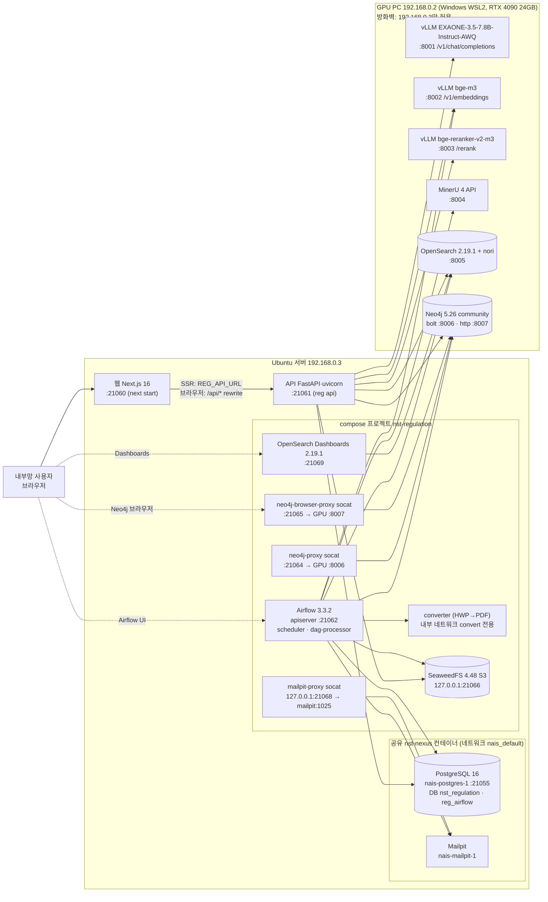
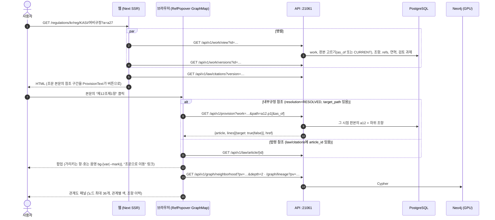
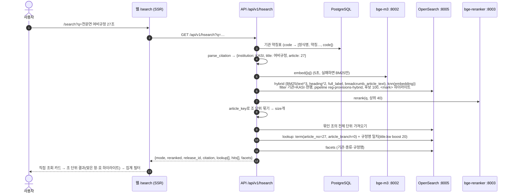
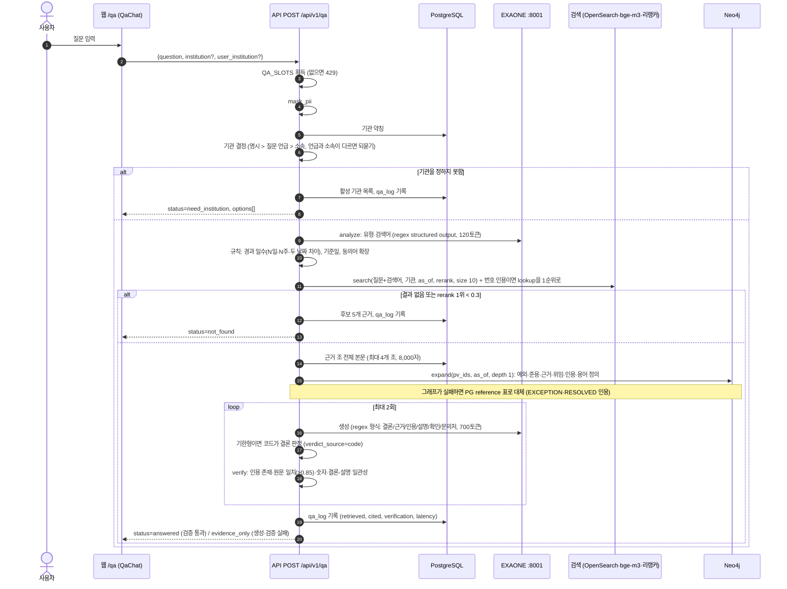
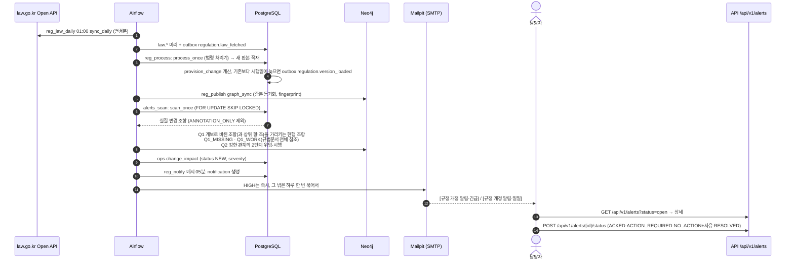

# 05. 서비스·인프라·E2E 요청 흐름

- 대상: NST·출연연 규정·법령 플랫폼을 운영하거나 고칠 개발자
- 웹 `http://192.168.0.3:21060` · API `http://192.168.0.3:21061` (OpenAPI 문서 `/docs`)
- 기준 코드: worktree `/data/project/nst-regulation-wt/m6-integration` (브랜치 `feat/m6-integration`, HEAD `bff3b1b`). 지금 떠 있는 API(`reg api`)와 웹도 이 worktree에서 실행 중이다.
- 작성일: 2026-10-03. 응답 예시는 이 날 실행 중인 API에 실제로 요청해서 얻었다.
- 수집·파싱·적재·색인 배치는 `02-data-loading.md`에서 다룬다. 이 문서는 서비스 쪽(조회·검색·질의응답·알림), 인프라, 요청 흐름을 다룬다.

---

## 1. 시스템 구성

### 1.1 구성도



- 기준 데이터는 PostgreSQL이다. OpenSearch 색인과 Neo4j 그래프는 PostgreSQL에서 다시 만들 수 있는 투영본이다.
- 원본 파일, 보기용 PDF, 별표 이미지와 표는 SeaweedFS S3(버킷 `regulation`)에 있다. API는 `/api/v1/file`과 `/api/v1/annex/*`에서 이 저장소를 읽는다.
- API는 호스트에서 `uv run reg api`로 돈다. 컨테이너가 아니다. Airflow 컨테이너는 `REG_*_DOCKER` 주소로 같은 DB와 OpenSearch에 붙는다.

### 1.2 포트 표

| 호스트 | 포트 | 서비스 | 바인딩 | 비고 |
|---|---|---|---|---|
| 192.168.0.3 | 21060 | 웹 (Next.js `next start`) | 0.0.0.0 | `scripts/run-dev.sh` |
| 192.168.0.3 | 21061 | API (FastAPI, `reg api`) | 0.0.0.0 | `/docs` OpenAPI |
| 192.168.0.3 | 21062 | Airflow api-server (UI) | 0.0.0.0 | 컨테이너 8080 |
| 192.168.0.3 | 21064 | Neo4j bolt 중계 (socat) | 0.0.0.0 | → 192.168.0.2:8006 |
| 192.168.0.3 | 21065 | Neo4j 브라우저 중계 (socat) | 0.0.0.0 | → 192.168.0.2:8007 |
| 192.168.0.3 | 21066 | SeaweedFS S3 (이 프로젝트 전용) | 127.0.0.1 | 공유 SeaweedFS는 볼륨 슬롯 8/8이 차서 따로 둠 |
| 192.168.0.3 | 21068 | Mailpit SMTP 중계 (socat) | 127.0.0.1 | → 공유 `mailpit:1025` |
| 192.168.0.3 | 21069 | OpenSearch Dashboards | 0.0.0.0 | → 192.168.0.2:8005 |
| 192.168.0.3 | 21055 | PostgreSQL 16 (공유 `nais-postgres-1`) | 0.0.0.0 | DB `nst_regulation`, Airflow 메타 DB `reg_airflow` |
| 192.168.0.3 | 21052 | Mailpit 웹 UI (공유 `nais-mailpit-1`) | 0.0.0.0 | 개발용 메일 확인 |
| 192.168.0.3 | (없음) | converter | 내부 네트워크 `convert` | 컨테이너 8080, 외부로 나가지 않음 |
| 192.168.0.2 | 8001 | vLLM LLM (`llm` = EXAONE-3.5-7.8B-Instruct-AWQ) | LAN | GPU 0.40, max-model-len 16384 |
| 192.168.0.2 | 8002 | vLLM 임베딩 (`bge-m3`, 1024차원) | LAN | GPU 0.10, `--runner pooling` |
| 192.168.0.2 | 8003 | vLLM 리랭커 (`bge-reranker` = bge-reranker-v2-m3) | LAN | GPU 0.10, `--runner pooling` |
| 192.168.0.2 | 8004 | MinerU 4 V1 파싱 API | LAN | 내부 vlm-server :30000 (GPU 0.20), API 키 필요 |
| 192.168.0.2 | 8005 | OpenSearch 2.19.1 + analysis-nori | LAN | 보안 플러그인 켬(HTTP), 힙 8GB |
| 192.168.0.2 | 8006 / 8007 | Neo4j 5.26 bolt / 브라우저 | LAN | 힙 4GB, 페이지캐시 8GB |

- GPU PC의 포트 8001~8007은 Windows 방화벽 규칙으로 192.168.0.3만 받는다. 규칙 명령은 `infra/vllm-local`, `infra/gpu-*`의 compose 주석에 있다.
- GPU PC의 VRAM 예산(24GB)은 embed 0.10 + rerank 0.10 + llm 0.40 + MinerU vlm 0.20 = 0.80이다. vLLM은 기동할 때 남은 VRAM을 보기 때문에 embed → rerank → llm → MinerU 순으로 올린다.

### 1.3 기술 스택 (lockfile·compose에서 확인한 버전)

| 영역 | 구성 요소 | 버전 | 출처 |
|---|---|---|---|
| 언어·패키지 | Python | 3.13 (실행 3.13.13) | `.python-version`, `pyproject.toml` |
| | uv | 프로젝트 관리자 (`uv.lock`) | |
| API | FastAPI / uvicorn | 0.142.2 / 0.54.0 | `uv.lock` |
| DB 접근 | psycopg / psycopg-pool | 3.3.6 / 3.3.3 | `uv.lock` |
| 마이그레이션 | Alembic / SQLAlchemy | 1.20.0 / 2.1.1 | `uv.lock` |
| CLI | typer | 0.27.2 (`reg` 명령) | `uv.lock` |
| HTTP·설정 | httpx / pydantic-settings | 0.28.1 / 2.15.0 | `uv.lock` |
| 그래프 드라이버 | neo4j (Python) | 6.3.1 | `uv.lock` |
| 객체 저장소 | boto3 | 1.43.106 | `uv.lock` |
| PDF | pdfplumber, pypdfium2, pillow, olefile | pdfplumber 0.11.10 | `uv.lock` |
| 테스트 | pytest / testcontainers / respx / ruff | 9.1.1 / 4.15.0 | `uv.lock` |
| 웹 | Next.js / React | 16.3.8 / 19.2.8 | `apps/web/package.json` |
| 웹 UI | Tailwind CSS 4, @base-ui/react 1.8, cmdk, motion 13.5, sonner 2, react-pdf 11, Pretendard | | `apps/web/package.json` |
| 배치 | Apache Airflow | 3.3.2 (LocalExecutor, Python 3.13 이미지) | `infra/airflow/Dockerfile` |
| DB | PostgreSQL | 16 (공유 `nais-postgres-1`) | `docker ps` |
| 검색 | OpenSearch / Dashboards | 2.19.1 + nori / 2.19.1 | `infra/gpu-opensearch`, `infra/docker-compose.yml` |
| 그래프 | Neo4j | 5.26 community | `infra/gpu-neo4j` |
| 추론 | vLLM | v0.30.0 (`vllm/vllm-openai`) | `infra/vllm-local` |
| 모델 | EXAONE-3.5-7.8B-Instruct-AWQ, BAAI/bge-m3, BAAI/bge-reranker-v2-m3 | | `infra/vllm-local` |
| OCR·표 | MinerU | 4 (자체 빌드 이미지 `mineru:4`) | `infra/gpu-mineru` |
| 저장소 | SeaweedFS | 4.48 | `infra/docker-compose.yml` |
| 중계 | alpine/socat | 1.8.0.0 | `infra/docker-compose.yml` |
| 변환기 | `nst-regulation/converter:0.2` (HWP→PDF) | | `infra/converter` |

### 1.4 현재 데이터 규모 (2026-10-03 조회)

| 항목 | 값 | 확인 방법 |
|---|---|---|
| 기관 (`/api/v1/institutions`) | 26개 (활성 25) | API |
| 규범문서 `regulation.work` | 3,839 | DB 읽기 전용 조회 |
| 판본 `regulation.work_version` | 12,079 | DB |
| 조항 판본 `regulation.provision_version` | 580,065 | DB |
| 참조 `regulation.reference` | 193,520 | DB |
| 검색 색인 | alias `reg-provisions` → `reg-provisions-r16`, 1,418,701 문서 (release 16, 게이트 통과) | `reg index status` |
| 구조 그래프 | Work 3,839 · Version 11,505 · Provision 547,927 · Term 9,512 · 관계 112,933 | `reg graph stats` |
| 개정 영향 `ops.change_impact` | 0건 | DB (법령 미러가 아직 비어 있음, §6.6) |

---

## 2. 패키지 구조와 의존 규칙

### 2.1 패키지

| 패키지 | 계층 | 하는 일 | 주요 모듈 |
|---|---|---|---|
| `reg.platform` | 기반 | 설정, DB 연결·마이그레이션, S3/로컬 저장소, HTTP 예의 클라이언트, LLM·임베딩·리랭커 클라이언트, Neo4j 드라이버, MinerU, 변환기, outbox, 실행 기록 | `settings`, `db/`, `storage/`, `llm`, `neo4j`, `outbox`, `runs`, `convert`, `mineru` |
| `reg.core` | 도메인 | 규범문서 모델, 파싱, 시행일 판정, 참조 해석, 품질 검사, 별표 렌더링, 적재·outbox 소비 | `model`, `parse`, `effective`, `refs`, `quality`, `annex*`, `ingest/{contract,registry,process,loader}` |
| `reg.sources.alio` | 출처 | ALIO 내부규정 수집 + 처리기(`regulation.source_fetched`) | `handler`, `cli` |
| `reg.sources.lawgo` | 출처 | law.go.kr 법령 미러 + 처리기(`regulation.law_fetched`) + 법령 API 조회 | `handler`, `api`, `cli` |
| `reg.index` | 투영 | OpenSearch 매핑·색인 빌드·게이트·게시(release)·하이브리드 검색 엔진 | `mapping`, `indexer`, `release`, `service`, `os` |
| `reg.graph` | 투영 | Neo4j 구조 그래프 투영·증분 동기화·질의(`expand`, `neighborhood`, `lineage`) | `project`, `sync`, `query` |
| `reg.ocr` | 처리 | 글자가 적은 판본(LOW_TEXT)을 MinerU로 OCR | `service`, `tasks` |
| `reg.search` | 서비스 | 인용 파서, 번호 직접 조회, 조 단위 검색 조립, 집계, 자동완성 | `citation`, `lookup`, `service`, `facets`, `suggest` |
| `reg.qa` | 서비스 | 질의 분석, 근거 확장, 답변 생성·검증, 평가 | `analyze`, `evidence`, `answer`, `service`, `evaluate` |
| `reg.alerts` | 서비스 | 개정 영향 분석, 알림함, 메일 알림, 사후 검증 | `impact`, `scan`, `inbox`, `notify`, `backtest` |
| `reg.ops` | 앱 | 하루 요약, 유지보수(로그·옛 색인 정리), 실패 기록 | `tasks`, `failures` |
| `reg.api` | 앱 | FastAPI 앱과 라우터 | `app`, `queries`, `*_routes` |
| `reg.cli`, `reg.wiring` | 앱 | `reg` CLI와 조립(출처 처리기 등록, 하위 CLI, 마이그레이션 위치) | |

### 2.2 의존 규칙 (`tests/test_architecture.py`)

`test_dependency_rules`는 `src/reg`의 모든 import를 AST로 읽는다. 아래 표에 없는 `reg.*` import가 하나라도 있으면 실패한다. `api`, `cli`, `wiring`, `ops`는 앱 계층이라 검사하지 않는다.

| 패키지 | import해도 되는 패키지 |
|---|---|
| `reg.platform` | platform |
| `reg.core` | platform, core |
| `reg.sources.alio` | platform, core, sources.alio |
| `reg.sources.lawgo` | platform, core, sources.lawgo |
| `reg.index` | platform, core, index |
| `reg.graph` | platform, core, graph |
| `reg.ocr` | platform, core, ocr |
| `reg.alerts` | platform, core, graph, alerts |
| `reg.search` | platform, core, index, search |
| `reg.qa` | platform, core, index, search, qa |

```mermaid
flowchart BT
  platform --> core
  core --> alio["sources.alio"]
  core --> lawgo["sources.lawgo"]
  core --> index
  core --> graph
  core --> ocr
  index --> search
  search --> qa
  graph --> alerts
  app["앱 계층<br/>api · cli · wiring · ops"] -.-> qa
  app -.-> alerts
  app -.-> alio
  app -.-> lawgo
```

- `reg.qa`는 `reg.graph`를 import하지 않는다. 그래프 근거 확장은 API가 `reg.graph.query.expand`를 감싼 함수를 `deps["related"]`로 넘긴다 (`app.py`의 `_graph_related`).
- 출처 모듈끼리(alio ↔ lawgo)는 서로 import하지 않는다.

### 2.3 출처 처리기 등록부

| 요소 | 위치 | 내용 |
|---|---|---|
| 계약 | `reg/core/ingest/contract.py` | `SourceHandler(topic, group_field, prepare)`. `prepare(conn, blob, payload, today, converter)`는 `PreparedVersion` 하나 또는 None을 돌려준다 |
| 등록부 | `reg/core/ingest/registry.py` | `register`·`handlers`·`clear`. core는 출처 모듈을 import하지 않는다 |
| 등록 | `reg/wiring.py` `register_sources()` | `alio.HANDLERS + lawgo.HANDLERS`를 등록한다 |
| ALIO 처리기 | `sources/alio/handler.py` | 주제 `regulation.source_fetched`, 묶음 키 `seq` |
| 법령 처리기 | `sources/lawgo/handler.py` | 주제 `regulation.law_fetched`, 묶음 키 `law_id` |
| 안전장치 | `process._check_unhandled` | 처리기가 없는 `regulation.*fetched` 대기 이벤트가 있으면 `RuntimeError("처리기가 등록되지 않은 주제…")`로 멈춘다 (`test_unregistered_topic_is_an_error`) |

### 2.4 outbox (`ops.outbox`)

`reg.platform.outbox.write(conn, topic, payload)`는 같은 트랜잭션 안에서 `ops.outbox`에 한 행을 넣는다. 소비자는 `FOR UPDATE SKIP LOCKED`로 이벤트를 가져가고, 3번 실패한 이벤트는 처리하지 않고 남겨 둔다(`MAX_ATTEMPTS = 3`).

| 주제 | 만드는 쪽 | 소비하는 쪽 | 건수 (전체 / 대기, 2026-10-03) |
|---|---|---|---|
| `regulation.source_fetched` | ALIO 수집 | `core.ingest.process.process_once` (ALIO 처리기) | 12,286 / 1 |
| `regulation.law_fetched` | 법령 미러 | `process_once` (법령 처리기) | 10 / 0 |
| `regulation.version_loaded` | `process.emit_version_events` (기존보다 시행일이 늦은 새 판본) | `alerts.scan.scan_once` → 영향 분석 | 12 / 0 |
| `ocr.needed.v1` | 품질 검사(LOW_TEXT) | `reg.ocr` | 259 / 0 |

- `process_once`는 같은 규정(`group_field` 값)의 이벤트를 한 묶음으로 처리한다. `pg_advisory_xact_lock`을 걸어, 같은 규정은 작업자 하나만 맡는다.
- 묶음마다 `rebuild_work`, `resolve_and_store`(참조 해석), `record_reference_tasks`, `emit_version_events`를 한 번씩 실행하고 커밋한다.

---

## 3. API 엔드포인트

- 앱: `reg.api.app.create_app(dsn, blob, search_deps)`. 연결 풀은 `ConnectionPool(min 1, max 8, dict_row)`이다.
- 인증은 없다. 내부망 전용이고, Keycloak 연동은 아직 하지 않았다(M5b 대기).
- `search_deps`는 `reg api`가 만든다: OpenSearch, 임베딩(timeout 5초·1회), 리랭커(10초), LLM(25초), `llm_model`.
- OpenAPI(`/openapi.json`)에는 엔드포인트 33개가 있다.

### 3.1 규정 조회 (PostgreSQL + S3)

| 메서드·경로 | 파라미터 | 응답 | 사용하는 시스템 |
|---|---|---|---|
| GET `/api/v1/institutions` | – | `[{code, name, kind, works}]` | PG `regulation.institution`, `work` |
| GET `/api/v1/works` | `institution?`, `kind?`(law\|reg), `q?` | `[{id, title, kind, institution, version{…}}]` (최대 1000) | PG |
| GET `/api/v1/work/versions` | `id` | `[{id, effective_from, effective_to, version_state, effective_status, effective_basis, amendment_kind, …}]` | PG `work_version` |
| GET `/api/v1/work/view` | `id`, `as_of?`, `version?` | `{work, version{…, source{source,url,mime,view_status,file_name,has_view}}, provisions[], refs{pv_id: [{start,end,rel_type,target_kind,target_work_id,target_path,target_name,resolution}]}, history[], tasks[]}` | PG `work_version`·`version_provision`·`provision_version`·`reference`·`amendment_history`·`review_task`·`source_document` |
| GET `/api/v1/file` | `version`, `kind`=view\|original | 보기용 PDF(`application/pdf`) 또는 원본 첨부(`Content-Disposition`) | PG → S3 |
| GET `/api/v1/references` | `pv`(여러 개) | `{outgoing[], incoming[]}` (나가는 참조는 넘긴 조항 전체, 들어오는 참조는 첫 조항 기준·현행만) | PG `reference` |
| GET `/api/v1/provision` | `work`, `path`, `as_of?` | 참조 팝업용 `{work_id, title, institution, institution_name, version_id, effective_from, article{path,label,heading}, lines[{path,label,text,target}], href}` | PG |
| GET `/api/v1/diff` | `from`, `to` (같은 규정의 판본) | `{from, to, changes[{kind: ADDED\|DELETED\|MODIFIED\|RENUMBERED\|ANNOTATION_ONLY, moved, path, unit, from, to}]}` | PG |
| GET `/api/v1/search` | `q`(2자 이상), `institution?` | 현행 조항 문자열 일치(ILIKE) 최대 50건. 색인이 없을 때 웹이 쓰는 대체 경로 | PG |
| GET `/api/v1/review-tasks` | `status`=OPEN\|RESOLVED\|DISMISSED, `kind?` | `[{id, kind, target, work_id, work_title, detail, status, created_at}]` (최대 300) | PG `review_task` |
| GET `/api/v1/annex` | `version`, `path`(annexN·formN…) | `{version, path, page, segments[{n,page,url}], table{status,url}}` | PG(판본만) → S3 |
| GET `/api/v1/annex/image` | `version`, `path`, `n` | PNG | S3 |
| GET `/api/v1/annex/table` | `version`, `path` | `{html}` (MinerU 표 변환 결과) | S3 |

### 3.2 검색 (OpenSearch + GPU 임베딩·리랭커)

| 메서드·경로 | 파라미터 | 응답 | 사용하는 시스템 |
|---|---|---|---|
| GET `/api/v1/hsearch` | `q`(2~300자), `institution?`, `as_of?`, `kind?`(law\|reg\|admrul), `unit?`(여러 개), `current_only`=true, `rerank`=true, `size`=10(≤50), `facets`=true | `{mode: hybrid\|bm25, reranked, release_id, hits[{work_id, version_id, article_path, path, title, full_label, score, rerank_score, matches[{path,label,unit,highlight}], units[…], chunk_id, path_label, text, …}], citation, lookup[], facets{institution, kind, title}}` | PG(기관 약칭) → bge-m3 → OpenSearch hybrid → bge-reranker |
| GET `/api/v1/search/lookup` | `q`, `as_of?`, `size`=5 | `{citation, hits[], relaxed}` | PG(약칭) → OpenSearch term 조회 |
| GET `/api/v1/search/suggest` | `q`, `institution?`, `size`=8 | 규정명 자동완성 (현재 웹은 쓰지 않음) | OpenSearch |

- 색인 alias가 없으면 503 `"검색 색인이 아직 없습니다"`를 돌려준다. 웹 검색 화면은 이때 `/api/v1/search`로 넘어간다.
- 검색을 기다리는 동안 DB 트랜잭션을 잡아 두지 않도록, 약칭을 읽은 뒤 `c.rollback()`을 호출한다.

### 3.3 질의응답 (PG + OpenSearch + GPU + Neo4j)

| 메서드·경로 | 파라미터 | 응답 | 사용하는 시스템 |
|---|---|---|---|
| POST `/api/v1/qa` | 본문 `{question(2~500자), institution?, user_institution?, as_of?}` | `{id, status, institution, as_of, question_type, evidence[], answer, verification, verdict_source, release_id, note, retrieved[], options?}` | PG(약칭·근거 본문·`ops.qa_log` 기록), OpenSearch, bge-m3, 리랭커, EXAONE, Neo4j(근거 확장, 실패하면 PG) |
| POST `/api/v1/qa/{qa_id}/feedback` | 본문 `{feedback: helpful\|not_helpful, reason?}` | `{ok: true}` | PG `ops.qa_log.feedback` |

- 동시에 생성하는 답변은 `QA_SLOTS = 3`개까지다. 넘으면 바로 429 `"질의가 몰려 있습니다…"`를 돌려준다 (`threading.BoundedSemaphore`).
- 웹 프록시 제한은 `next.config.ts`의 `experimental.proxyTimeout = 120000`이다.

### 3.4 개정 알림 (PG)

| 메서드·경로 | 파라미터 | 응답 | 사용하는 시스템 |
|---|---|---|---|
| GET `/api/v1/alerts` | `status`=open\|done\|NEW\|ACKED\|ACTION_REQUIRED\|NO_ACTION\|RESOLVED, `institution?`, `severity?` | `ops.change_impact` 행 + `cause_title`, `affected_title`, `institution` (심각도 → 최신순, 최대 200) | PG |
| GET `/api/v1/alerts/{impact_id}` | – | 알림 상세 (원인 조항 변경 전후 본문, 영향받는 조항 본문 포함) | PG |
| POST `/api/v1/alerts/{impact_id}/status` | `{status: ACKED\|ACTION_REQUIRED\|NO_ACTION\|RESOLVED, note?}` | `{ok: true}`. NO_ACTION은 사유가 없으면 422 | PG |

### 3.5 법령 미러 (`/api/v1/law/*`, PG `law.*` + S3)

| 메서드·경로 | 응답 |
|---|---|
| GET `/api/v1/law/citations?version=` | 내부규정 판본의 법령 인용 위치 (`{pv_id: [{start, article_id, …}]}`) |
| GET `/api/v1/law/article/{article_id}` | 조문 상세 `{law, version{edition_line…}, article, children[], links{article_go, law_go}}` |
| GET `/api/v1/law/{law_id}` · `/{law_id}/articles` · `/{law_id}/annexes` | 법령 요약·조문 목록·별표 목록 |
| GET `/api/v1/law/annex/{seq}` · `/html` · `/pdf` | 별표 메타, 정리한 HTML(CSP sandbox), PDF |
| GET `/api/v1/law/version/{mst}/xml` | 보관한 원본 XML |

### 3.6 구조 그래프 (Neo4j)

| 메서드·경로 | 파라미터 | 응답 |
|---|---|---|
| GET `/api/v1/graph/neighborhood` | `pv`, `depth`=1\|2, `limit`=200 | `{center, nodes[{id, kind, labels, props}], edges[{source, target, type, props}]}` |
| GET `/api/v1/graph/lineage` | `pv` | `{lineage, work_id, entries[{pv_id, path, full_label, text, valid_from, valid_to, version_ids, change}], deleted_in}` |
| GET `/api/v1/graph/expand` | `pv`(≤50), `as_of?`, `depth`, `limit`=30 | `{as_of, items[{pv_id, work_id, path, full_label, text, reason, rel, direction(out\|in\|term\|parent), via, hops, evidence, stale}]}` |

- 드라이버는 첫 요청 때 `app.state.graph_driver`에 만든다.
- `ServiceUnavailable`·`SessionExpired`·`TransientError`·`AuthError`가 나면 503 `"그래프 서버에 연결할 수 없습니다"`를 돌려준다. 그 밖의 오류는 500으로 둔다.

---

## 4. E2E 요청 흐름

### 4.0 웹 → API 경로

| 호출 위치 | 경로 |
|---|---|
| 서버 컴포넌트 (SSR, `lib/api.ts` `apiGet`) | `REG_API_URL`(기본 `http://127.0.0.1:21061`)로 직접 호출 |
| 브라우저 (`fetch("/api/v1/…")`) | Next rewrites `/api/:path*` → API |

| 화면 | 경로 | 쓰는 API |
|---|---|---|
| 규정 목록 | `/regulations` (`/`는 여기로 redirect) | `institutions`, `works` |
| 규정 보기 | `/regulations/[...id]` | `work/view`, `work/versions`, `law/citations`, `law/article`, `references`(Relations), `graph/neighborhood`·`lineage`(GraphMap), `provision`(RefPopover), `annex`(RegAnnexCard) |
| 원본 보기 | `/source/[...id]` | `work/view`, `file` (react-pdf) |
| 검색 | `/search` | `hsearch` (503이면 `search`), `institutions` |
| 질의응답 | `/qa` | `institutions`, `qa`, `qa/{id}/feedback` |
| 알림함 | `/alerts` | `alerts`, `alerts/{id}`, `alerts/{id}/status` |
| 판본 비교 | `/compare` | `work/versions`, `diff` |
| 법령 | `/laws/[lawId]` | `law/{id}`, `law/article`, `law/annex` |
| 검토 대기 | `/review` | `review-tasks` |

### 4.1 (a) 규정 보기와 참조 팝업



| 단계 | 세부 |
|---|---|
| 참조 표시 (`ProvisionText.tsx`) | 법령 인용 → 법령 팝업. RESOLVED이고 `target_path`가 있으면 → 규정 팝업. 대상 규정만 알면 → 링크. 해석하지 못한 참조는 `ref-unresolved`로 표시한다 |
| 팝업 (`RefPopover.tsx`) | 페이지를 옮기지 않는다. Esc나 바깥 클릭으로 닫는다. 처음 열 때 한 번만 불러오고, 404이면 "참조된 조문을 찾지 못했습니다"를 보인다 |
| 음영 | `/api/v1/provision`이 `target = (path == hit or 그 하위)`를 계산한다. 그 항이 없어졌으면 조 전체를 표시한다 |
| 실측 | `/api/v1/work/view`(여비규정, 조항 154개) 0.019초. `/api/v1/provision`(a12.p1) 0.009초. `/api/v1/graph/neighborhood`(depth 1) 0.009초 |

실제 팝업 응답 (요약):

```json
{"work_id":"kr/reg/KASI/여비규정","title":"여비규정","institution":"KASI","version_id":"kr/reg/KASI/여비규정@2024-01-17",
 "article":{"path":"a12","label":"제12조","heading":"교육훈련 및 해외근무시의 여비"},
 "lines":[{"path":"a12","label":"제12조","text":"","target":false},
          {"path":"a12.p1","label":"①","text":"국외교육훈련 및 해외근무의 경우에는 별표 제4호에 따라 여비를 지급하고 …","target":true},
          {"path":"a12.p2","label":"②","text":"외부기관에서 경비를 지원받는 경우에는 다음 각호에 의한다.","target":false}, "…"],
 "href":"/regulations/kr/reg/KASI/%EC%97%AC%EB%B9%84%EA%B7%9C%EC%A0%95?a=a12#a12.p1"}
```

### 4.2 (b) 검색 "천문연 여비규정 27조"



| 구성 요소 | 구현 | 값 |
|---|---|---|
| 인용 파서 | `search/citation.py` | 조·의·항(①)·호·목·별표·별지를 인식한다. 번호가 없으면 인용이 아니다. 기관은 약칭표로, 규정명은 번호 앞에서 기관 언급을 뺀 나머지로 정한다 |
| 기관 필터 | `search/service.py` | 인용에 기관이 있으면 하이브리드 검색과 집계도 그 기관으로 거른다. 명시한 `institution`이 우선한다 |
| 하이브리드 결합 | `index/mapping.py` `PIPELINE_BODY` | min_max 정규화, arithmetic_mean, 가중치 [BM25 0.4, knn 0.6] |
| 리랭크 | `index/service.py` | `RERANK_TOP = 40`, 실패하면 하이브리드 점수 순서를 그대로 쓴다 |
| 묶기 | `_group` | OpenSearch 2.19는 hybrid 질의 아래에서 collapse를 지원하지 않는다. 그래서 묶기는 코드에서 한다. 조마다 `matches`를 최대 5개 둔다 |
| 직접 조회 | `search/lookup.py` | 결과가 없으면 목 → 호 → 항 순으로 한 단계씩 넓힌다(`relaxed`) |
| 장애 시 | | 임베딩 실패 → `mode: bm25`. 리랭커 실패 → `reranked: false`. 색인 없음 → 503 → 웹은 PG ILIKE 검색 |

실측 (2026-10-03, `size=3`, 0.39초):

| 항목 | 값 |
|---|---|
| `mode` / `reranked` / `release_id` | hybrid / true / 16 |
| `citation` | `{institution: KASI, title: 여비규정, article: 27}` |
| `lookup[0]` | `kr/reg/KASI/여비규정` a27 "여비규정 제27조" (score 220.5) |
| `lookup[1]` | `kr/law/009402` a27 "공무원 여비 규정 제27조" (score 38.5) |
| `hits[0]` | `kr/reg/KASI/한국천문연구원스쿨운영규정` a27 (rerank 0.9986), matches a27.p1 "UST학생의 국내`<mark>`여비`</mark>`는 …" |
| `facets.institution` 상위 | KASI 1,640 · KAERI 283 · KIOM 272 |

- 정확한 조문은 `lookup`이 맡고, 내용상 가까운 조는 `hits`가 맡는다. 웹은 `lookup`을 먼저 보여준다.
- 위 실측에서 `hits[0]`은 규정명이 다른 "스쿨운영규정 제27조"였다.

### 4.3 (c) 질의응답



| 상태 | 조건 | 화면 |
|---|---|---|
| `need_institution` | 기관을 정하지 못했거나, 질문 속 기관과 소속 기관이 다름 | 기관 선택 버튼 (`options`, 활성 기관 25개) |
| `not_found` | 검색 결과가 없거나, 리랭크 1위 점수 < `MIN_SCORE 0.3` | "관련 규정을 찾지 못했습니다" + 가까운 후보 근거 |
| `evidence_only` | LLM 장애(`llm_unavailable`), 형식 오류(`llm_invalid_output`), 2회 모두 검증 실패 | "자동 설명을 만들지 못해 근거 조문만 보여드립니다" + 근거 |
| `answered` | 검증 통과 | 결론·인용(원문 구간으로 교체)·설명·확인 필요·문의처 + 근거 |

| 단계 | 핵심 규칙 (코드 위치) |
|---|---|
| 분석 (`qa/analyze.py`) | 유형은 기한·금액·가능여부·절차·정의·기타 중 하나다. 경과 기간이 있으면 LLM 분류와 관계없이 `기한`으로 정한다 |
| 근거 확장 (`qa/evidence.py`) | 그래프 관계 중 `parent` 방향, 별표, 부칙은 넣지 않는다. 그래프 근거는 6개까지다(`GRAPH_LIMIT`). 용어 정의는 정의 항목 하나만 넣는다 |
| 생성 (`qa/answer.py`) | EXAONE의 JSON 모드는 공백을 반복 출력하며 멈추지 않았다. 그래서 vLLM `structured_outputs.regex`로 줄 형식을 강제한다. 근거 id는 `E1…En`만 허용한다 |
| 코드 판정 | 인용한 근거에 기한이 하나뿐이면 코드가 결론을 정한다: 경과 일수 > N일이면 미충족, 아니면 충족. N개월 기한은 28N일 이하면 충족, 31N일 초과면 미충족, 그 사이는 조건부다. 기한이 여럿이면 판정하지 않는다 |
| 검증 | `citation`(근거 id 존재), `quote`(원문과 85% 이상 일치, 숫자와 부정 표현이 같아야 함), `number`(설명의 숫자와 기한이 근거·질문·계산값에 있음), `consistency`(결론과 설명의 표현이 모순되지 않음) |
| 기록 | `ops.qa_log` (question, status, verdict, release_id, model, retrieved, cited, verification, answer, latency_ms, feedback) |

실측 1 — 기관 지정, 기한형 (1.70초):

```
POST /api/v1/qa {"question":"출장 다녀온 지 10일이 지났는데 출장 증빙서를 아직 제출 안 했어요. 괜찮나요?","institution":"KASI"}
status=answered  question_type=기한  verdict_source=code  release_id=16
answer.결론=미충족
answer.근거=[E1 "출장자는 출장 종료일 다음 날을 기점으로 7일 이내에 출장을 확인할 수 있는 증빙서를 회계담당부서에 제출하여야 한다."]
answer.설명="여비규정 제27조(출장증빙의 제출)의 기한은 7일 이내이고 질문 상황은 10일이 지나 기한을 넘겼습니다. …"
verification={ok: true, problems: [], dropped_citations: 0}
evidence: E1 primary 여비규정 제27조 (matched a27.p1·p2·p3) · E2 primary 여비규정 부칙 · E3 primary 취업요령 제36조
          · E4 primary 여비규정 제10조 · E5 cited 여비규정 제13조 (CITATION, "인용 조항") · E6 cited 여비규정 제15조
```

실측 2 — 기관 없음 (0.25초):

```
POST /api/v1/qa {"question":"연차휴가는 며칠까지 이월할 수 있나요?"}
status=need_institution  note="어느 기관 규정 기준으로 볼까요? 기관마다 기한이 다릅니다."  options=25개
```

### 4.4 (d) 법령 개정 → 영향 분석 → 알림함



| 규칙 | 내용 (`alerts/impact.py`) |
|---|---|
| 원인 | `kr/law/`, `kr/admrul/`만 원인으로 본다. 내부규정끼리의 영향(NST ↔ 산하기관 등)은 만들지 않는다 (사용자 결정 2026-10-02) |
| 관계 | BASIS, DELEGATION, IMPLEMENTS, MUTATIS, EXCEPTION, CITATION. 이 중 강한 관계는 BASIS·DELEGATION·MUTATIS·IMPLEMENTS다 |
| 심각도 | HIGH: 삭제, 또는 강한 관계에서 수정. MEDIUM: 그 밖의 수정·번호 이동. LOW: 신설. 규범문서 전체를 가리키는 참조는 한 단계 낮춘다. 2단계 영향은 1단계보다 무겁게 매기지 않는다 |
| 영향 종류 | 참조 대상 삭제 / 근거·위임·준용 대상 개정 / 참조 대상 개정 / 참조 번호 이동 / 관련 조문 신설 / 참조 규범문서 개정 |
| 그래프 신선도 | 그래프의 fingerprint가 PG와 다르면 `LookupError`를 던진다. 그러면 이벤트를 완료 처리하지 않고 다음 실행 때 다시 시도한다 |
| 알림 대상 | 규정 담당자(`ops.owner_assignment`, `reg owners`로 가져옴). 담당자가 없으면 `config/admins.yaml`의 기관 관리자 |
| 알림함 상태 | open = NEW·ACKED·ACTION_REQUIRED, done = NO_ACTION·RESOLVED |
| 사후 검증 | `docs/reports/2026-10-02-impact-backtest.md`: 개정 1,467건을 재생해 영향 188건을 찾았다(RESOLVED로 저장해 알림은 나가지 않음). 이 검증은 원인을 법령으로 한정하기 전 PG 기반 그래프에서 했다 |
| 현재 | `ops.change_impact` 0건, 알림함(open·done) 비어 있음. 법령 미러가 OC 키 승인을 기다리고 있어 `regulation.law_fetched`가 10건뿐이다 (§6.6) |

### 4.5 (e) 일 배치 E2E

수집 → 파싱·적재 → OCR → 법령 연계 → 그래프·영향 분석 → 색인 빌드·게이트·게시 → 알림·요약의 순서는 `02-data-loading.md`에 있다. Airflow DAG 일정은 `docs/ops/airflow.md`에 있다.

| DAG | 일정 (KST) | 서비스와 맞닿는 부분 |
|---|---|---|
| `reg_law_daily` | 01:00 | 법령 미러 → `regulation.law_fetched` |
| `reg_alio_daily` | 02:00 | ALIO 수집 → `regulation.source_fetched` |
| `reg_process` | Asset 기반 + 03:30 안전망 | 판본 적재 → `regulation.version_loaded` |
| `reg_publish` | 파싱 직후 (Asset) | `graph_sync` → `alerts_scan` / `embed_check` → `index_build` → `index_gate` → `index_publish`(alias 교체) → `daily_summary` |
| `reg_notify` | 매시 05분 | 알림 메일 |
| `reg_maintenance` | 04:00 | 요청 로그 90일, 질의 로그 365일, Airflow 로그 30일, 옛 색인 정리 |

- 질의응답 답변은 게시된 release(`release_id`)에 고정된다. 근거 확장에서 다른 규범문서의 판본을 찾을 때도 `ops.release_item`의 같은 release 안에서 찾는다.

---

## 5. 질의응답 품질

### 5.1 평가 방법

| 항목 | 내용 |
|---|---|
| 문항 | `eval/qa_cases.yaml` 16문항: 기한형 answered 12, 기관 되묻기 2, 관련 규정 없음 2(`not_found` 또는 `answered`면 정답) |
| 실행기 | `reg.qa.evaluate.run_eval`. 운영 API와 같은 `ask()`를 쓰고, `--graph`(기본)이면 Neo4j 근거 확장도 같게 쓴다 |
| 상태 일치율 | 실제 status가 기대 status 목록 안에 있는 비율 |
| 인용 정확도 | 답변이 인용한 근거가 기대 조(`article`)이고 규정 id에 `work_contains`가 들어 있는 비율 (목표 ≥ 0.90) |
| 검색 적중률 | 기대 조가 근거 1·2위 안에 있는 비율 |
| 숫자 일치율, 결론-설명 일관성 | 검증기의 `numbers_match`, `consistent` (목표 1.00) |
| 결론 정확도 | 기대 verdict와 같은 비율 (목표 ≥ 0.85) |
| 기관 되묻기 정확도 | 목표 1.00 |
| p95 응답 시간 | 목표 < 10,000ms |

### 5.2 최신 결과 (2026-10-03 13:04, 색인 r16, 그래프 근거 확장, 읽기 전용)

출처: `docs/reports/2026-10-02-qa-eval.md`. 이 파일은 `reg eval qa`의 기본 출력 경로라서 실행할 때마다 덮어쓴다.

| 지표 | M6 (10-02) | M7 그래프 없음 (10-03 10:11) | **M7 그래프 (10-03 13:04)** | 목표 |
|---|---|---|---|---|
| 상태 일치율 | – | 1.0 | **1.0** | – |
| 인용 정확도 | 0.833 | 0.917 | **0.917** | ≥ 0.90 |
| 검색 적중률 | – | 0.917 | **0.917** | – |
| 숫자 일치율 | – | 1.0 | **1.0** | 1.00 |
| 결론-설명 일관성 | – | 1.0 | **1.0** | 1.00 |
| 결론 정확도 | – | 1.0 | **1.0** | ≥ 0.85 |
| 기관 되묻기 정확도 | – | 1.0 | **1.0** | 1.00 |
| p95 응답 시간(ms) | 1,689 | 2,054 | **1,947** | < 10,000 |

인용 정확도에서 틀린 문항은 1개다:

| 문항 | 질문 | 기대 | 실제 근거 1위 | 결론 |
|---|---|---|---|---|
| `kist-hotel-late` | "KIST 출장 중 숙박비 상한을 넘겨 썼는데 여행 끝나고 10일 지났어요. 정산 신청 가능한가요?" | `KIST/여비규정` a14 | `kr/reg/KIST/여비규정@2021-12-29.2` a29-3 (국외여비 쪽 조) | 미충족 (맞음) |

- 결론은 맞았다. 다만 인용한 조가 기대한 국내 숙박비 조(a14)가 아니었다.
- 색인 게이트 스모크(`reg index status`)에서는 같은 문항의 1위가 a14.p6이었다. 질의응답은 검색어 확장과 lookup 우선 정렬을 거치므로 결과가 다를 수 있다.

### 5.3 다시 실행

```bash
cd /data/project/nst-regulation-wt/m6-integration
uv run reg eval qa --no-log                                   # 16문항, DB 읽기 전용, 그래프 근거 확장
uv run reg eval qa --no-log --out docs/reports/$(date +%F)-qa-eval.md   # 보고서를 새 파일로
uv run reg eval qa --no-log --no-graph                        # PG 참조 표 방식과 비교
uv run reg eval qa --no-log --limit 3                         # 앞 3문항만
```

- `--no-log`은 DB 연결을 read-only로 열어 `ops.qa_log`에 쓰지 않는다.
- 결과 요약은 표준출력에도 나온다.

---

## 6. 운영

### 6.1 시작·재시작

| 대상 | 명령 (저장소 루트) | 동작 |
|---|---|---|
| API + 웹 | `bash scripts/run-dev.sh` | `.env` 로드 → `npm run build` (실패하면 기존 서비스를 그대로 둠) → 기존 API·웹 종료 (PID 파일과 명령줄을 확인) → 포트 해제 대기 → `setsid uv run reg api --host 0.0.0.0 --port 21061`, `setsid npm run start` → `/api/v1/institutions`·`/regulations` 응답 확인 (최대 120초) |
| Airflow·변환기 | `bash scripts/airflow.sh up` / `down` / `ps` / `logs [서비스]` / `build` / `check` / `init-db` | `down`은 Airflow 3종과 converter만 멈춘다 |
| 금지 | `docker compose -f infra/docker-compose.yml down` | storage(원본 보관소)와 중계까지 내려간다 |
| GPU PC 추론 | `infra/vllm-local/up.sh`, `check.sh` | embed → rerank → llm 순서 |
| GPU PC MinerU | `infra/gpu-mineru/up.sh`, `check.sh` | vllm-local이 healthy가 된 뒤 |
| GPU PC OpenSearch·Neo4j | `infra/gpu-opensearch`, `infra/gpu-neo4j`의 compose | `.env`에 관리자 비밀번호 키 필요 |
| 코드 변경 → 배치 | `bash scripts/airflow.sh build && bash scripts/airflow.sh up` | `src/`는 이미지에 들어 있다. `airflow/dags/`, `config/`는 마운트되어 있어 다시 빌드할 필요 없다 |

### 6.2 상태 확인

| 대상 | 확인 방법 |
|---|---|
| API | `curl -sf localhost:21061/api/v1/institutions` (별도 health 엔드포인트 없음) |
| 웹 | `curl -sf -o /dev/null localhost:21060/regulations` |
| Airflow | compose healthcheck: apiserver `/api/v2/version`, scheduler `:8974/health`, dag-processor `airflow jobs check`. `bash scripts/airflow.sh ps` |
| converter | compose healthcheck `/healthz` |
| 색인 | `uv run reg index status` → release 목록, 게이트 결과, `alias → reg-provisions-r16` |
| 그래프 | `uv run reg graph stats` → Work·Version·Provision·Term·relations 수 |
| 배치 결과 | `uv run reg ops summary [--day YYYY-MM-DD]`, `ops.pipeline_run` (실패는 `stats->>'source' = 'on_failure_callback'`) |
| GPU 추론 | `infra/vllm-local/check.sh`, `infra/gpu-mineru/check.sh`. vLLM 컨테이너 healthcheck `/health` |
| 검색 장애 판별 | `/api/v1/hsearch` 응답의 `mode`(bm25면 임베딩 장애), `reranked`(false면 리랭커 장애) |

### 6.3 로그

| 대상 | 위치 |
|---|---|
| API / 웹 / 웹 빌드 | `.run/api.log`, `.run/web.log`, `.run/web-build.log` (PID: `.run/api.pid`, `.run/web.pid`) |
| Airflow 태스크 | `bash scripts/airflow.sh logs` (scheduler), 볼륨 `airflow-logs` (30일 뒤 `reg_maintenance`가 정리) |
| 질의 기록 | `ops.qa_log` (365일 보관) |
| 외부 요청 기록 | `ops.request_log` (90일 보관) |

### 6.4 백업·복구 관점

| 저장소 | 성격 | 비고 |
|---|---|---|
| PostgreSQL `nst_regulation` (스키마 `regulation`, `law`, `ops`) | 기준 데이터 | 공유 컨테이너 `nais-postgres-1`. 이 저장소에는 백업 스크립트가 없다(`scripts/`, `docs/ops` 검색 결과) |
| SeaweedFS 볼륨 `storage-data` | 원본·보기용 PDF·별표 이미지 | 원본은 다시 수집할 수 있지만, 폐지된 규정의 원본은 다시 받지 못할 수 있다 |
| OpenSearch (GPU PC 볼륨 `os-data`) | 투영본 | `reg index build`로 다시 만든다 (r16 빌드에 1,597초 걸림) |
| Neo4j (GPU PC 볼륨 `neo4j-data`) | 투영본 | `reg graph rebuild`로 다시 만든다 |
| Airflow 메타 DB `reg_airflow` | 실행 이력 | `scripts/airflow.sh init-db`로 다시 만든다 |

### 6.5 `.env` 키와 계정 (이름만)

`.env`는 `/data/project/nst-regulation/.env`를 가리키는 심볼릭 링크다. 예시는 `.env.example`에 있다.

| 범주 | 키 |
|---|---|
| DB | `REG_DATABASE_URL`, `REG_MIGRATOR_URL`, `REG_SUPERUSER_URL`, `REG_DATABASE_URL_DOCKER` |
| S3 | `REG_S3_ENDPOINT`, `REG_S3_BUCKET`, `REG_S3_ACCESS_KEY`, `REG_S3_SECRET_KEY` |
| 수집 | `REG_LAWGO_OC`, `REG_ALIO_MIN_INTERVAL`, `REG_LAWGO_MIN_INTERVAL` |
| 검색 | `REG_OS_URL`, `REG_OS_URL_DOCKER`, `REG_GPU_OS_URL`, `REG_OS_ADMIN_PASSWORD`, `REG_GPU_OS_ADMIN_PASSWORD`, `REG_OS_DASHBOARDS_PASSWORD` |
| 그래프 | `REG_NEO4J_URL`, `REG_GPU_NEO4J_URL`, `REG_NEO4J_PASSWORD` (설정에는 `REG_NEO4J_TARGET`, `REG_NEO4J_USER`도 있음) |
| GPU 모델 | `REG_EMBED_URL`, `REG_EMBED_MODEL`, `REG_RERANK_URL`, `REG_RERANK_MODEL`, `REG_LLM_URL`, `REG_LLM_MODEL` (`.env.example` 기준. 기본값은 `settings.py`의 192.168.0.2:8001~8003) |
| OCR | `REG_MINERU_URL`, `REG_MINERU_API_KEY` |
| 메일 | `REG_SMTP_HOST`, `REG_SMTP_PORT` (설정에는 `REG_SMTP_FROM`, `REG_WEB_URL`도 있음) |
| Airflow | `REG_AIRFLOW_DB_PASSWORD`, `REG_AIRFLOW_FERNET_KEY`, `REG_AIRFLOW_SECRET_KEY`, `REG_AIRFLOW_JWT_SECRET`, `REG_AIRFLOW_ADMIN_USER`, `REG_AIRFLOW_ADMIN_PASSWORD` |
| Dashboards | `REG_DASHBOARDS_PASSWORD`, `OS_DASHBOARDS_LOGIN_ID`, `OS_DASHBOARDS_LOGIN_PW` |
| GPU PC compose (GPU PC의 `.env`) | `OS_ADMIN_PASSWORD`, `NEO4J_PASSWORD`, `MINERU_API_KEY`, `HF_TOKEN` |

| 로그인 화면 | 계정 위치 |
|---|---|
| 웹 21060 / API 21061 | 로그인 없음 (내부망 전용, Keycloak 연동 대기) |
| Airflow UI 21062 | `REG_AIRFLOW_ADMIN_USER` / `REG_AIRFLOW_ADMIN_PASSWORD` |
| OpenSearch Dashboards 21069 | OpenSearch 보안 플러그인 계정으로 로그인. Dashboards 내부 계정은 `kibanaserver` / `REG_OS_DASHBOARDS_PASSWORD`. 로그인용 키는 `OS_DASHBOARDS_LOGIN_ID` / `OS_DASHBOARDS_LOGIN_PW` |
| Neo4j 브라우저 21065 | 사용자 `neo4j` / `REG_NEO4J_PASSWORD` |
| Mailpit 21052 | 공유 nst-nexus 설정 |

### 6.6 알려진 문제와 남은 일

| 항목 | 상태 | 근거 |
|---|---|---|
| law.go.kr OC 키 | 승인 대기. 법령 최초 적재(`reg law full`)와 `reg_law_*` DAG도 보류 중이다. 그래서 법령 개정 알림이 아직 생기지 않는다 | `regulation.law_fetched` 10건, `ops.change_impact` 0건 (DB 조회). 키 이름 `REG_LAWGO_OC` |
| 옛 색인 `nais-regulations-r14` | 쓰지 않음 (497,158건). 사용자 승인 뒤 삭제한다 | `reg index status`: release 14 PUBLISHED, alias는 r16. `reg index status`의 색인 목록은 `reg-provisions-*`만 보여준다 |
| 글리프 반복 | 남아 있음 | 운영 메모 (이 문서에서 다시 재현하지 않음). PUA 글리프는 본문 479 → 87, 별표 7,414 → 134로 줄었다 (`docs/reports/2026-10-02-parsing-quality.md`) |
| 호(item) 파싱 오류 26건 | 남아 있음 | 운영 메모 (이 문서에서 다시 세지 않음). 검토 대기 PARSE 과제는 `/api/v1/review-tasks?kind=PARSE`로 본다 (조회 상한 300건) |
| 오래 도는 `reg process` 작업자의 메모리 증가 | 남아 있음 | 운영 메모. 긴 재처리는 작업자를 나눠 돌리거나 다시 시작해서 피한다 (`.run/process-*.pid`) |
| 검토 대기 과제 | 상한 300건이 모두 OPEN: REFERENCE 210 · PARSE 44 · EFFECTIVE_DATE 37 · CONFLICT 6 · LOW_TEXT 3 | `/api/v1/review-tasks` |
| 인증 | 없음 (Keycloak, 결정 기록 API는 M5b) | `app.py` |
| 실패 알림 메일 | 없음 (D-6). Airflow UI와 `ops.pipeline_run`으로 확인 | `docs/ops/airflow.md` |
| 색인 r15 | FAILED로 남아 있음 | `reg index status` |
| `kist-hotel-late` 인용 | §5.2 | QA 평가 |

---

## 7. 테스트

### 7.1 구성

| 위치 | 내용 |
|---|---|
| `tests/conftest.py` | 세션 범위 testcontainers: `postgres:16` → `bootstrap` + 모든 마이그레이션(`reg.wiring.migration_locations()`), `nais-opensearch:2.19.1-nori`(보안 끔), `neo4j:5.26-community`. 테스트마다 데이터 테이블을 TRUNCATE해 서로 격리한다. `loaded` 픽스처는 천문연 여비규정 실파일을 처리까지 마친 상태를 만든다 |
| `tests/test_architecture.py` | 의존 규칙(§2.2), 처리기 없는 주제는 오류 |
| `tests/api/` | `test_annex_routes`, `test_graph_routes`, `test_search_routes` |
| `tests/test_api.py`, `test_provision_api.py`, `test_alerts_api.py`, `test_qa_api_limits.py` | API (TestClient). QA 슬롯 429 포함 |
| `tests/test_qa_*.py`, `test_evaluate.py` | 분석·근거 확장·생성·검증·서비스·평가 (LLM은 가짜 또는 respx) |
| `tests/search/`, `tests/index/`, `test_search.py`, `test_os.py` | 인용 파서, lookup, 하이브리드 묶기, 매핑, 게이트 |
| `tests/test_graph*.py`, `test_impact.py`, `test_scan.py`, `test_notify.py` | 그래프 투영·질의, 영향 분석, 알림 |
| `tests/core/`, `test_parse.py`, `test_refs*.py`, `test_effective.py`, … | 파싱·참조·시행일 (정답셋 `tests/core/fixtures/gold`) |
| `tests/dags/`, `tests/ops/`, `tests/ocr/`, `tests/platform/`, `tests/sources/` | DAG 구조, 운영 작업, OCR, 변환기 컨테이너, 출처 |
| `tests/test_migrations*.py` | 마이그레이션 0002·0003·0007·0008 |
| 웹 | 자동 테스트 없음 (`apps/web`에 테스트 파일 없음, `npm run lint`만 있음). `tests/e2e` 디렉터리는 이 worktree에 없다 |
| Airflow DAG 점검 | `bash scripts/airflow.sh check` (Airflow 이미지 안에서 `airflow/tests/check_dags.py`, 네트워크 없음) |

### 7.2 실행

```bash
cd /data/project/nst-regulation-wt/m6-integration
uv run pytest -q                       # 기본: -m 'not integration' (pyproject addopts). Docker 필요
uv run pytest -q tests/test_architecture.py
uv run pytest -q -m integration        # 공유 인프라가 필요한 3개
uv run ruff check src tests
```

### 7.3 현재 수

| 항목 | 값 |
|---|---|
| 수집되는 테스트 (`--collect-only`, 2026-10-03) | 664개 중 661개 선택, `integration` 3개 제외 |
| 최근 전체 실행 결과 | 657 passed (호출자가 알려 준 값. 이 문서를 쓰면서 다시 실행하지 않음) |
| 커버리지 측정 | 설정 없음 |

## 8. GPU PC 운영 메모 (2026-10-04)

- **기동 순서**: `vllm-llm-1`(gpu 0.40)을 MinerU(`gpu-mineru-vlm-1`, `gpu-mineru-api-1`)보다 **먼저** 띄운다. MinerU가 먼저 메모리를 잡으면 LLM이 "No available memory for the cache blocks"로 뜨지 못한다. 복구: `docker stop gpu-mineru-vlm-1 gpu-mineru-api-1` → `docker restart vllm-llm-1`(정상 확인) → `docker start gpu-mineru-vlm-1 gpu-mineru-api-1`.
- **느려짐 증상**: LLM 생성이 15 tok/s 이하로 떨어지거나(정상 약 150 tok/s, 200토큰 1.4초) 리랭커가 요청 없이 CPU 99%로 멈추면 해당 컨테이너만 재시작한다. 리랭커에는 문서당 2,000자까지만 보낸다(`RERANK_MAX_CHARS`).
- **GPU를 오래 쓰는 일괄 작업**(별표 표 변환 `reg annex tables`, 비교값 `reg compare build`)은 서비스 시간대에 돌리지 않는다. Airflow에서는 `gpu_pool`(슬롯 1)로 서로 겹치지 않는다.
